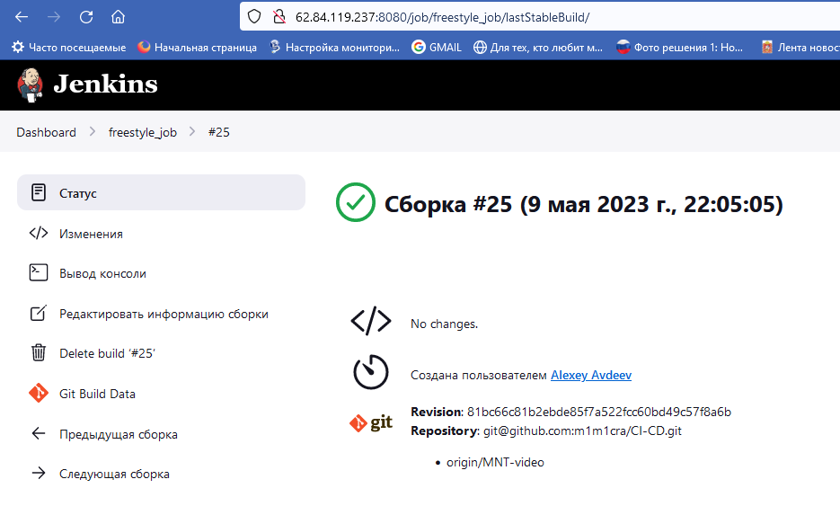
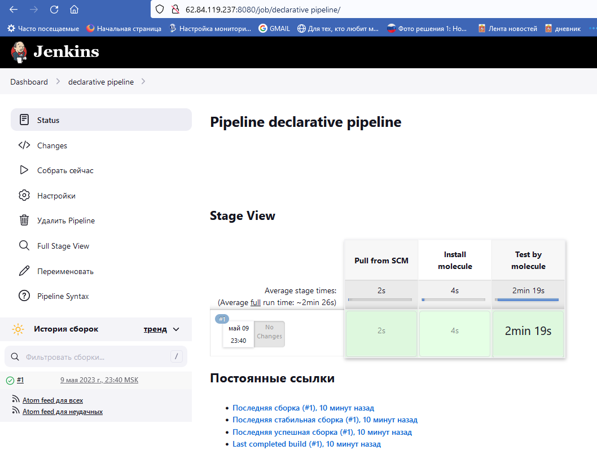
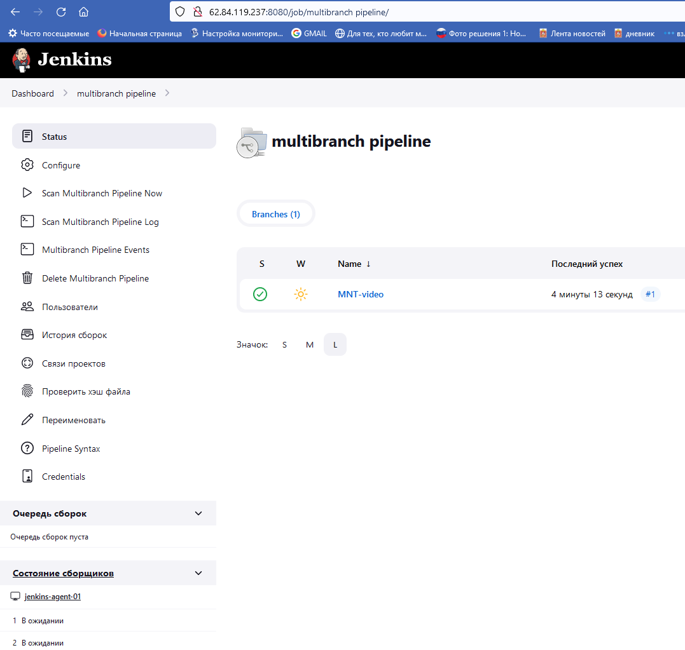
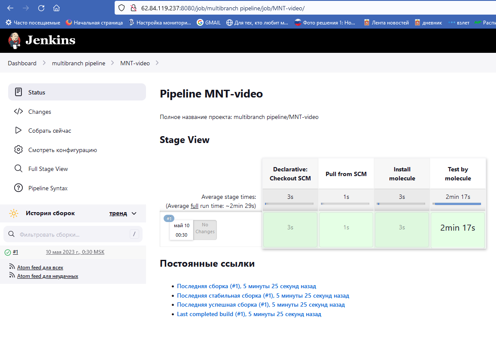

# Домашнее задание к занятию "10.Jenkins"

## Подготовка к выполнению

1. Создать 2 VM: для jenkins-master и jenkins-agent.
2. Установить jenkins при помощи playbook'a.
3. Запустить и проверить работоспособность.
4. Сделать первоначальную настройку.

## Основная часть

1. Сделать Freestyle Job, который будет запускать `molecule test` из любого вашего репозитория с ролью.




<details>
  
  
  
  
  
  
<summary>Полный лог выполнения freestyle-job тут</summary>
  
  ```bash
  
22:05:05 Started by user admin
22:05:05 Running as SYSTEM
22:05:05 Building remotely on jenkins-agent-01 in workspace /opt/jenkins_agent/workspace/freestyle_job
22:05:05 The recommended git tool is: NONE
22:05:05 using credential 6707fa7d-edcd-425e-8a88-d3e03910ba79
22:05:05  > git rev-parse --resolve-git-dir /opt/jenkins_agent/workspace/freestyle_job/.git # timeout=10
22:05:05 Fetching changes from the remote Git repository
22:05:05  > git config remote.origin.url git@github.com:m1m1cra/CI-CD.git # timeout=10
22:05:05 Fetching upstream changes from git@github.com:m1m1cra/CI-CD.git
22:05:05  > git --version # timeout=10
22:05:05  > git --version # 'git version 2.39.1'
22:05:05 using GIT_SSH to set credentials 
22:05:05 [INFO] Currently running in a labeled security context
22:05:05 [INFO] Currently SELinux is 'enforcing' on the host
22:05:05  > /usr/bin/chcon --type=ssh_home_t /opt/jenkins_agent/workspace/freestyle_job@tmp/jenkins-gitclient-ssh15216595042040973562.key
22:05:05  > git fetch --tags --force --progress -- git@github.com:m1m1cra/CI-CD.git +refs/heads/*:refs/remotes/origin/* # timeout=10
22:05:07  > git rev-parse origin/MNT-video^{commit} # timeout=10
22:05:07 Checking out Revision 81bc66c81b2ebde85f7a522fcc60bd49c57f8a6b (origin/MNT-video)
22:05:07  > git config core.sparsecheckout # timeout=10
22:05:07  > git checkout -f 81bc66c81b2ebde85f7a522fcc60bd49c57f8a6b # timeout=10
22:05:07 Commit message: "Update README.md"
22:05:07  > git rev-list --no-walk 81bc66c81b2ebde85f7a522fcc60bd49c57f8a6b # timeout=10
22:05:07 [freestyle_job] $ /bin/sh -xe /tmp/jenkins15024170992390428668.sh
22:05:07 + export PATH=/usr/local/bin:/usr/bin:/bin
22:05:07 + PATH=/usr/local/bin:/usr/bin:/bin
22:05:07 + export LANG=en_US.UTF-8
22:05:07 + LANG=en_US.UTF-8
22:05:07 + cd 08-ansible-05-testing/playbook/roles/ansible-clickhouse
22:05:07 + /usr/local/bin/molecule test -s centos_7
22:05:09 WARNING  Driver docker does not provide a schema.
22:05:09 INFO     centos_7 scenario test matrix: dependency, cleanup, destroy, syntax, create, prepare, converge, idempotence, side_effect, verify, cleanup, destroy
22:05:09 INFO     Performing prerun with role_name_check=0...
22:05:09 INFO     Set ANSIBLE_LIBRARY=/root/.cache/ansible-compat/b9a93c/modules:/root/.ansible/plugins/modules:/usr/share/ansible/plugins/modules
22:05:09 INFO     Set ANSIBLE_COLLECTIONS_PATH=/root/.cache/ansible-compat/b9a93c/collections:/root/.ansible/collections:/usr/share/ansible/collections
22:05:09 INFO     Set ANSIBLE_ROLES_PATH=/root/.cache/ansible-compat/b9a93c/roles:/root/.ansible/roles:/usr/share/ansible/roles:/etc/ansible/roles
22:05:09 INFO     Using /root/.cache/ansible-compat/b9a93c/roles/alexeysetevoi.clickhouse symlink to current repository in order to enable Ansible to find the role using its expected full name.
22:05:09 INFO     Running centos_7 > dependency
22:05:09 WARNING  Skipping, missing the requirements file.
22:05:09 WARNING  Skipping, missing the requirements file.
22:05:09 INFO     Running centos_7 > cleanup
22:05:09 WARNING  Skipping, cleanup playbook not configured.
22:05:09 INFO     Running centos_7 > destroy
22:05:09 INFO     Sanity checks: 'docker'
22:05:10 
22:05:10 PLAY [Destroy] *****************************************************************
22:05:10 
22:05:10 TASK [Set async_dir for HOME env] **********************************************
22:05:10 ok: [localhost]
22:05:10 
22:05:10 TASK [Destroy molecule instance(s)] ********************************************
22:05:11 changed: [localhost] => (item=centos_7)
22:05:11 
22:05:11 TASK [Wait for instance(s) deletion to complete] *******************************
22:05:11 ok: [localhost] => (item=centos_7)
22:05:11 
22:05:11 TASK [Delete docker networks(s)] ***********************************************
22:05:11 skipping: [localhost]
22:05:11 
22:05:11 PLAY RECAP *********************************************************************
22:05:11 localhost                  : ok=3    changed=1    unreachable=0    failed=0    skipped=1    rescued=0    ignored=0
22:05:11 
22:05:11 INFO     Running centos_7 > syntax
22:05:12 
22:05:12 playbook: /opt/jenkins_agent/workspace/freestyle_job/08-ansible-05-testing/playbook/roles/ansible-clickhouse/molecule/centos_7/converge.yml
22:05:12 INFO     Running centos_7 > create
22:05:12 
22:05:12 PLAY [Create] ******************************************************************
22:05:12 
22:05:12 TASK [Set async_dir for HOME env] **********************************************
22:05:13 ok: [localhost]
22:05:13 
22:05:13 TASK [Log into a Docker registry] **********************************************
22:05:13 skipping: [localhost] => (item=None) 
22:05:13 skipping: [localhost]
22:05:13 
22:05:13 TASK [Check presence of custom Dockerfiles] ************************************
22:05:13 ok: [localhost] => (item={'capabilities': ['SYS_ADMIN'], 'command': '/usr/sbin/init', 'dockerfile': '../resources/Dockerfile.j2', 'env': {'ANSIBLE_USER': 'ansible', 'DEPLOY_GROUP': 'deployer', 'SUDO_GROUP': 'wheel', 'container': 'docker'}, 'image': 'centos:7', 'name': 'centos_7', 'privileged': True, 'tmpfs': ['/run', '/tmp'], 'volumes': ['/sys/fs/cgroup:/sys/fs/cgroup']})
22:05:13 
22:05:13 TASK [Create Dockerfiles from image names] *************************************
22:05:14 changed: [localhost] => (item={'capabilities': ['SYS_ADMIN'], 'command': '/usr/sbin/init', 'dockerfile': '../resources/Dockerfile.j2', 'env': {'ANSIBLE_USER': 'ansible', 'DEPLOY_GROUP': 'deployer', 'SUDO_GROUP': 'wheel', 'container': 'docker'}, 'image': 'centos:7', 'name': 'centos_7', 'privileged': True, 'tmpfs': ['/run', '/tmp'], 'volumes': ['/sys/fs/cgroup:/sys/fs/cgroup']})
22:05:14 
22:05:14 TASK [Synchronization the context] *********************************************
22:05:14 changed: [localhost] => (item={'capabilities': ['SYS_ADMIN'], 'command': '/usr/sbin/init', 'dockerfile': '../resources/Dockerfile.j2', 'env': {'ANSIBLE_USER': 'ansible', 'DEPLOY_GROUP': 'deployer', 'SUDO_GROUP': 'wheel', 'container': 'docker'}, 'image': 'centos:7', 'name': 'centos_7', 'privileged': True, 'tmpfs': ['/run', '/tmp'], 'volumes': ['/sys/fs/cgroup:/sys/fs/cgroup']})
22:05:14 
22:05:14 TASK [Discover local Docker images] ********************************************
22:05:15 ok: [localhost] => (item=None)
22:05:15 ok: [localhost]
22:05:15 
22:05:15 TASK [Build an Ansible compatible image (new)] *********************************
22:05:18 ok: [localhost] => (item=molecule_local/centos:7)
22:05:18 
22:05:18 TASK [Create docker network(s)] ************************************************
22:05:18 skipping: [localhost]
22:05:18 
22:05:18 TASK [Determine the CMD directives] ********************************************
22:05:18 ok: [localhost] => (item=None)
22:05:18 ok: [localhost]
22:05:18 
22:05:18 TASK [Create molecule instance(s)] *********************************************
22:05:19 changed: [localhost] => (item=centos_7)
22:05:19 
22:05:19 TASK [Wait for instance(s) creation to complete] *******************************
22:05:25 FAILED - RETRYING: [localhost]: Wait for instance(s) creation to complete (300 retries left).
22:05:25 changed: [localhost] => (item=None)
22:05:25 changed: [localhost]
22:05:25 
22:05:25 PLAY RECAP *********************************************************************
22:05:25 localhost                  : ok=9    changed=4    unreachable=0    failed=0    skipped=2    rescued=0    ignored=0
22:05:25 
22:05:25 INFO     Running centos_7 > prepare
22:05:25 WARNING  Skipping, prepare playbook not configured.
22:05:25 INFO     Running centos_7 > converge
22:05:25 
22:05:25 PLAY [Converge] ****************************************************************
22:05:25 
22:05:25 TASK [Gathering Facts] *********************************************************
22:05:28 ok: [centos_7]
22:05:28 
22:05:28 TASK [Include ansible-clickhouse] **********************************************
22:05:28 
22:05:28 TASK [ansible-clickhouse : Include OS Family Specific Variables] ***************
22:05:28 ok: [centos_7]
22:05:28 
22:05:28 TASK [ansible-clickhouse : include_tasks] **************************************
22:05:28 included: /opt/jenkins_agent/workspace/freestyle_job/08-ansible-05-testing/playbook/roles/ansible-clickhouse/tasks/precheck.yml for centos_7
22:05:28 
22:05:28 TASK [ansible-clickhouse : Requirements check | Checking sse4_2 support] *******
22:05:29 ok: [centos_7]
22:05:29 
22:05:29 TASK [ansible-clickhouse : Requirements check | Not supported distribution && release] ***
22:05:29 skipping: [centos_7]
22:05:29 
22:05:29 TASK [ansible-clickhouse : include_tasks] **************************************
22:05:29 included: /opt/jenkins_agent/workspace/freestyle_job/08-ansible-05-testing/playbook/roles/ansible-clickhouse/tasks/params.yml for centos_7
22:05:29 
22:05:29 TASK [ansible-clickhouse : Set clickhouse_service_enable] **********************
22:05:29 ok: [centos_7]
22:05:29 
22:05:29 TASK [ansible-clickhouse : Set clickhouse_service_ensure] **********************
22:05:29 ok: [centos_7]
22:05:29 
22:05:29 TASK [ansible-clickhouse : include_tasks] **************************************
22:05:29 included: /opt/jenkins_agent/workspace/freestyle_job/08-ansible-05-testing/playbook/roles/ansible-clickhouse/tasks/install/yum.yml for centos_7
22:05:29 
22:05:29 TASK [ansible-clickhouse : Install by YUM | Ensure clickhouse repo GPG key imported] ***
22:05:32 changed: [centos_7]
22:05:32 
22:05:32 TASK [ansible-clickhouse : Install by YUM | Ensure clickhouse repo installed] ***
22:05:32 --- before: /etc/yum.repos.d/clickhouse.repo
22:05:32 +++ after: /etc/yum.repos.d/clickhouse.repo
22:05:32 @@ -0,0 +1,7 @@
22:05:32 +[clickhouse]
22:05:32 +baseurl = https://repo.clickhouse.tech/rpm/stable/x86_64/
22:05:32 +enabled = 1
22:05:32 +gpgcheck = 1
22:05:32 +gpgkey = https://repo.clickhouse.tech//CLICKHOUSE-KEY.GPG
22:05:32 +name = Clickhouse repo
22:05:32 +
22:05:32 
22:05:32 changed: [centos_7]
22:05:32 
22:05:32 TASK [ansible-clickhouse : Install by YUM | Ensure clickhouse package installed (latest)] ***
22:06:11 changed: [centos_7]
22:06:11 
22:06:11 TASK [ansible-clickhouse : Install by YUM | Ensure clickhouse package installed (version latest)] ***
22:06:11 skipping: [centos_7]
22:06:11 
22:06:11 TASK [ansible-clickhouse : include_tasks] **************************************
22:06:11 included: /opt/jenkins_agent/workspace/freestyle_job/08-ansible-05-testing/playbook/roles/ansible-clickhouse/tasks/configure/sys.yml for centos_7
22:06:11 
22:06:11 TASK [ansible-clickhouse : Check clickhouse config, data and logs] *************
22:06:14 ok: [centos_7] => (item=/var/log/clickhouse-server)
22:06:14 --- before
22:06:14 +++ after
22:06:14 @@ -1,4 +1,4 @@
22:06:14  {
22:06:14 -    "mode": "0700",
22:06:14 +    "mode": "0770",
22:06:14      "path": "/etc/clickhouse-server"
22:06:14  }
22:06:14 
22:06:14 changed: [centos_7] => (item=/etc/clickhouse-server)
22:06:14 --- before
22:06:14 +++ after
22:06:14 @@ -1,7 +1,7 @@
22:06:14  {
22:06:14 -    "group": 0,
22:06:14 -    "mode": "0755",
22:06:14 -    "owner": 0,
22:06:14 +    "group": 996,
22:06:14 +    "mode": "0770",
22:06:14 +    "owner": 999,
22:06:14      "path": "/var/lib/clickhouse/tmp/",
22:06:14 -    "state": "absent"
22:06:14 +    "state": "directory"
22:06:14  }
22:06:14 
22:06:14 changed: [centos_7] => (item=/var/lib/clickhouse/tmp/)
22:06:14 --- before
22:06:14 +++ after
22:06:14 @@ -1,4 +1,4 @@
22:06:14  {
22:06:14 -    "mode": "0700",
22:06:14 +    "mode": "0770",
22:06:14      "path": "/var/lib/clickhouse/"
22:06:14  }
22:06:14 
22:06:14 changed: [centos_7] => (item=/var/lib/clickhouse/)
22:06:14 
22:06:14 TASK [ansible-clickhouse : Config | Create config.d folder] ********************
22:06:15 --- before
22:06:15 +++ after
22:06:15 @@ -1,4 +1,4 @@
22:06:15  {
22:06:15 -    "mode": "0500",
22:06:15 +    "mode": "0770",
22:06:15      "path": "/etc/clickhouse-server/config.d"
22:06:15  }
22:06:15 
22:06:15 changed: [centos_7]
22:06:15 
22:06:15 TASK [ansible-clickhouse : Config | Create users.d folder] *********************
22:06:15 --- before
22:06:15 +++ after
22:06:15 @@ -1,4 +1,4 @@
22:06:15  {
22:06:15 -    "mode": "0500",
22:06:15 +    "mode": "0770",
22:06:15      "path": "/etc/clickhouse-server/users.d"
22:06:15  }
22:06:15 
22:06:15 changed: [centos_7]
22:06:15 
22:06:15 TASK [ansible-clickhouse : Config | Generate system config] ********************
22:06:17 --- before
22:06:17 +++ after: /root/.ansible/tmp/ansible-local-86734e6b4066u/tmpk_if1med/config.j2
22:06:17 @@ -0,0 +1,381 @@
22:06:17 +<?xml version="1.0"?>
22:06:17 +<!--
22:06:17 + -
22:06:17 + - Ansible managed: Do NOT edit this file manually!
22:06:17 + -
22:06:17 +--> 
22:06:17 +<clickhouse>
22:06:17 +    <logger>
22:06:17 +        <!-- Possible levels: https://github.com/pocoproject/poco/blob/develop/Foundation/include/Poco/Logger.h#L105 -->
22:06:17 +        <level>trace</level>
22:06:17 +        <log>/var/log/clickhouse-server/clickhouse-server.log</log>
22:06:17 +        <errorlog>/var/log/clickhouse-server/clickhouse-server.err.log</errorlog>
22:06:17 +        <size>1000M</size>
22:06:17 +        <count>10</count>
22:06:17 +    </logger>
22:06:17 +
22:06:17 +    <http_port>8123</http_port>
22:06:17 +
22:06:17 +    <tcp_port>9000</tcp_port>
22:06:17 +
22:06:17 +    <!-- Used with https_port and tcp_port_secure. Full ssl options list: https://github.com/ClickHouse-Extras/poco/blob/master/NetSSL_OpenSSL/include/Poco/Net/SSLManager.h#L71 -->
22:06:17 +    <openSSL>
22:06:17 +        <server> <!-- Used for https server AND secure tcp port -->
22:06:17 +            <!-- openssl req -subj "/CN=localhost" -new -newkey rsa:2048 -days 365 -nodes -x509 -keyout /etc/clickhouse-server/server.key -out /etc/clickhouse-server/server.crt -->
22:06:17 +            <certificateFile>/etc/clickhouse-server/server.crt</certificateFile>
22:06:17 +            <privateKeyFile>/etc/clickhouse-server/server.key</privateKeyFile>
22:06:17 +            <!-- openssl dhparam -out /etc/clickhouse-server/dhparam.pem 4096 -->
22:06:17 +            <dhParamsFile>/etc/clickhouse-server/dhparam.pem</dhParamsFile>
22:06:17 +            <verificationMode>none</verificationMode>
22:06:17 +            <loadDefaultCAFile>true</loadDefaultCAFile>
22:06:17 +            <cacheSessions>true</cacheSessions>
22:06:17 +            <disableProtocols>sslv2,sslv3</disableProtocols>
22:06:17 +            <preferServerCiphers>true</preferServerCiphers>
22:06:17 +        </server>
22:06:17 +
22:06:17 +        <client> <!-- Used for connecting to https dictionary source -->
22:06:17 +            <loadDefaultCAFile>true</loadDefaultCAFile>
22:06:17 +            <cacheSessions>true</cacheSessions>
22:06:17 +            <disableProtocols>sslv2,sslv3</disableProtocols>
22:06:17 +            <preferServerCiphers>true</preferServerCiphers>
22:06:17 +            <!-- Use for self-signed: <verificationMode>none</verificationMode> -->
22:06:17 +            <invalidCertificateHandler>
22:06:17 +                <!-- Use for self-signed: <name>AcceptCertificateHandler</name> -->
22:06:17 +                <name>RejectCertificateHandler</name>
22:06:17 +            </invalidCertificateHandler>
22:06:17 +        </client>
22:06:17 +    </openSSL>
22:06:17 +
22:06:17 +    <!-- Default root page on http[s] server. For example load UI from https://tabix.io/ when opening http://localhost:8123 -->
22:06:17 +    <!--
22:06:17 +    <http_server_default_response><![CDATA[<html ng-app="SMI2"><head><base href="http://ui.tabix.io/"></head><body><div ui-view="" class="content-ui"></div><script src="http://loader.tabix.io/master.js"></script></body></html>]]></http_server_default_response>
22:06:17 +    -->
22:06:17 +
22:06:17 +    <!-- Port for communication between replicas. Used for data exchange. -->
22:06:17 +    <interserver_http_port>9009</interserver_http_port>
22:06:17 +
22:06:17 +
22:06:17 +
22:06:17 +    <!-- Hostname that is used by other replicas to request this server.
22:06:17 +         If not specified, than it is determined analoguous to 'hostname -f' command.
22:06:17 +         This setting could be used to switch replication to another network interface.
22:06:17 +      -->
22:06:17 +    <!--
22:06:17 +    <interserver_http_host>example.clickhouse.com</interserver_http_host>
22:06:17 +    -->
22:06:17 +
22:06:17 +    <!-- Listen specified host. use :: (wildcard IPv6 address), if you want to accept connections both with IPv4 and IPv6 from everywhere. -->
22:06:17 +    <!-- <listen_host>::</listen_host> -->
22:06:17 +    <!-- Same for hosts with disabled ipv6: -->
22:06:17 +    <!-- <listen_host>0.0.0.0</listen_host> -->
22:06:17 +    <listen_host>127.0.0.1</listen_host>
22:06:17 +
22:06:17 +    <max_connections>2048</max_connections>
22:06:17 +    <keep_alive_timeout>3</keep_alive_timeout>
22:06:17 +
22:06:17 +    <!-- Maximum number of concurrent queries. -->
22:06:17 +    <max_concurrent_queries>100</max_concurrent_queries>
22:06:17 +
22:06:17 +    <!-- Set limit on number of open files (default: maximum). This setting makes sense on Mac OS X because getrlimit() fails to retrieve
22:06:17 +         correct maximum value. -->
22:06:17 +    <!-- <max_open_files>262144</max_open_files> -->
22:06:17 +
22:06:17 +    <!-- Size of cache of uncompressed blocks of data, used in tables of MergeTree family.
22:06:17 +         In bytes. Cache is single for server. Memory is allocated only on demand.
22:06:17 +         Cache is used when 'use_uncompressed_cache' user setting turned on (off by default).
22:06:17 +         Uncompressed cache is advantageous only for very short queries and in rare cases.
22:06:17 +      -->
22:06:17 +    <uncompressed_cache_size>8589934592</uncompressed_cache_size>
22:06:17 +
22:06:17 +    <!-- Approximate size of mark cache, used in tables of MergeTree family.
22:06:17 +         In bytes. Cache is single for server. Memory is allocated only on demand.
22:06:17 +         You should not lower this value.
22:06:17 +      -->
22:06:17 +    <mark_cache_size>5368709120</mark_cache_size>
22:06:17 +
22:06:17 +
22:06:17 +    <!-- Path to data directory, with trailing slash. -->
22:06:17 +    <path>/var/lib/clickhouse/</path>
22:06:17 +
22:06:17 +    <!-- Path to temporary data for processing hard queries. -->
22:06:17 +    <tmp_path>/var/lib/clickhouse/tmp/</tmp_path>
22:06:17 +
22:06:17 +    <!-- Directory with user provided files that are accessible by 'file' table function. -->
22:06:17 +    <user_files_path>/var/lib/clickhouse/user_files/</user_files_path>
22:06:17 +
22:06:17 +    <!-- Path to configuration file with users, access rights, profiles of settings, quotas. -->
22:06:17 +    <users_config>users.xml</users_config>
22:06:17 +
22:06:17 +    <!-- Default profile of settings. -->
22:06:17 +    <default_profile>default</default_profile>
22:06:17 +
22:06:17 +    <!-- System profile of settings. This settings are used by internal processes (Buffer storage, Distibuted DDL worker and so on). -->
22:06:17 +    <!-- <system_profile>default</system_profile> -->
22:06:17 +
22:06:17 +    <!-- Default database. -->
22:06:17 +    <default_database>default</default_database>
22:06:17 +
22:06:17 +    <!-- Server time zone could be set here.
22:06:17 +
22:06:17 +         Time zone is used when converting between String and DateTime types,
22:06:17 +          when printing DateTime in text formats and parsing DateTime from text,
22:06:17 +          it is used in date and time related functions, if specific time zone was not passed as an argument.
22:06:17 +
22:06:17 +         Time zone is specified as identifier from IANA time zone database, like UTC or Africa/Abidjan.
22:06:17 +         If not specified, system time zone at server startup is used.
22:06:17 +
22:06:17 +         Please note, that server could display time zone alias instead of specified name.
22:06:17 +         Example: W-SU is an alias for Europe/Moscow and Zulu is an alias for UTC.
22:06:17 +    -->
22:06:17 +    <!-- <timezone>Europe/Moscow</timezone> -->
22:06:17 +
22:06:17 +    <!-- You can specify umask here (see "man umask"). Server will apply it on startup.
22:06:17 +         Number is always parsed as octal. Default umask is 027 (other users cannot read logs, data files, etc; group can only read).
22:06:17 +    -->
22:06:17 +    <!-- <umask>022</umask> -->
22:06:17 +
22:06:17 +    <!-- Perform mlockall after startup to lower first queries latency
22:06:17 +          and to prevent clickhouse executable from being paged out under high IO load.
22:06:17 +         Enabling this option is recommended but will lead to increased startup time for up to a few seconds.
22:06:17 +    -->
22:06:17 +    <mlock_executable>False</mlock_executable>
22:06:17 +
22:06:17 +    <!-- Configuration of clusters that could be used in Distributed tables.
22:06:17 +         https://clickhouse.com/docs/en/engines/table-engines/special/distributed/
22:06:17 +      -->
22:06:17 +    <remote_servers incl="clickhouse_remote_servers" />
22:06:17 +
22:06:17 +
22:06:17 +    <!-- If element has 'incl' attribute, then for it's value will be used corresponding substitution from another file.
22:06:17 +         By default, path to file with substitutions is /etc/metrika.xml. It could be changed in config in 'include_from' element.
22:06:17 +         Values for substitutions are specified in /clickhouse/name_of_substitution elements in that file.
22:06:17 +      -->
22:06:17 +
22:06:17 +    <!-- ZooKeeper is used to store metadata about replicas, when using Replicated tables.
22:06:17 +         Optional. If you don't use replicated tables, you could omit that.
22:06:17 +
22:06:17 +         See https://clickhouse.com/docs/en/engines/table-engines/mergetree-family/replication/
22:06:17 +      -->
22:06:17 +    <zookeeper incl="zookeeper-servers" optional="true" />
22:06:17 +
22:06:17 +    <!-- Substitutions for parameters of replicated tables.
22:06:17 +          Optional. If you don't use replicated tables, you could omit that.
22:06:17 +         See https://clickhouse.com/docs/en/engines/table-engines/mergetree-family/replication/#creating-replicated-tables
22:06:17 +      -->
22:06:17 +    <macros incl="macros" optional="true" />
22:06:17 +
22:06:17 +
22:06:17 +    <!-- Reloading interval for embedded dictionaries, in seconds. Default: 3600. -->
22:06:17 +    <builtin_dictionaries_reload_interval>3600</builtin_dictionaries_reload_interval>
22:06:17 +
22:06:17 +    <!-- If true, dictionaries are created lazily on first use. Otherwise they are initialised on server startup. Default: true -->
22:06:17 +    <!-- See also: https://clickhouse.com/docs/en/operations/server-configuration-parameters/settings/#server_configuration_parameters-dictionaries_lazy_load -->
22:06:17 +    <dictionaries_lazy_load>True</dictionaries_lazy_load>
22:06:17 +
22:06:17 +    <!-- Maximum session timeout, in seconds. Default: 3600. -->
22:06:17 +    <max_session_timeout>3600</max_session_timeout>
22:06:17 +
22:06:17 +    <!-- Default session timeout, in seconds. Default: 60. -->
22:06:17 +    <default_session_timeout>60</default_session_timeout>
22:06:17 +
22:06:17 +    <!-- Sending data to Graphite for monitoring. Several sections can be defined. -->
22:06:17 +    <!--
22:06:17 +        interval - send every X second
22:06:17 +        root_path - prefix for keys
22:06:17 +        hostname_in_path - append hostname to root_path (default = true)
22:06:17 +        metrics - send data from table system.metrics
22:06:17 +        events - send data from table system.events
22:06:17 +        asynchronous_metrics - send data from table system.asynchronous_metrics
22:06:17 +    -->
22:06:17 +    <!--
22:06:17 +    <graphite>
22:06:17 +        <host>localhost</host>
22:06:17 +        <port>42000</port>
22:06:17 +        <timeout>0.1</timeout>
22:06:17 +        <interval>60</interval>
22:06:17 +        <root_path>one_min</root_path>
22:06:17 +        <hostname_in_path>true</hostname_in_path>
22:06:17 +
22:06:17 +        <metrics>true</metrics>
22:06:17 +        <events>true</events>
22:06:17 +        <asynchronous_metrics>true</asynchronous_metrics>
22:06:17 +    </graphite>
22:06:17 +    <graphite>
22:06:17 +        <host>localhost</host>
22:06:17 +        <port>42000</port>
22:06:17 +        <timeout>0.1</timeout>
22:06:17 +        <interval>1</interval>
22:06:17 +        <root_path>one_sec</root_path>
22:06:17 +
22:06:17 +        <metrics>true</metrics>
22:06:17 +        <events>true</events>
22:06:17 +        <asynchronous_metrics>false</asynchronous_metrics>
22:06:17 +    </graphite>
22:06:17 +    -->
22:06:17 +
22:06:17 +
22:06:17 +    <!-- Query log. Used only for queries with setting log_queries = 1. -->
22:06:17 +    <query_log>
22:06:17 +        <!-- What table to insert data. If table is not exist, it will be created.
22:06:17 +             When query log structure is changed after system update,
22:06:17 +              then old table will be renamed and new table will be created automatically.
22:06:17 +        -->
22:06:17 +        <database>system</database>
22:06:17 +        <table>query_log</table>
22:06:17 +        <!--
22:06:17 +            PARTITION BY expr https://clickhouse.com/docs/en/table_engines/mergetree-family/custom_partitioning_key/
22:06:17 +            Example:
22:06:17 +                event_date
22:06:17 +                toMonday(event_date)
22:06:17 +                toYYYYMM(event_date)
22:06:17 +                toStartOfHour(event_time)
22:06:17 +        -->
22:06:17 +        <partition_by>toYYYYMM(event_date)</partition_by>
22:06:17 +        <!-- Interval of flushing data. -->
22:06:17 +        <flush_interval_milliseconds>7500</flush_interval_milliseconds>
22:06:17 +    </query_log>
22:06:17 +
22:06:17 +    <!-- Query thread log. Has information about all threads participated in query execution.
22:06:17 +         Used only for queries with setting log_query_threads = 1. -->
22:06:17 +    <query_thread_log>
22:06:17 +        <database>system</database>
22:06:17 +        <table>query_thread_log</table>
22:06:17 +        <partition_by>toYYYYMM(event_date)</partition_by>
22:06:17 +        <flush_interval_milliseconds>7500</flush_interval_milliseconds>
22:06:17 +    </query_thread_log>
22:06:17 +
22:06:17 +    <!-- Uncomment if use part log.
22:06:17 +         Part log contains information about all actions with parts in MergeTree tables (creation, deletion, merges, downloads).
22:06:17 +    <part_log>
22:06:17 +        <database>system</database>
22:06:17 +        <table>part_log</table>
22:06:17 +        <flush_interval_milliseconds>7500</flush_interval_milliseconds>
22:06:17 +    </part_log>
22:06:17 +    -->
22:06:17 +
22:06:17 +
22:06:17 +    <!-- Parameters for embedded dictionaries, used in Yandex.Metrica.
22:06:17 +         See https://clickhouse.com/docs/en/dicts/internal_dicts/
22:06:17 +    -->
22:06:17 +
22:06:17 +    <!-- Path to file with region hierarchy. -->
22:06:17 +    <!-- <path_to_regions_hierarchy_file>/opt/geo/regions_hierarchy.txt</path_to_regions_hierarchy_file> -->
22:06:17 +
22:06:17 +    <!-- Path to directory with files containing names of regions -->
22:06:17 +    <!-- <path_to_regions_names_files>/opt/geo/</path_to_regions_names_files> -->
22:06:17 +
22:06:17 +
22:06:17 +    <!-- Configuration of external dictionaries. See:
22:06:17 +         https://clickhouse.com/docs/en/sql-reference/dictionaries/external-dictionaries/external-dicts
22:06:17 +    -->
22:06:17 +    <dictionaries_config>*_dictionary.xml</dictionaries_config>
22:06:17 +
22:06:17 +    <!-- Uncomment if you want data to be compressed 30-100% better.
22:06:17 +         Don't do that if you just started using ClickHouse.
22:06:17 +      -->
22:06:17 +    <compression incl="clickhouse_compression">
22:06:17 +    <!--
22:06:17 +        <!- - Set of variants. Checked in order. Last matching case wins. If nothing matches, lz4 will be used. - ->
22:06:17 +        <case>
22:06:17 +
22:06:17 +            <!- - Conditions. All must be satisfied. Some conditions may be omitted. - ->
22:06:17 +            <min_part_size>10000000000</min_part_size>        <!- - Min part size in bytes. - ->
22:06:17 +            <min_part_size_ratio>0.01</min_part_size_ratio>   <!- - Min size of part relative to whole table size. - ->
22:06:17 +
22:06:17 +            <!- - What compression method to use. - ->
22:06:17 +            <method>zstd</method>
22:06:17 +        </case>
22:06:17 +    -->
22:06:17 +    </compression>
22:06:17 +
22:06:17 +    <!-- Allow to execute distributed DDL queries (CREATE, DROP, ALTER, RENAME) on cluster.
22:06:17 +         Works only if ZooKeeper is enabled. Comment it if such functionality isn't required. -->
22:06:17 +    <distributed_ddl>
22:06:17 +        <!-- Path in ZooKeeper to queue with DDL queries -->
22:06:17 +        <path>/clickhouse/task_queue/ddl</path>
22:06:17 +
22:06:17 +        <!-- Settings from this profile will be used to execute DDL queries -->
22:06:17 +        <!-- <profile>default</profile> -->
22:06:17 +    </distributed_ddl>
22:06:17 +
22:06:17 +    <!-- Settings to fine tune MergeTree tables. See documentation in source code, in MergeTreeSettings.h -->
22:06:17 +        <merge_tree>
22:06:17 +        </merge_tree>
22:06:17 +
22:06:17 +    <!-- Protection from accidental DROP.
22:06:17 +         If size of a MergeTree table is greater than max_table_size_to_drop (in bytes) than table could not be dropped with any DROP query.
22:06:17 +         If you want do delete one table and don't want to restart clickhouse-server, you could create special file <clickhouse-path>/flags/force_drop_table and make DROP once.
22:06:17 +         By default max_table_size_to_drop is 50GB; max_table_size_to_drop=0 allows to DROP any tables.
22:06:17 +         The same for max_partition_size_to_drop.
22:06:17 +         Uncomment to disable protection.
22:06:17 +    -->
22:06:17 +    <!-- <max_table_size_to_drop>0</max_table_size_to_drop> -->
22:06:17 +    <!-- <max_partition_size_to_drop>0</max_partition_size_to_drop> -->
22:06:17 +
22:06:17 +    <!-- Example of parameters for GraphiteMergeTree table engine -->
22:06:17 +    <graphite_rollup_example>
22:06:17 +        <pattern>
22:06:17 +            <regexp>click_cost</regexp>
22:06:17 +            <function>any</function>
22:06:17 +            <retention>
22:06:17 +                <age>0</age>
22:06:17 +                <precision>3600</precision>
22:06:17 +            </retention>
22:06:17 +            <retention>
22:06:17 +                <age>86400</age>
22:06:17 +                <precision>60</precision>
22:06:17 +            </retention>
22:06:17 +        </pattern>
22:06:17 +        <default>
22:06:17 +            <function>max</function>
22:06:17 +            <retention>
22:06:17 +                <age>0</age>
22:06:17 +                <precision>60</precision>
22:06:17 +            </retention>
22:06:17 +            <retention>
22:06:17 +                <age>3600</age>
22:06:17 +                <precision>300</precision>
22:06:17 +            </retention>
22:06:17 +            <retention>
22:06:17 +                <age>86400</age>
22:06:17 +                <precision>3600</precision>
22:06:17 +            </retention>
22:06:17 +        </default>
22:06:17 +    </graphite_rollup_example>
22:06:17 +
22:06:17 +
22:06:17 +    <!-- Exposing metrics data for scraping from Prometheus. -->
22:06:17 +    <!--
22:06:17 +        endpoint – HTTP endpoint for scraping metrics by prometheus server. Start from ‘/’.
22:06:17 +        port – Port for endpoint.
22:06:17 +        metrics – Flag that sets to expose metrics from the system.metrics table.
22:06:17 +        events – Flag that sets to expose metrics from the system.events table.
22:06:17 +        asynchronous_metrics – Flag that sets to expose current metrics values from the system.asynchronous_metrics table.
22:06:17 +    -->
22:06:17 +    <!--
22:06:17 +    <prometheus>
22:06:17 +        <endpoint>/metrics</endpoint>
22:06:17 +        <port>8001</port>
22:06:17 +        <metrics>true</metrics>
22:06:17 +        <events>true</events>
22:06:17 +        <asynchronous_metrics>true</asynchronous_metrics>
22:06:17 +    </prometheus>
22:06:17 +    -->
22:06:17 +
22:06:17 +
22:06:17 +    <!-- Directory in <clickhouse-path> containing schema files for various input formats.
22:06:17 +         The directory will be created if it doesn't exist.
22:06:17 +      -->
22:06:17 +    <format_schema_path>/var/lib/clickhouse//format_schemas/</format_schema_path>
22:06:17 +
22:06:17 +    <!-- Uncomment to disable ClickHouse internal DNS caching. -->
22:06:17 +    <!-- <disable_internal_dns_cache>1</disable_internal_dns_cache> -->
22:06:17 +
22:06:17 +    <kafka>
22:06:17 +    </kafka>
22:06:17 +
22:06:17 +
22:06:17 +
22:06:17 +
22:06:17 +
22:06:17 +</clickhouse>
22:06:17 
22:06:17 changed: [centos_7]
22:06:17 
22:06:17 TASK [ansible-clickhouse : Config | Generate users config] *********************
22:06:19 --- before
22:06:19 +++ after: /root/.ansible/tmp/ansible-local-86734e6b4066u/tmp0c8wan5t/users.j2
22:06:19 @@ -0,0 +1,106 @@
22:06:19 +<?xml version="1.0"?>
22:06:19 +<!--
22:06:19 + -
22:06:19 + - Ansible managed: Do NOT edit this file manually!
22:06:19 + -
22:06:19 +--> 
22:06:19 +<clickhouse>
22:06:19 +   <profiles>
22:06:19 +    <!-- Profiles of settings. -->
22:06:19 +    <!-- Default profiles. -->
22:06:19 +        <default>
22:06:19 +            <max_memory_usage>10000000000</max_memory_usage>
22:06:19 +            <use_uncompressed_cache>0</use_uncompressed_cache>
22:06:19 +            <load_balancing>random</load_balancing>
22:06:19 +            <max_partitions_per_insert_block>100</max_partitions_per_insert_block>
22:06:19 +        </default>
22:06:19 +        <readonly>
22:06:19 +            <readonly>1</readonly>
22:06:19 +        </readonly>
22:06:19 +        <!-- Default profiles end. -->
22:06:19 +    <!-- Custom profiles. -->
22:06:19 +        <!-- Custom profiles end. -->
22:06:19 +    </profiles>
22:06:19 +
22:06:19 +    <!-- Users and ACL. -->
22:06:19 +    <users>
22:06:19 +    <!-- Default users. -->
22:06:19 +            <!-- Default user for login if user not defined -->
22:06:19 +        <default>
22:06:19 +                <password></password>
22:06:19 +                <networks incl="networks" replace="replace">
22:06:19 +                <ip>::1</ip>
22:06:19 +                <ip>127.0.0.1</ip>
22:06:19 +                </networks>
22:06:19 +        <profile>default</profile>
22:06:19 +        <quota>default</quota>
22:06:19 +            </default>
22:06:19 +            <!-- Example of user with readonly access -->
22:06:19 +        <readonly>
22:06:19 +                <password></password>
22:06:19 +                <networks incl="networks" replace="replace">
22:06:19 +                <ip>::1</ip>
22:06:19 +                <ip>127.0.0.1</ip>
22:06:19 +                </networks>
22:06:19 +        <profile>readonly</profile>
22:06:19 +        <quota>default</quota>
22:06:19 +            </readonly>
22:06:19 +        <!-- Custom users. -->
22:06:19 +            <!-- classic user with plain password -->
22:06:19 +        <testuser>
22:06:19 +                <password_sha256_hex>f2ca1bb6c7e907d06dafe4687e579fce76b37e4e93b7605022da52e6ccc26fd2</password_sha256_hex>
22:06:19 +                <networks incl="networks" replace="replace">
22:06:19 +                <ip>::1</ip>
22:06:19 +                <ip>127.0.0.1</ip>
22:06:19 +                </networks>
22:06:19 +        <profile>default</profile>
22:06:19 +        <quota>default</quota>
22:06:19 +                 <allow_databases>
22:06:19 +                    <database>testu1</database>
22:06:19 +                </allow_databases>
22:06:19 +                            </testuser>
22:06:19 +            <!-- classic user with hex password -->
22:06:19 +        <testuser2>
22:06:19 +                <password>testplpassword</password>
22:06:19 +                <networks incl="networks" replace="replace">
22:06:19 +                <ip>::1</ip>
22:06:19 +                <ip>127.0.0.1</ip>
22:06:19 +                </networks>
22:06:19 +        <profile>default</profile>
22:06:19 +        <quota>default</quota>
22:06:19 +                 <allow_databases>
22:06:19 +                    <database>testu2</database>
22:06:19 +                </allow_databases>
22:06:19 +                            </testuser2>
22:06:19 +            <!-- classic user with multi dbs and multi-custom network allow password -->
22:06:19 +        <testuser3>
22:06:19 +                <password>testplpassword</password>
22:06:19 +                <networks incl="networks" replace="replace">
22:06:19 +                <ip>192.168.0.0/24</ip>
22:06:19 +                <ip>10.0.0.0/8</ip>
22:06:19 +                </networks>
22:06:19 +        <profile>default</profile>
22:06:19 +        <quota>default</quota>
22:06:19 +                 <allow_databases>
22:06:19 +                    <database>testu1</database>
22:06:19 +                    <database>testu2</database>
22:06:19 +                    <database>testu3</database>
22:06:19 +                </allow_databases>
22:06:19 +                            </testuser3>
22:06:19 +        </users>
22:06:19 +
22:06:19 +    <!-- Quotas. -->
22:06:19 +    <quotas>
22:06:19 +        <!-- Default quotas. -->
22:06:19 +        <default>
22:06:19 +        <interval>
22:06:19 +        <duration>3600</duration>
22:06:19 +        <queries>0</queries>
22:06:19 +        <errors>0</errors>
22:06:19 +        <result_rows>0</result_rows>
22:06:19 +        <read_rows>0</read_rows>
22:06:19 +        <execution_time>0</execution_time>
22:06:19 +    </interval>
22:06:19 +        </default>
22:06:19 +            </quotas>
22:06:19 +</clickhouse>
22:06:19 
22:06:19 changed: [centos_7]
22:06:19 
22:06:19 TASK [ansible-clickhouse : Config | Generate remote_servers config] ************
22:06:19 skipping: [centos_7]
22:06:19 
22:06:19 TASK [ansible-clickhouse : Config | Generate macros config] ********************
22:06:19 skipping: [centos_7]
22:06:19 
22:06:19 TASK [ansible-clickhouse : Config | Generate zookeeper servers config] *********
22:06:19 skipping: [centos_7]
22:06:19 
22:06:19 TASK [ansible-clickhouse : Config | Fix interserver_http_port and intersever_https_port collision] ***
22:06:19 skipping: [centos_7]
22:06:19 
22:06:19 TASK [ansible-clickhouse : Notify Handlers Now] ********************************
22:06:19 
22:06:19 RUNNING HANDLER [ansible-clickhouse : Restart Clickhouse Service] **************
22:06:19 ok: [centos_7]
22:06:19 
22:06:19 TASK [ansible-clickhouse : include_tasks] **************************************
22:06:19 included: /opt/jenkins_agent/workspace/freestyle_job/08-ansible-05-testing/playbook/roles/ansible-clickhouse/tasks/service.yml for centos_7
22:06:19 
22:06:19 TASK [ansible-clickhouse : Ensure clickhouse-server.service is enabled: True and state: restarted] ***
22:06:21 changed: [centos_7]
22:06:21 
22:06:21 TASK [ansible-clickhouse : Wait for Clickhouse Server to Become Ready] *********
22:06:26 ok: [centos_7]
22:06:26 
22:06:26 TASK [ansible-clickhouse : include_tasks] **************************************
22:06:26 included: /opt/jenkins_agent/workspace/freestyle_job/08-ansible-05-testing/playbook/roles/ansible-clickhouse/tasks/configure/db.yml for centos_7
22:06:26 
22:06:26 TASK [ansible-clickhouse : Set ClickHose Connection String] ********************
22:06:26 ok: [centos_7]
22:06:26 
22:06:26 TASK [ansible-clickhouse : Gather list of existing databases] ******************
22:06:27 ok: [centos_7]
22:06:27 
22:06:27 TASK [ansible-clickhouse : Config | Delete database config] ********************
22:06:27 skipping: [centos_7] => (item={'name': 'testu1'}) 
22:06:27 skipping: [centos_7] => (item={'name': 'testu2'}) 
22:06:27 skipping: [centos_7] => (item={'name': 'testu3'}) 
22:06:27 skipping: [centos_7] => (item={'name': 'testu4', 'state': 'absent'}) 
22:06:27 skipping: [centos_7]
22:06:27 
22:06:27 TASK [ansible-clickhouse : Config | Create database config] ********************
22:06:29 changed: [centos_7] => (item={'name': 'testu1'})
22:06:29 changed: [centos_7] => (item={'name': 'testu2'})
22:06:29 changed: [centos_7] => (item={'name': 'testu3'})
22:06:29 skipping: [centos_7] => (item={'name': 'testu4', 'state': 'absent'}) 
22:06:29 
22:06:29 TASK [ansible-clickhouse : include_tasks] **************************************
22:06:29 included: /opt/jenkins_agent/workspace/freestyle_job/08-ansible-05-testing/playbook/roles/ansible-clickhouse/tasks/configure/dict.yml for centos_7
22:06:29 
22:06:29 TASK [ansible-clickhouse : Config | Generate dictionary config] ****************
22:06:31 --- before
22:06:31 +++ after: /root/.ansible/tmp/ansible-local-86734e6b4066u/tmp2g_gqv0x/dicts.j2
22:06:31 @@ -0,0 +1,63 @@
22:06:31 +<?xml version="1.0"?>
22:06:31 +<!--
22:06:31 + -
22:06:31 + - Ansible managed: Do NOT edit this file manually!
22:06:31 + -
22:06:31 +-->
22:06:31 +<clickhouse>
22:06:31 + <dictionary>
22:06:31 +   <name>test_dict</name>
22:06:31 +   <source>
22:06:31 +    <odbc>
22:06:31 +     <connection_string>DSN=testdb</connection_string>
22:06:31 +     <table>dict_source</table>
22:06:31 +    </odbc>
22:06:31 +   </source>
22:06:31 +   <lifetime>
22:06:31 +     <min>300</min>
22:06:31 +     <max>360</max>
22:06:31 +   </lifetime>
22:06:31 +   <layout>
22:06:31 +     <hashed/>
22:06:31 +   </layout>
22:06:31 +   <structure>
22:06:31 +     <id>
22:06:31 +       <name>testIntKey</name>
22:06:31 +     </id>
22:06:31 +     <attribute>
22:06:31 +       <name>testAttrName</name>
22:06:31 +       <type>UInt32</type>
22:06:31 +       <null_value>0</null_value>
22:06:31 +     </attribute>
22:06:31 +   </structure>
22:06:31 + </dictionary>
22:06:31 + <dictionary>
22:06:31 +   <name>test_dict</name>
22:06:31 +   <source>
22:06:31 +    <odbc>
22:06:31 +     <connection_string>DSN=testdb</connection_string>
22:06:31 +     <table>dict_source</table>
22:06:31 +    </odbc>
22:06:31 +   </source>
22:06:31 +   <lifetime>
22:06:31 +     <min>300</min>
22:06:31 +     <max>360</max>
22:06:31 +   </lifetime>
22:06:31 +   <layout>
22:06:31 +     <complex_key_hashed/>
22:06:31 +   </layout>
22:06:31 +   <structure>
22:06:31 +     <key>
22:06:31 +     <attribute>
22:06:31 +       <name>testAttrComplexName</name>
22:06:31 +       <type>String</type>
22:06:31 +     </attribute>
22:06:31 +     </key>
22:06:31 +     <attribute>
22:06:31 +       <name>testAttrName</name>
22:06:31 +       <type>String</type>
22:06:31 +       <null_value></null_value>
22:06:31 +     </attribute>
22:06:31 +   </structure>
22:06:31 + </dictionary>
22:06:31 +</clickhouse>
22:06:31 
22:06:31 changed: [centos_7]
22:06:31 
22:06:31 TASK [ansible-clickhouse : include_tasks] **************************************
22:06:31 skipping: [centos_7]
22:06:31 
22:06:31 PLAY RECAP *********************************************************************
22:06:31 centos_7                   : ok=27   changed=11   unreachable=0    failed=0    skipped=8    rescued=0    ignored=0
22:06:31 
22:06:31 INFO     Running centos_7 > idempotence
22:06:32 
22:06:32 PLAY [Converge] ****************************************************************
22:06:32 
22:06:32 TASK [Gathering Facts] *********************************************************
22:06:36 ok: [centos_7]
22:06:36 
22:06:36 TASK [Include ansible-clickhouse] **********************************************
22:06:36 
22:06:36 TASK [ansible-clickhouse : Include OS Family Specific Variables] ***************
22:06:36 ok: [centos_7]
22:06:36 
22:06:36 TASK [ansible-clickhouse : include_tasks] **************************************
22:06:36 included: /opt/jenkins_agent/workspace/freestyle_job/08-ansible-05-testing/playbook/roles/ansible-clickhouse/tasks/precheck.yml for centos_7
22:06:36 
22:06:36 TASK [ansible-clickhouse : Requirements check | Checking sse4_2 support] *******
22:06:37 ok: [centos_7]
22:06:37 
22:06:37 TASK [ansible-clickhouse : Requirements check | Not supported distribution && release] ***
22:06:37 skipping: [centos_7]
22:06:37 
22:06:37 TASK [ansible-clickhouse : include_tasks] **************************************
22:06:37 included: /opt/jenkins_agent/workspace/freestyle_job/08-ansible-05-testing/playbook/roles/ansible-clickhouse/tasks/params.yml for centos_7
22:06:37 
22:06:37 TASK [ansible-clickhouse : Set clickhouse_service_enable] **********************
22:06:37 ok: [centos_7]
22:06:37 
22:06:37 TASK [ansible-clickhouse : Set clickhouse_service_ensure] **********************
22:06:37 ok: [centos_7]
22:06:37 
22:06:37 TASK [ansible-clickhouse : include_tasks] **************************************
22:06:37 included: /opt/jenkins_agent/workspace/freestyle_job/08-ansible-05-testing/playbook/roles/ansible-clickhouse/tasks/install/yum.yml for centos_7
22:06:37 
22:06:37 TASK [ansible-clickhouse : Install by YUM | Ensure clickhouse repo GPG key imported] ***
22:06:40 ok: [centos_7]
22:06:40 
22:06:40 TASK [ansible-clickhouse : Install by YUM | Ensure clickhouse repo installed] ***
22:06:41 ok: [centos_7]
22:06:41 
22:06:41 TASK [ansible-clickhouse : Install by YUM | Ensure clickhouse package installed (latest)] ***
22:06:44 ok: [centos_7]
22:06:44 
22:06:44 TASK [ansible-clickhouse : Install by YUM | Ensure clickhouse package installed (version latest)] ***
22:06:44 skipping: [centos_7]
22:06:44 
22:06:44 TASK [ansible-clickhouse : include_tasks] **************************************
22:06:44 included: /opt/jenkins_agent/workspace/freestyle_job/08-ansible-05-testing/playbook/roles/ansible-clickhouse/tasks/configure/sys.yml for centos_7
22:06:44 
22:06:44 TASK [ansible-clickhouse : Check clickhouse config, data and logs] *************
22:06:47 ok: [centos_7] => (item=/var/log/clickhouse-server)
22:06:47 ok: [centos_7] => (item=/etc/clickhouse-server)
22:06:47 ok: [centos_7] => (item=/var/lib/clickhouse/tmp/)
22:06:47 ok: [centos_7] => (item=/var/lib/clickhouse/)
22:06:47 
22:06:47 TASK [ansible-clickhouse : Config | Create config.d folder] ********************
22:06:47 ok: [centos_7]
22:06:47 
22:06:47 TASK [ansible-clickhouse : Config | Create users.d folder] *********************
22:06:48 ok: [centos_7]
22:06:48 
22:06:48 TASK [ansible-clickhouse : Config | Generate system config] ********************
22:06:49 ok: [centos_7]
22:06:49 
22:06:49 TASK [ansible-clickhouse : Config | Generate users config] *********************
22:06:50 ok: [centos_7]
22:06:50 
22:06:50 TASK [ansible-clickhouse : Config | Generate remote_servers config] ************
22:06:50 skipping: [centos_7]
22:06:50 
22:06:50 TASK [ansible-clickhouse : Config | Generate macros config] ********************
22:06:50 skipping: [centos_7]
22:06:50 
22:06:50 TASK [ansible-clickhouse : Config | Generate zookeeper servers config] *********
22:06:50 skipping: [centos_7]
22:06:50 
22:06:50 TASK [ansible-clickhouse : Config | Fix interserver_http_port and intersever_https_port collision] ***
22:06:50 skipping: [centos_7]
22:06:50 
22:06:50 TASK [ansible-clickhouse : Notify Handlers Now] ********************************
22:06:50 
22:06:50 TASK [ansible-clickhouse : include_tasks] **************************************
22:06:50 included: /opt/jenkins_agent/workspace/freestyle_job/08-ansible-05-testing/playbook/roles/ansible-clickhouse/tasks/service.yml for centos_7
22:06:50 
22:06:50 TASK [ansible-clickhouse : Ensure clickhouse-server.service is enabled: True and state: started] ***
22:06:52 ok: [centos_7]
22:06:52 
22:06:52 TASK [ansible-clickhouse : Wait for Clickhouse Server to Become Ready] *********
22:06:57 ok: [centos_7]
22:06:57 
22:06:57 TASK [ansible-clickhouse : include_tasks] **************************************
22:06:57 included: /opt/jenkins_agent/workspace/freestyle_job/08-ansible-05-testing/playbook/roles/ansible-clickhouse/tasks/configure/db.yml for centos_7
22:06:57 
22:06:57 TASK [ansible-clickhouse : Set ClickHose Connection String] ********************
22:06:57 ok: [centos_7]
22:06:57 
22:06:57 TASK [ansible-clickhouse : Gather list of existing databases] ******************
22:06:58 ok: [centos_7]
22:06:58 
22:06:58 TASK [ansible-clickhouse : Config | Delete database config] ********************
22:06:58 skipping: [centos_7] => (item={'name': 'testu1'}) 
22:06:58 skipping: [centos_7] => (item={'name': 'testu2'}) 
22:06:58 skipping: [centos_7] => (item={'name': 'testu3'}) 
22:06:58 skipping: [centos_7] => (item={'name': 'testu4', 'state': 'absent'}) 
22:06:58 skipping: [centos_7]
22:06:58 
22:06:58 TASK [ansible-clickhouse : Config | Create database config] ********************
22:06:58 skipping: [centos_7] => (item={'name': 'testu1'}) 
22:06:58 skipping: [centos_7] => (item={'name': 'testu2'}) 
22:06:58 skipping: [centos_7] => (item={'name': 'testu3'}) 
22:06:58 skipping: [centos_7] => (item={'name': 'testu4', 'state': 'absent'}) 
22:06:58 skipping: [centos_7]
22:06:58 
22:06:58 TASK [ansible-clickhouse : include_tasks] **************************************
22:06:58 included: /opt/jenkins_agent/workspace/freestyle_job/08-ansible-05-testing/playbook/roles/ansible-clickhouse/tasks/configure/dict.yml for centos_7
22:06:58 
22:06:58 TASK [ansible-clickhouse : Config | Generate dictionary config] ****************
22:06:59 ok: [centos_7]
22:06:59 
22:06:59 TASK [ansible-clickhouse : include_tasks] **************************************
22:06:59 skipping: [centos_7]
22:06:59 
22:06:59 PLAY RECAP *********************************************************************
22:06:59 centos_7                   : ok=25   changed=0    unreachable=0    failed=0    skipped=9    rescued=0    ignored=0
22:06:59 
22:06:59 INFO     Idempotence completed successfully.
22:06:59 INFO     Running centos_7 > side_effect
22:06:59 WARNING  Skipping, side effect playbook not configured.
22:06:59 INFO     Running centos_7 > verify
22:06:59 INFO     Running Ansible Verifier
22:07:00 
22:07:00 PLAY [Verify] ******************************************************************
22:07:00 
22:07:00 TASK [Example assertion] *******************************************************
22:07:00 ok: [centos_7] => {
22:07:00     "changed": false,
22:07:00     "msg": "All assertions passed"
22:07:00 }
22:07:00 
22:07:00 PLAY RECAP *********************************************************************
22:07:00 centos_7                   : ok=1    changed=0    unreachable=0    failed=0    skipped=0    rescued=0    ignored=0
22:07:00 
22:07:00 INFO     Verifier completed successfully.
22:07:00 INFO     Running centos_7 > cleanup
22:07:00 WARNING  Skipping, cleanup playbook not configured.
22:07:00 INFO     Running centos_7 > destroy
22:07:01 
22:07:01 PLAY [Destroy] *****************************************************************
22:07:01 
22:07:01 TASK [Set async_dir for HOME env] **********************************************
22:07:01 ok: [localhost]
22:07:01 
22:07:01 TASK [Destroy molecule instance(s)] ********************************************
22:07:02 changed: [localhost] => (item=centos_7)
22:07:02 
22:07:02 TASK [Wait for instance(s) deletion to complete] *******************************
22:07:07 FAILED - RETRYING: [localhost]: Wait for instance(s) deletion to complete (300 retries left).
22:07:07 changed: [localhost] => (item=centos_7)
22:07:07 
22:07:07 TASK [Delete docker networks(s)] ***********************************************
22:07:08 skipping: [localhost]
22:07:08 
22:07:08 PLAY RECAP *********************************************************************
22:07:08 localhost                  : ok=3    changed=2    unreachable=0    failed=0    skipped=1    rescued=0    ignored=0
22:07:08 
22:07:08 INFO     Pruning extra files from scenario ephemeral directory
22:07:08 Finished: SUCCESS

 

```
</details>


2. Сделать Declarative Pipeline Job, который будет запускать `molecule test` из любого вашего репозитория с ролью.

```groovy
pipeline {
    agent any

    stages {
        stage('Pull from SCM') {
            steps {
                git branch: 'MNT-video', credentialsId: '6707fa7d-edcd-425e-8a88-d3e03910ba79', url: 'git@github.com:m1m1cra/CI-CD.git'
            }
        }
        stage('Install molecule') {
            steps {
                sh 'pip install molecule && pip install molecule_docker'
            }
        }
        stage('Test by molecule') {
            environment {
                PATH = "/usr/local/bin:${env.PATH}"
            }
            steps {
                dir('08-ansible-05-testing/playbook/roles/ansible-clickhouse') {
                    sh 'molecule test -s centos_7'
                }
            }
        }
    }
}

```




<details>
  
  
<summary>Полный лог выполнения declarative job тут</summary>
  
  
  
  
  
  ```bash
  
Started by user Alexey Avdeev
[Pipeline] Start of Pipeline
[Pipeline] node
Running on jenkins-agent-01 in /opt/jenkins_agent/workspace/declarative pipeline
[Pipeline] {
[Pipeline] stage
[Pipeline] { (Pull from SCM)
[Pipeline] git
The recommended git tool is: NONE
using credential 6707fa7d-edcd-425e-8a88-d3e03910ba79
Fetching changes from the remote Git repository
 > git rev-parse --resolve-git-dir /opt/jenkins_agent/workspace/declarative pipeline/.git # timeout=10
 > git config remote.origin.url git@github.com:m1m1cra/CI-CD.git # timeout=10
Fetching upstream changes from git@github.com:m1m1cra/CI-CD.git
 > git --version # timeout=10
 > git --version # 'git version 2.39.1'
using GIT_SSH to set credentials 
[INFO] Currently running in a labeled security context
[INFO] Currently SELinux is 'enforcing' on the host
 > /usr/bin/chcon --type=ssh_home_t /opt/jenkins_agent/workspace/declarative pipeline@tmp/jenkins-gitclient-ssh5211429050972357672.key
 > git fetch --tags --force --progress -- git@github.com:m1m1cra/CI-CD.git +refs/heads/*:refs/remotes/origin/* # timeout=10
Checking out Revision 1e55c4e839b99a422d3c39ee79bf3f8e95f970d4 (refs/remotes/origin/MNT-video)
Commit message: "Update README.md"
First time build. Skipping changelog.
[Pipeline] }
[Pipeline] // stage
[Pipeline] stage
[Pipeline] { (Install molecule)
 > git rev-parse refs/remotes/origin/MNT-video^{commit} # timeout=10
 > git config core.sparsecheckout # timeout=10
 > git checkout -f 1e55c4e839b99a422d3c39ee79bf3f8e95f970d4 # timeout=10
 > git branch -a -v --no-abbrev # timeout=10
 > git branch -D MNT-video # timeout=10
 > git checkout -b MNT-video 1e55c4e839b99a422d3c39ee79bf3f8e95f970d4 # timeout=10
[Pipeline] sh
+ pip install molecule
WARNING: pip is being invoked by an old script wrapper. This will fail in a future version of pip.
Please see https://github.com/pypa/pip/issues/5599 for advice on fixing the underlying issue.
To avoid this problem you can invoke Python with '-m pip' instead of running pip directly.
Requirement already satisfied: molecule in /usr/local/lib/python3.6/site-packages (3.4.0)
Requirement already satisfied: dataclasses in /usr/local/lib/python3.6/site-packages (from molecule) (0.8)
Requirement already satisfied: PyYAML<6,>=5.1 in /usr/local/lib64/python3.6/site-packages (from molecule) (5.4.1)
Requirement already satisfied: cerberus!=1.3.3,!=1.3.4,>=1.3.1 in /usr/local/lib/python3.6/site-packages (from molecule) (1.3.2)
Requirement already satisfied: pluggy<1.0,>=0.7.1 in /usr/local/lib/python3.6/site-packages (from molecule) (0.13.1)
Requirement already satisfied: click<9,>=8.0 in /usr/local/lib/python3.6/site-packages (from molecule) (8.0.4)
Requirement already satisfied: ansible-lint>=5.1.1 in /usr/local/lib/python3.6/site-packages (from molecule) (5.4.0)
Requirement already satisfied: click-help-colors>=0.9 in /usr/local/lib/python3.6/site-packages (from molecule) (0.9.1)
Requirement already satisfied: cookiecutter>=1.7.3 in /usr/local/lib/python3.6/site-packages (from molecule) (1.7.3)
Requirement already satisfied: enrich>=1.2.5 in /usr/local/lib/python3.6/site-packages (from molecule) (1.2.7)
Requirement already satisfied: subprocess-tee>=0.3.2 in /usr/local/lib/python3.6/site-packages (from molecule) (0.3.5)
Requirement already satisfied: Jinja2>=2.11.3 in /usr/local/lib/python3.6/site-packages (from molecule) (3.0.3)
Requirement already satisfied: rich>=9.5.1 in /usr/local/lib/python3.6/site-packages (from molecule) (12.6.0)
Requirement already satisfied: setuptools>=42 in /usr/local/lib/python3.6/site-packages (from molecule) (59.6.0)
Requirement already satisfied: paramiko<3,>=2.5.0 in /usr/local/lib/python3.6/site-packages (from molecule) (2.12.0)
Requirement already satisfied: packaging in /usr/local/lib/python3.6/site-packages (from molecule) (21.3)
Requirement already satisfied: selinux in /usr/local/lib/python3.6/site-packages (from molecule) (0.2.1)
Requirement already satisfied: wcmatch>=7.0 in /usr/local/lib/python3.6/site-packages (from ansible-lint>=5.1.1->molecule) (8.3)
Requirement already satisfied: typing-extensions in /usr/local/lib/python3.6/site-packages (from ansible-lint>=5.1.1->molecule) (4.1.1)
Requirement already satisfied: ruamel.yaml<1,>=0.15.34 in /usr/local/lib/python3.6/site-packages (from ansible-lint>=5.1.1->molecule) (0.17.25)
Requirement already satisfied: tenacity in /usr/local/lib/python3.6/site-packages (from ansible-lint>=5.1.1->molecule) (8.2.2)
Requirement already satisfied: importlib-metadata in /usr/local/lib/python3.6/site-packages (from click<9,>=8.0->molecule) (4.8.3)
Requirement already satisfied: poyo>=0.5.0 in /usr/local/lib/python3.6/site-packages (from cookiecutter>=1.7.3->molecule) (0.5.0)
Requirement already satisfied: jinja2-time>=0.2.0 in /usr/local/lib/python3.6/site-packages (from cookiecutter>=1.7.3->molecule) (0.2.0)
Requirement already satisfied: six>=1.10 in /usr/local/lib/python3.6/site-packages (from cookiecutter>=1.7.3->molecule) (1.16.0)
Requirement already satisfied: python-slugify>=4.0.0 in /usr/local/lib/python3.6/site-packages (from cookiecutter>=1.7.3->molecule) (6.1.2)
Requirement already satisfied: binaryornot>=0.4.4 in /usr/local/lib/python3.6/site-packages (from cookiecutter>=1.7.3->molecule) (0.4.4)
Requirement already satisfied: requests>=2.23.0 in /usr/local/lib/python3.6/site-packages (from cookiecutter>=1.7.3->molecule) (2.27.1)
Requirement already satisfied: MarkupSafe>=2.0 in /usr/local/lib64/python3.6/site-packages (from Jinja2>=2.11.3->molecule) (2.0.1)
Requirement already satisfied: bcrypt>=3.1.3 in /usr/local/lib64/python3.6/site-packages (from paramiko<3,>=2.5.0->molecule) (4.0.1)
Requirement already satisfied: cryptography>=2.5 in /usr/local/lib64/python3.6/site-packages (from paramiko<3,>=2.5.0->molecule) (40.0.2)
Requirement already satisfied: pynacl>=1.0.1 in /usr/local/lib64/python3.6/site-packages (from paramiko<3,>=2.5.0->molecule) (1.5.0)
Requirement already satisfied: commonmark<0.10.0,>=0.9.0 in /usr/local/lib/python3.6/site-packages (from rich>=9.5.1->molecule) (0.9.1)
Requirement already satisfied: pygments<3.0.0,>=2.6.0 in /usr/local/lib/python3.6/site-packages (from rich>=9.5.1->molecule) (2.14.0)
Requirement already satisfied: pyparsing!=3.0.5,>=2.0.2 in /usr/local/lib/python3.6/site-packages (from packaging->molecule) (3.0.9)
Requirement already satisfied: distro>=1.3.0 in /usr/local/lib/python3.6/site-packages (from selinux->molecule) (1.8.0)
Requirement already satisfied: chardet>=3.0.2 in /usr/local/lib/python3.6/site-packages (from binaryornot>=0.4.4->cookiecutter>=1.7.3->molecule) (5.0.0)
Requirement already satisfied: cffi>=1.12 in /usr/local/lib64/python3.6/site-packages (from cryptography>=2.5->paramiko<3,>=2.5.0->molecule) (1.15.1)
Requirement already satisfied: zipp>=0.5 in /usr/local/lib/python3.6/site-packages (from importlib-metadata->click<9,>=8.0->molecule) (3.6.0)
Requirement already satisfied: arrow in /usr/local/lib/python3.6/site-packages (from jinja2-time>=0.2.0->cookiecutter>=1.7.3->molecule) (1.2.3)
Requirement already satisfied: text-unidecode>=1.3 in /usr/local/lib/python3.6/site-packages (from python-slugify>=4.0.0->cookiecutter>=1.7.3->molecule) (1.3)
Requirement already satisfied: urllib3<1.27,>=1.21.1 in /usr/local/lib/python3.6/site-packages (from requests>=2.23.0->cookiecutter>=1.7.3->molecule) (1.26.15)
Requirement already satisfied: idna<4,>=2.5 in /usr/local/lib/python3.6/site-packages (from requests>=2.23.0->cookiecutter>=1.7.3->molecule) (3.4)
Requirement already satisfied: certifi>=2017.4.17 in /usr/local/lib/python3.6/site-packages (from requests>=2.23.0->cookiecutter>=1.7.3->molecule) (2023.5.7)
Requirement already satisfied: charset-normalizer~=2.0.0 in /usr/local/lib/python3.6/site-packages (from requests>=2.23.0->cookiecutter>=1.7.3->molecule) (2.0.12)
Requirement already satisfied: ruamel.yaml.clib>=0.2.7 in /usr/local/lib64/python3.6/site-packages (from ruamel.yaml<1,>=0.15.34->ansible-lint>=5.1.1->molecule) (0.2.7)
Requirement already satisfied: bracex>=2.1.1 in /usr/local/lib/python3.6/site-packages (from wcmatch>=7.0->ansible-lint>=5.1.1->molecule) (2.2.1)
Requirement already satisfied: pycparser in /usr/local/lib/python3.6/site-packages (from cffi>=1.12->cryptography>=2.5->paramiko<3,>=2.5.0->molecule) (2.21)
Requirement already satisfied: python-dateutil>=2.7.0 in /usr/local/lib/python3.6/site-packages (from arrow->jinja2-time>=0.2.0->cookiecutter>=1.7.3->molecule) (2.8.2)
WARNING: Running pip as the 'root' user can result in broken permissions and conflicting behaviour with the system package manager. It is recommended to use a virtual environment instead: https://pip.pypa.io/warnings/venv
+ pip install molecule_docker
WARNING: pip is being invoked by an old script wrapper. This will fail in a future version of pip.
Please see https://github.com/pypa/pip/issues/5599 for advice on fixing the underlying issue.
To avoid this problem you can invoke Python with '-m pip' instead of running pip directly.
Requirement already satisfied: molecule_docker in /usr/local/lib/python3.6/site-packages (1.1.0)
Requirement already satisfied: ansible-compat>=0.5.0 in /usr/local/lib/python3.6/site-packages (from molecule_docker) (1.0.0)
Requirement already satisfied: docker>=4.3.1 in /usr/local/lib/python3.6/site-packages (from molecule_docker) (5.0.3)
Requirement already satisfied: selinux in /usr/local/lib/python3.6/site-packages (from molecule_docker) (0.2.1)
Requirement already satisfied: molecule>=3.4.0 in /usr/local/lib/python3.6/site-packages (from molecule_docker) (3.4.0)
Requirement already satisfied: requests in /usr/local/lib/python3.6/site-packages (from molecule_docker) (2.27.1)
Requirement already satisfied: subprocess-tee>=0.3.5 in /usr/local/lib/python3.6/site-packages (from ansible-compat>=0.5.0->molecule_docker) (0.3.5)
Requirement already satisfied: cached-property~=1.5 in /usr/local/lib/python3.6/site-packages (from ansible-compat>=0.5.0->molecule_docker) (1.5.2)
Requirement already satisfied: PyYAML in /usr/local/lib64/python3.6/site-packages (from ansible-compat>=0.5.0->molecule_docker) (5.4.1)
Requirement already satisfied: websocket-client>=0.32.0 in /usr/local/lib/python3.6/site-packages (from docker>=4.3.1->molecule_docker) (1.3.1)
Requirement already satisfied: setuptools>=42 in /usr/local/lib/python3.6/site-packages (from molecule>=3.4.0->molecule_docker) (59.6.0)
Requirement already satisfied: rich>=9.5.1 in /usr/local/lib/python3.6/site-packages (from molecule>=3.4.0->molecule_docker) (12.6.0)
Requirement already satisfied: ansible-lint>=5.1.1 in /usr/local/lib/python3.6/site-packages (from molecule>=3.4.0->molecule_docker) (5.4.0)
Requirement already satisfied: enrich>=1.2.5 in /usr/local/lib/python3.6/site-packages (from molecule>=3.4.0->molecule_docker) (1.2.7)
Requirement already satisfied: click-help-colors>=0.9 in /usr/local/lib/python3.6/site-packages (from molecule>=3.4.0->molecule_docker) (0.9.1)
Requirement already satisfied: packaging in /usr/local/lib/python3.6/site-packages (from molecule>=3.4.0->molecule_docker) (21.3)
Requirement already satisfied: cerberus!=1.3.3,!=1.3.4,>=1.3.1 in /usr/local/lib/python3.6/site-packages (from molecule>=3.4.0->molecule_docker) (1.3.2)
Requirement already satisfied: pluggy<1.0,>=0.7.1 in /usr/local/lib/python3.6/site-packages (from molecule>=3.4.0->molecule_docker) (0.13.1)
Requirement already satisfied: Jinja2>=2.11.3 in /usr/local/lib/python3.6/site-packages (from molecule>=3.4.0->molecule_docker) (3.0.3)
Requirement already satisfied: cookiecutter>=1.7.3 in /usr/local/lib/python3.6/site-packages (from molecule>=3.4.0->molecule_docker) (1.7.3)
Requirement already satisfied: dataclasses in /usr/local/lib/python3.6/site-packages (from molecule>=3.4.0->molecule_docker) (0.8)
Requirement already satisfied: paramiko<3,>=2.5.0 in /usr/local/lib/python3.6/site-packages (from molecule>=3.4.0->molecule_docker) (2.12.0)
Requirement already satisfied: click<9,>=8.0 in /usr/local/lib/python3.6/site-packages (from molecule>=3.4.0->molecule_docker) (8.0.4)
Requirement already satisfied: certifi>=2017.4.17 in /usr/local/lib/python3.6/site-packages (from requests->molecule_docker) (2023.5.7)
Requirement already satisfied: idna<4,>=2.5 in /usr/local/lib/python3.6/site-packages (from requests->molecule_docker) (3.4)
Requirement already satisfied: urllib3<1.27,>=1.21.1 in /usr/local/lib/python3.6/site-packages (from requests->molecule_docker) (1.26.15)
Requirement already satisfied: charset-normalizer~=2.0.0 in /usr/local/lib/python3.6/site-packages (from requests->molecule_docker) (2.0.12)
Requirement already satisfied: distro>=1.3.0 in /usr/local/lib/python3.6/site-packages (from selinux->molecule_docker) (1.8.0)
Requirement already satisfied: typing-extensions in /usr/local/lib/python3.6/site-packages (from ansible-lint>=5.1.1->molecule>=3.4.0->molecule_docker) (4.1.1)
Requirement already satisfied: tenacity in /usr/local/lib/python3.6/site-packages (from ansible-lint>=5.1.1->molecule>=3.4.0->molecule_docker) (8.2.2)
Requirement already satisfied: wcmatch>=7.0 in /usr/local/lib/python3.6/site-packages (from ansible-lint>=5.1.1->molecule>=3.4.0->molecule_docker) (8.3)
Requirement already satisfied: ruamel.yaml<1,>=0.15.34 in /usr/local/lib/python3.6/site-packages (from ansible-lint>=5.1.1->molecule>=3.4.0->molecule_docker) (0.17.25)
Requirement already satisfied: importlib-metadata in /usr/local/lib/python3.6/site-packages (from click<9,>=8.0->molecule>=3.4.0->molecule_docker) (4.8.3)
Requirement already satisfied: jinja2-time>=0.2.0 in /usr/local/lib/python3.6/site-packages (from cookiecutter>=1.7.3->molecule>=3.4.0->molecule_docker) (0.2.0)
Requirement already satisfied: poyo>=0.5.0 in /usr/local/lib/python3.6/site-packages (from cookiecutter>=1.7.3->molecule>=3.4.0->molecule_docker) (0.5.0)
Requirement already satisfied: binaryornot>=0.4.4 in /usr/local/lib/python3.6/site-packages (from cookiecutter>=1.7.3->molecule>=3.4.0->molecule_docker) (0.4.4)
Requirement already satisfied: python-slugify>=4.0.0 in /usr/local/lib/python3.6/site-packages (from cookiecutter>=1.7.3->molecule>=3.4.0->molecule_docker) (6.1.2)
Requirement already satisfied: six>=1.10 in /usr/local/lib/python3.6/site-packages (from cookiecutter>=1.7.3->molecule>=3.4.0->molecule_docker) (1.16.0)
Requirement already satisfied: MarkupSafe>=2.0 in /usr/local/lib64/python3.6/site-packages (from Jinja2>=2.11.3->molecule>=3.4.0->molecule_docker) (2.0.1)
Requirement already satisfied: bcrypt>=3.1.3 in /usr/local/lib64/python3.6/site-packages (from paramiko<3,>=2.5.0->molecule>=3.4.0->molecule_docker) (4.0.1)
Requirement already satisfied: pynacl>=1.0.1 in /usr/local/lib64/python3.6/site-packages (from paramiko<3,>=2.5.0->molecule>=3.4.0->molecule_docker) (1.5.0)
Requirement already satisfied: cryptography>=2.5 in /usr/local/lib64/python3.6/site-packages (from paramiko<3,>=2.5.0->molecule>=3.4.0->molecule_docker) (40.0.2)
Requirement already satisfied: commonmark<0.10.0,>=0.9.0 in /usr/local/lib/python3.6/site-packages (from rich>=9.5.1->molecule>=3.4.0->molecule_docker) (0.9.1)
Requirement already satisfied: pygments<3.0.0,>=2.6.0 in /usr/local/lib/python3.6/site-packages (from rich>=9.5.1->molecule>=3.4.0->molecule_docker) (2.14.0)
Requirement already satisfied: pyparsing!=3.0.5,>=2.0.2 in /usr/local/lib/python3.6/site-packages (from packaging->molecule>=3.4.0->molecule_docker) (3.0.9)
Requirement already satisfied: chardet>=3.0.2 in /usr/local/lib/python3.6/site-packages (from binaryornot>=0.4.4->cookiecutter>=1.7.3->molecule>=3.4.0->molecule_docker) (5.0.0)
Requirement already satisfied: cffi>=1.12 in /usr/local/lib64/python3.6/site-packages (from cryptography>=2.5->paramiko<3,>=2.5.0->molecule>=3.4.0->molecule_docker) (1.15.1)
Requirement already satisfied: zipp>=0.5 in /usr/local/lib/python3.6/site-packages (from importlib-metadata->click<9,>=8.0->molecule>=3.4.0->molecule_docker) (3.6.0)
Requirement already satisfied: arrow in /usr/local/lib/python3.6/site-packages (from jinja2-time>=0.2.0->cookiecutter>=1.7.3->molecule>=3.4.0->molecule_docker) (1.2.3)
Requirement already satisfied: text-unidecode>=1.3 in /usr/local/lib/python3.6/site-packages (from python-slugify>=4.0.0->cookiecutter>=1.7.3->molecule>=3.4.0->molecule_docker) (1.3)
Requirement already satisfied: ruamel.yaml.clib>=0.2.7 in /usr/local/lib64/python3.6/site-packages (from ruamel.yaml<1,>=0.15.34->ansible-lint>=5.1.1->molecule>=3.4.0->molecule_docker) (0.2.7)
Requirement already satisfied: bracex>=2.1.1 in /usr/local/lib/python3.6/site-packages (from wcmatch>=7.0->ansible-lint>=5.1.1->molecule>=3.4.0->molecule_docker) (2.2.1)
Requirement already satisfied: pycparser in /usr/local/lib/python3.6/site-packages (from cffi>=1.12->cryptography>=2.5->paramiko<3,>=2.5.0->molecule>=3.4.0->molecule_docker) (2.21)
Requirement already satisfied: python-dateutil>=2.7.0 in /usr/local/lib/python3.6/site-packages (from arrow->jinja2-time>=0.2.0->cookiecutter>=1.7.3->molecule>=3.4.0->molecule_docker) (2.8.2)
WARNING: Running pip as the 'root' user can result in broken permissions and conflicting behaviour with the system package manager. It is recommended to use a virtual environment instead: https://pip.pypa.io/warnings/venv
[Pipeline] }
[Pipeline] // stage
[Pipeline] stage
[Pipeline] { (Test by molecule)
[Pipeline] withEnv
[Pipeline] {
[Pipeline] dir
Running in /opt/jenkins_agent/workspace/declarative pipeline/08-ansible-05-testing/playbook/roles/ansible-clickhouse
[Pipeline] {
[Pipeline] sh
+ molecule test -s centos_7
/usr/local/lib/python3.6/site-packages/requests/__init__.py:104: RequestsDependencyWarning: urllib3 (1.26.15) or chardet (5.0.0)/charset_normalizer (2.0.12) doesn't match a supported version!
  RequestsDependencyWarning)
INFO     centos_7 scenario test matrix: dependency, lint, cleanup, destroy, syntax, create, prepare, converge, idempotence, side_effect, verify, cleanup, destroy
INFO     Performing prerun...
INFO     Guessed /opt/jenkins_agent/workspace/declarative pipeline as project root directory
INFO     Using /root/.cache/ansible-lint/9a8524/roles/alexeysetevoi.clickhouse symlink to current repository in order to enable Ansible to find the role using its expected full name.
INFO     Added ANSIBLE_ROLES_PATH=~/.ansible/roles:/usr/share/ansible/roles:/etc/ansible/roles:/root/.cache/ansible-lint/9a8524/roles
INFO     Inventory /opt/jenkins_agent/workspace/declarative pipeline/08-ansible-05-testing/playbook/roles/ansible-clickhouse/molecule/centos_7/../resources/inventory/hosts.yml linked to /root/.cache/molecule/ansible-clickhouse/centos_7/inventory/hosts
INFO     Inventory /opt/jenkins_agent/workspace/declarative pipeline/08-ansible-05-testing/playbook/roles/ansible-clickhouse/molecule/centos_7/../resources/inventory/group_vars/ linked to /root/.cache/molecule/ansible-clickhouse/centos_7/inventory/group_vars
INFO     Inventory /opt/jenkins_agent/workspace/declarative pipeline/08-ansible-05-testing/playbook/roles/ansible-clickhouse/molecule/centos_7/../resources/inventory/host_vars/ linked to /root/.cache/molecule/ansible-clickhouse/centos_7/inventory/host_vars
INFO     Running centos_7 > dependency
WARNING  Skipping, missing the requirements file.
WARNING  Skipping, missing the requirements file.
INFO     Inventory /opt/jenkins_agent/workspace/declarative pipeline/08-ansible-05-testing/playbook/roles/ansible-clickhouse/molecule/centos_7/../resources/inventory/hosts.yml linked to /root/.cache/molecule/ansible-clickhouse/centos_7/inventory/hosts
INFO     Inventory /opt/jenkins_agent/workspace/declarative pipeline/08-ansible-05-testing/playbook/roles/ansible-clickhouse/molecule/centos_7/../resources/inventory/group_vars/ linked to /root/.cache/molecule/ansible-clickhouse/centos_7/inventory/group_vars
INFO     Inventory /opt/jenkins_agent/workspace/declarative pipeline/08-ansible-05-testing/playbook/roles/ansible-clickhouse/molecule/centos_7/../resources/inventory/host_vars/ linked to /root/.cache/molecule/ansible-clickhouse/centos_7/inventory/host_vars
INFO     Running centos_7 > lint
COMMAND: yamllint .
ansible-lint
flake8

WARNING  Listing 81 violation(s) that are fatal
]8;id=570941;https://ansible-lint.readthedocs.io/rules/fqcn/\fqcn[action-core]]8;;\: Use FQCN for builtin module actions (set_fact).
handlers/main.yml:3 Use `ansible.builtin.set_fact` or `ansible.legacy.set_fact` instead.

]8;id=256450;https://ansible-lint.readthedocs.io/rules/schema/\schema[meta]]8;;\: 2.8 is not of type 'string'
meta/main.yml:1  Returned errors will not include exact line numbers, but they will mention
the schema name being used as a tag, like ``schema[playbook]``,
``schema[tasks]``.

This rule is not skippable and stops further processing of the file.

If incorrect schema was picked, you might want to either:

* move the file to standard location, so its file is detected correctly.
* use ``kinds:`` option in linter config to help it pick correct file type.


]8;id=557237;https://ansible-lint.readthedocs.io/rules/fqcn/\fqcn[action-core]]8;;\: Use FQCN for builtin module actions (include_role).
molecule/centos_7/converge.yml:5 Use `ansible.builtin.include_role` or `ansible.legacy.include_role` instead.

]8;id=873878;https://ansible-lint.readthedocs.io/rules/fqcn/\fqcn[action-core]]8;;\: Use FQCN for builtin module actions (assert).
molecule/centos_7/verify.yml:8 Use `ansible.builtin.assert` or `ansible.legacy.assert` instead.

]8;id=29406;https://ansible-lint.readthedocs.io/rules/fqcn/\fqcn[action-core]]8;;\: Use FQCN for builtin module actions (include_role).
molecule/centos_8/converge.yml:5 Use `ansible.builtin.include_role` or `ansible.legacy.include_role` instead.

]8;id=211890;https://ansible-lint.readthedocs.io/rules/fqcn/\fqcn[action-core]]8;;\: Use FQCN for builtin module actions (assert).
molecule/centos_8/verify.yml:8 Use `ansible.builtin.assert` or `ansible.legacy.assert` instead.

]8;id=842128;https://ansible-lint.readthedocs.io/rules/schema/\schema[inventory]]8;;\: None is not of type 'object'
molecule/resources/inventory/hosts.yml:1  Returned errors will not include exact line numbers, but they will mention
the schema name being used as a tag, like ``schema[playbook]``,
``schema[tasks]``.

This rule is not skippable and stops further processing of the file.

If incorrect schema was picked, you might want to either:

* move the file to standard location, so its file is detected correctly.
* use ``kinds:`` option in linter config to help it pick correct file type.


]8;id=627338;https://ansible-lint.readthedocs.io/rules/fqcn/\fqcn[action-core]]8;;\: Use FQCN for builtin module actions (include_role).
molecule/resources/playbooks/converge.yml:5 Use `ansible.builtin.include_role` or `ansible.legacy.include_role` instead.

]8;id=527747;https://ansible-lint.readthedocs.io/rules/fqcn/\fqcn[action-core]]8;;\: Use FQCN for builtin module actions (include_role).
molecule/ubuntu_focal/converge.yml:5 Use `ansible.builtin.include_role` or `ansible.legacy.include_role` instead.

]8;id=951690;https://ansible-lint.readthedocs.io/rules/fqcn/\fqcn[action-core]]8;;\: Use FQCN for builtin module actions (assert).
molecule/ubuntu_focal/verify.yml:8 Use `ansible.builtin.assert` or `ansible.legacy.assert` instead.

]8;id=399564;https://ansible-lint.readthedocs.io/rules/fqcn/\fqcn[action-core]]8;;\: Use FQCN for builtin module actions (set_fact).
tasks/configure/db.yml:2 Use `ansible.builtin.set_fact` or `ansible.legacy.set_fact` instead.

]8;id=393135;https://ansible-lint.readthedocs.io/rules/jinja/\jinja[spacing]]8;;\: Jinja2 spacing could be improved: clickhouse-client -h 127.0.0.1 --port {{ clickhouse_tcp_secure_port | default(clickhouse_tcp_port) }}{{' --secure' if clickhouse_tcp_secure_port is defined else '' }} -> clickhouse-client -h 127.0.0.1 --port {{ clickhouse_tcp_secure_port | default(clickhouse_tcp_port) }}{{ ' --secure' if clickhouse_tcp_secure_port is defined else '' }} (warning)
tasks/configure/db.yml:2 Jinja2 template rewrite recommendation: `clickhouse-client -h 127.0.0.1 --port {{ clickhouse_tcp_secure_port | default(clickhouse_tcp_port) }}{{ ' --secure' if clickhouse_tcp_secure_port is defined else '' }}`.

]8;id=953010;https://ansible-lint.readthedocs.io/rules/no-free-form/\no-free-form]8;;\: Avoid using free-form when calling module actions. (set_fact)
tasks/configure/db.yml:2 Task/Handler: Set ClickHose Connection String

]8;id=26774;https://ansible-lint.readthedocs.io/rules/fqcn/\fqcn[action-core]]8;;\: Use FQCN for builtin module actions (command).
tasks/configure/db.yml:5 Use `ansible.builtin.command` or `ansible.legacy.command` instead.

]8;id=170854;https://ansible-lint.readthedocs.io/rules/fqcn/\fqcn[action-core]]8;;\: Use FQCN for builtin module actions (command).
tasks/configure/db.yml:11 Use `ansible.builtin.command` or `ansible.legacy.command` instead.

]8;id=940508;https://ansible-lint.readthedocs.io/rules/no-changed-when/\no-changed-when]8;;\: Commands should not change things if nothing needs doing.
tasks/configure/db.yml:11 Task/Handler: Config | Delete database config

]8;id=841349;https://ansible-lint.readthedocs.io/rules/fqcn/\fqcn[action-core]]8;;\: Use FQCN for builtin module actions (command).
tasks/configure/db.yml:20 Use `ansible.builtin.command` or `ansible.legacy.command` instead.

]8;id=636061;https://ansible-lint.readthedocs.io/rules/no-changed-when/\no-changed-when]8;;\: Commands should not change things if nothing needs doing.
tasks/configure/db.yml:20 Task/Handler: Config | Create database config

]8;id=579964;https://ansible-lint.readthedocs.io/rules/fqcn/\fqcn[action-core]]8;;\: Use FQCN for builtin module actions (template).
tasks/configure/dict.yml:2 Use `ansible.builtin.template` or `ansible.legacy.template` instead.

]8;id=719930;https://ansible-lint.readthedocs.io/rules/fqcn/\fqcn[action-core]]8;;\: Use FQCN for builtin module actions (file).
tasks/configure/sys.yml:2 Use `ansible.builtin.file` or `ansible.legacy.file` instead.

]8;id=81517;https://ansible-lint.readthedocs.io/rules/fqcn/\fqcn[action-core]]8;;\: Use FQCN for builtin module actions (file).
tasks/configure/sys.yml:17 Use `ansible.builtin.file` or `ansible.legacy.file` instead.

]8;id=267122;https://ansible-lint.readthedocs.io/rules/fqcn/\fqcn[action-core]]8;;\: Use FQCN for builtin module actions (file).
tasks/configure/sys.yml:26 Use `ansible.builtin.file` or `ansible.legacy.file` instead.

]8;id=703586;https://ansible-lint.readthedocs.io/rules/fqcn/\fqcn[action-core]]8;;\: Use FQCN for builtin module actions (template).
tasks/configure/sys.yml:35 Use `ansible.builtin.template` or `ansible.legacy.template` instead.

]8;id=284027;https://ansible-lint.readthedocs.io/rules/fqcn/\fqcn[action-core]]8;;\: Use FQCN for builtin module actions (template).
tasks/configure/sys.yml:45 Use `ansible.builtin.template` or `ansible.legacy.template` instead.

]8;id=295277;https://ansible-lint.readthedocs.io/rules/fqcn/\fqcn[action-core]]8;;\: Use FQCN for builtin module actions (template).
tasks/configure/sys.yml:54 Use `ansible.builtin.template` or `ansible.legacy.template` instead.

]8;id=124711;https://ansible-lint.readthedocs.io/rules/fqcn/\fqcn[action-core]]8;;\: Use FQCN for builtin module actions (template).
tasks/configure/sys.yml:65 Use `ansible.builtin.template` or `ansible.legacy.template` instead.

]8;id=964974;https://ansible-lint.readthedocs.io/rules/fqcn/\fqcn[action-core]]8;;\: Use FQCN for builtin module actions (template).
tasks/configure/sys.yml:76 Use `ansible.builtin.template` or `ansible.legacy.template` instead.

]8;id=465004;https://ansible-lint.readthedocs.io/rules/fqcn/\fqcn[action-core]]8;;\: Use FQCN for builtin module actions (lineinfile).
tasks/configure/sys.yml:87 Use `ansible.builtin.lineinfile` or `ansible.legacy.lineinfile` instead.

]8;id=659933;https://ansible-lint.readthedocs.io/rules/fqcn/\fqcn[action-core]]8;;\: Use FQCN for builtin module actions (apt_key).
tasks/install/apt.yml:5 Use `ansible.builtin.apt_key` or `ansible.legacy.apt_key` instead.

]8;id=590158;https://ansible-lint.readthedocs.io/rules/fqcn/\fqcn[action-core]]8;;\: Use FQCN for builtin module actions (apt_repository).
tasks/install/apt.yml:12 Use `ansible.builtin.apt_repository` or `ansible.legacy.apt_repository` instead.

]8;id=929804;https://ansible-lint.readthedocs.io/rules/fqcn/\fqcn[action-core]]8;;\: Use FQCN for builtin module actions (apt_repository).
tasks/install/apt.yml:20 Use `ansible.builtin.apt_repository` or `ansible.legacy.apt_repository` instead.

]8;id=993934;https://ansible-lint.readthedocs.io/rules/fqcn/\fqcn[action-core]]8;;\: Use FQCN for builtin module actions (apt).
tasks/install/apt.yml:27 Use `ansible.builtin.apt` or `ansible.legacy.apt` instead.

]8;id=384272;https://ansible-lint.readthedocs.io/rules/fqcn/\fqcn[action-core]]8;;\: Use FQCN for builtin module actions (apt).
tasks/install/apt.yml:36 Use `ansible.builtin.apt` or `ansible.legacy.apt` instead.

]8;id=615294;https://ansible-lint.readthedocs.io/rules/fqcn/\fqcn[action-core]]8;;\: Use FQCN for builtin module actions (copy).
tasks/install/apt.yml:45 Use `ansible.builtin.copy` or `ansible.legacy.copy` instead.

]8;id=264879;https://ansible-lint.readthedocs.io/rules/risky-file-permissions/\risky-file-permissions]8;;\: File permissions unset or incorrect.
tasks/install/apt.yml:45 Task/Handler: Hold specified version during APT upgrade | Package installation

]8;id=107815;https://ansible-lint.readthedocs.io/rules/fqcn/\fqcn[action-core]]8;;\: Use FQCN for builtin module actions (rpm_key).
tasks/install/dnf.yml:5 Use `ansible.builtin.rpm_key` or `ansible.legacy.rpm_key` instead.

]8;id=317658;https://ansible-lint.readthedocs.io/rules/fqcn/\fqcn[action-core]]8;;\: Use FQCN for builtin module actions (yum_repository).
tasks/install/dnf.yml:12 Use `ansible.builtin.yum_repository` or `ansible.legacy.yum_repository` instead.

]8;id=277254;https://ansible-lint.readthedocs.io/rules/fqcn/\fqcn[action-core]]8;;\: Use FQCN for builtin module actions (dnf).
tasks/install/dnf.yml:24 Use `ansible.builtin.dnf` or `ansible.legacy.dnf` instead.

]8;id=448822;https://ansible-lint.readthedocs.io/rules/fqcn/\fqcn[action-core]]8;;\: Use FQCN for builtin module actions (dnf).
tasks/install/dnf.yml:32 Use `ansible.builtin.dnf` or `ansible.legacy.dnf` instead.

]8;id=307924;https://ansible-lint.readthedocs.io/rules/fqcn/\fqcn[action-core]]8;;\: Use FQCN for builtin module actions (rpm_key).
tasks/install/yum.yml:5 Use `ansible.builtin.rpm_key` or `ansible.legacy.rpm_key` instead.

]8;id=394677;https://ansible-lint.readthedocs.io/rules/fqcn/\fqcn[action-core]]8;;\: Use FQCN for builtin module actions (yum_repository).
tasks/install/yum.yml:12 Use `ansible.builtin.yum_repository` or `ansible.legacy.yum_repository` instead.

]8;id=362179;https://ansible-lint.readthedocs.io/rules/fqcn/\fqcn[action-core]]8;;\: Use FQCN for builtin module actions (yum).
tasks/install/yum.yml:24 Use `ansible.builtin.yum` or `ansible.legacy.yum` instead.

]8;id=388152;https://ansible-lint.readthedocs.io/rules/fqcn/\fqcn[action-core]]8;;\: Use FQCN for builtin module actions (yum).
tasks/install/yum.yml:32 Use `ansible.builtin.yum` or `ansible.legacy.yum` instead.

]8;id=8027;https://ansible-lint.readthedocs.io/rules/fqcn/\fqcn[action-core]]8;;\: Use FQCN for builtin module actions (include_vars).
tasks/main.yml:3 Use `ansible.builtin.include_vars` or `ansible.legacy.include_vars` instead.

]8;id=1889;https://ansible-lint.readthedocs.io/rules/fqcn/\fqcn[action-core]]8;;\: Use FQCN for builtin module actions (include_tasks).
tasks/main.yml:14 Use `ansible.builtin.include_tasks` or `ansible.legacy.include_tasks` instead.

]8;id=293802;https://ansible-lint.readthedocs.io/rules/name/\name[missing]]8;;\: All tasks should be named.
tasks/main.yml:14 Task/Handler: include_tasks precheck.yml

]8;id=189487;https://ansible-lint.readthedocs.io/rules/fqcn/\fqcn[action-core]]8;;\: Use FQCN for builtin module actions (include_tasks).
tasks/main.yml:17 Use `ansible.builtin.include_tasks` or `ansible.legacy.include_tasks` instead.

]8;id=245145;https://ansible-lint.readthedocs.io/rules/name/\name[missing]]8;;\: All tasks should be named.
tasks/main.yml:17 Task/Handler: include_tasks params.yml

]8;id=523191;https://ansible-lint.readthedocs.io/rules/fqcn/\fqcn[action-core]]8;;\: Use FQCN for builtin module actions (include_tasks).
tasks/main.yml:20 Use `ansible.builtin.include_tasks` or `ansible.legacy.include_tasks` instead.

]8;id=49939;https://ansible-lint.readthedocs.io/rules/name/\name[missing]]8;;\: All tasks should be named.
tasks/main.yml:20 Task/Handler: include_tasks file={{ lookup('first_found', params) }} apply={'tags': ['install'], '__line__': 23, '__file__': PosixPath('tasks/main.yml')}

]8;id=73909;https://ansible-lint.readthedocs.io/rules/fqcn/\fqcn[action-core]]8;;\: Use FQCN for builtin module actions (include_tasks).
tasks/main.yml:32 Use `ansible.builtin.include_tasks` or `ansible.legacy.include_tasks` instead.

]8;id=152928;https://ansible-lint.readthedocs.io/rules/name/\name[missing]]8;;\: All tasks should be named.
tasks/main.yml:32 Task/Handler: include_tasks file=configure/sys.yml apply={'tags': ['config', 'config_sys'], '__line__': 35, '__file__': PosixPath('tasks/main.yml')}

]8;id=798649;https://ansible-lint.readthedocs.io/rules/fqcn/\fqcn[action-core]]8;;\: Use FQCN for builtin module actions (meta).
tasks/main.yml:39 Use `ansible.builtin.meta` or `ansible.legacy.meta` instead.

]8;id=284345;https://ansible-lint.readthedocs.io/rules/fqcn/\fqcn[action-core]]8;;\: Use FQCN for builtin module actions (include_tasks).
tasks/main.yml:42 Use `ansible.builtin.include_tasks` or `ansible.legacy.include_tasks` instead.

]8;id=736092;https://ansible-lint.readthedocs.io/rules/name/\name[missing]]8;;\: All tasks should be named.
tasks/main.yml:42 Task/Handler: include_tasks service.yml

]8;id=74211;https://ansible-lint.readthedocs.io/rules/fqcn/\fqcn[action-core]]8;;\: Use FQCN for builtin module actions (wait_for).
tasks/main.yml:45 Use `ansible.builtin.wait_for` or `ansible.legacy.wait_for` instead.

]8;id=849227;https://ansible-lint.readthedocs.io/rules/fqcn/\fqcn[action-core]]8;;\: Use FQCN for builtin module actions (include_tasks).
tasks/main.yml:51 Use `ansible.builtin.include_tasks` or `ansible.legacy.include_tasks` instead.

]8;id=824094;https://ansible-lint.readthedocs.io/rules/name/\name[missing]]8;;\: All tasks should be named.
tasks/main.yml:51 Task/Handler: include_tasks file=configure/db.yml apply={'tags': ['config', 'config_db'], '__line__': 54, '__file__': PosixPath('tasks/main.yml')}

]8;id=606506;https://ansible-lint.readthedocs.io/rules/fqcn/\fqcn[action-core]]8;;\: Use FQCN for builtin module actions (include_tasks).
tasks/main.yml:58 Use `ansible.builtin.include_tasks` or `ansible.legacy.include_tasks` instead.

]8;id=950373;https://ansible-lint.readthedocs.io/rules/name/\name[missing]]8;;\: All tasks should be named.
tasks/main.yml:58 Task/Handler: include_tasks file=configure/dict.yml apply={'tags': ['config', 'config_dict'], '__line__': 61, '__file__': PosixPath('tasks/main.yml')}

]8;id=281110;https://ansible-lint.readthedocs.io/rules/fqcn/\fqcn[action-core]]8;;\: Use FQCN for builtin module actions (include_tasks).
tasks/main.yml:65 Use `ansible.builtin.include_tasks` or `ansible.legacy.include_tasks` instead.

]8;id=898270;https://ansible-lint.readthedocs.io/rules/name/\name[missing]]8;;\: All tasks should be named.
tasks/main.yml:65 Task/Handler: include_tasks file=remove.yml apply={'tags': ['remove'], '__line__': 68, '__file__': PosixPath('tasks/main.yml')}

]8;id=701639;https://ansible-lint.readthedocs.io/rules/fqcn/\fqcn[action-core]]8;;\: Use FQCN for builtin module actions (set_fact).
tasks/params.yml:3 Use `ansible.builtin.set_fact` or `ansible.legacy.set_fact` instead.

]8;id=140569;https://ansible-lint.readthedocs.io/rules/fqcn/\fqcn[action-core]]8;;\: Use FQCN for builtin module actions (set_fact).
tasks/params.yml:7 Use `ansible.builtin.set_fact` or `ansible.legacy.set_fact` instead.

]8;id=479718;https://ansible-lint.readthedocs.io/rules/fqcn/\fqcn[action-core]]8;;\: Use FQCN for builtin module actions (command).
tasks/precheck.yml:1 Use `ansible.builtin.command` or `ansible.legacy.command` instead.

]8;id=924810;https://ansible-lint.readthedocs.io/rules/fqcn/\fqcn[action-core]]8;;\: Use FQCN for builtin module actions (fail).
tasks/precheck.yml:5 Use `ansible.builtin.fail` or `ansible.legacy.fail` instead.

]8;id=126042;https://ansible-lint.readthedocs.io/rules/fqcn/\fqcn[action-core]]8;;\: Use FQCN for builtin module actions (file).
tasks/remove.yml:3 Use `ansible.builtin.file` or `ansible.legacy.file` instead.

]8;id=341435;https://ansible-lint.readthedocs.io/rules/fqcn/\fqcn[action-core]]8;;\: Use FQCN for builtin module actions (include_tasks).
tasks/remove.yml:15 Use `ansible.builtin.include_tasks` or `ansible.legacy.include_tasks` instead.

]8;id=667473;https://ansible-lint.readthedocs.io/rules/name/\name[missing]]8;;\: All tasks should be named.
tasks/remove.yml:15 Task/Handler: include_tasks remove/{{ ansible_pkg_mgr }}.yml

]8;id=953886;https://ansible-lint.readthedocs.io/rules/fqcn/\fqcn[action-core]]8;;\: Use FQCN for builtin module actions (apt).
tasks/remove/apt.yml:5 Use `ansible.builtin.apt` or `ansible.legacy.apt` instead.

]8;id=26332;https://ansible-lint.readthedocs.io/rules/fqcn/\fqcn[action-core]]8;;\: Use FQCN for builtin module actions (apt_repository).
tasks/remove/apt.yml:12 Use `ansible.builtin.apt_repository` or `ansible.legacy.apt_repository` instead.

]8;id=973579;https://ansible-lint.readthedocs.io/rules/fqcn/\fqcn[action-core]]8;;\: Use FQCN for builtin module actions (apt_key).
tasks/remove/apt.yml:18 Use `ansible.builtin.apt_key` or `ansible.legacy.apt_key` instead.

]8;id=323718;https://ansible-lint.readthedocs.io/rules/fqcn/\fqcn[action-core]]8;;\: Use FQCN for builtin module actions (dnf).
tasks/remove/dnf.yml:5 Use `ansible.builtin.dnf` or `ansible.legacy.dnf` instead.

]8;id=176251;https://ansible-lint.readthedocs.io/rules/fqcn/\fqcn[action-core]]8;;\: Use FQCN for builtin module actions (yum_repository).
tasks/remove/dnf.yml:12 Use `ansible.builtin.yum_repository` or `ansible.legacy.yum_repository` instead.

]8;id=460449;https://ansible-lint.readthedocs.io/rules/fqcn/\fqcn[action-core]]8;;\: Use FQCN for builtin module actions (rpm_key).
tasks/remove/dnf.yml:19 Use `ansible.builtin.rpm_key` or `ansible.legacy.rpm_key` instead.

]8;id=754025;https://ansible-lint.readthedocs.io/rules/fqcn/\fqcn[action-core]]8;;\: Use FQCN for builtin module actions (yum).
tasks/remove/yum.yml:5 Use `ansible.builtin.yum` or `ansible.legacy.yum` instead.

]8;id=978957;https://ansible-lint.readthedocs.io/rules/fqcn/\fqcn[action-core]]8;;\: Use FQCN for builtin module actions (yum_repository).
tasks/remove/yum.yml:12 Use `ansible.builtin.yum_repository` or `ansible.legacy.yum_repository` instead.

]8;id=55134;https://ansible-lint.readthedocs.io/rules/fqcn/\fqcn[action-core]]8;;\: Use FQCN for builtin module actions (rpm_key).
tasks/remove/yum.yml:19 Use `ansible.builtin.rpm_key` or `ansible.legacy.rpm_key` instead.

]8;id=909385;https://ansible-lint.readthedocs.io/rules/fqcn/\fqcn[action-core]]8;;\: Use FQCN for builtin module actions (service).
tasks/service.yml:3 Use `ansible.builtin.service` or `ansible.legacy.service` instead.

]8;id=768986;https://ansible-lint.readthedocs.io/rules/name/\name[template]]8;;\: Jinja templates should only be at the end of 'name'
tasks/service.yml:3 Task/Handler: Ensure {{ clickhouse_service }} is enabled: {{ clickhouse_service_enable }} and state: {{ clickhouse_service_ensure }}

]8;id=527129;https://ansible-lint.readthedocs.io/rules/jinja/\jinja[spacing]]8;;\: Jinja2 spacing could be improved: deb http://repo.yandex.ru/clickhouse/{{ansible_distribution_release}} stable main -> deb http://repo.yandex.ru/clickhouse/{{ ansible_distribution_release }} stable main (warning)
vars/debian.yml:4 Jinja2 template rewrite recommendation: `deb http://repo.yandex.ru/clickhouse/{{ ansible_distribution_release }} stable main`.

Read ]8;id=433626;https://ansible-lint.readthedocs.io/configuring/#ignoring-rules-for-entire-files\documentation]8;;\ for instructions on how to ignore specific rule violations.

                       Rule Violation Summary                       
 count tag                    profile    rule associated tags       
     2 ]8;id=114695;https://ansible-lint.readthedocs.io/rules/jinja\jinja[spacing]]8;;\         basic      formatting (warning)       
     1 ]8;id=658064;https://ansible-lint.readthedocs.io/rules/no-free-form\no-free-form]8;;\           basic      syntax, risk               
     1 ]8;id=269982;https://ansible-lint.readthedocs.io/rules/schema\schema[inventory]]8;;\      basic      core                       
     1 ]8;id=315771;https://ansible-lint.readthedocs.io/rules/schema\schema[meta]]8;;\           basic      core                       
     9 ]8;id=81918;https://ansible-lint.readthedocs.io/rules/name\name[missing]]8;;\          basic      idiom                      
     1 ]8;id=429161;https://ansible-lint.readthedocs.io/rules/name\name[template]]8;;\         moderate   idiom                      
     1 ]8;id=170610;https://ansible-lint.readthedocs.io/rules/risky-file-permissions\risky-file-permissions]8;;\ safety     unpredictability           
     2 ]8;id=996834;https://ansible-lint.readthedocs.io/rules/no-changed-when\no-changed-when]8;;\        shared     command-shell, idempotency 
    63 ]8;id=913956;https://ansible-lint.readthedocs.io/rules/fqcn\fqcn[action-core]]8;;\      production formatting                 

Failed after min profile: 79 failure(s), 2 warning(s) on 53 files.
INFO     Inventory /opt/jenkins_agent/workspace/declarative pipeline/08-ansible-05-testing/playbook/roles/ansible-clickhouse/molecule/centos_7/../resources/inventory/hosts.yml linked to /root/.cache/molecule/ansible-clickhouse/centos_7/inventory/hosts
INFO     Inventory /opt/jenkins_agent/workspace/declarative pipeline/08-ansible-05-testing/playbook/roles/ansible-clickhouse/molecule/centos_7/../resources/inventory/group_vars/ linked to /root/.cache/molecule/ansible-clickhouse/centos_7/inventory/group_vars
INFO     Inventory /opt/jenkins_agent/workspace/declarative pipeline/08-ansible-05-testing/playbook/roles/ansible-clickhouse/molecule/centos_7/../resources/inventory/host_vars/ linked to /root/.cache/molecule/ansible-clickhouse/centos_7/inventory/host_vars
INFO     Running centos_7 > cleanup
WARNING  Skipping, cleanup playbook not configured.
INFO     Inventory /opt/jenkins_agent/workspace/declarative pipeline/08-ansible-05-testing/playbook/roles/ansible-clickhouse/molecule/centos_7/../resources/inventory/hosts.yml linked to /root/.cache/molecule/ansible-clickhouse/centos_7/inventory/hosts
INFO     Inventory /opt/jenkins_agent/workspace/declarative pipeline/08-ansible-05-testing/playbook/roles/ansible-clickhouse/molecule/centos_7/../resources/inventory/group_vars/ linked to /root/.cache/molecule/ansible-clickhouse/centos_7/inventory/group_vars
INFO     Inventory /opt/jenkins_agent/workspace/declarative pipeline/08-ansible-05-testing/playbook/roles/ansible-clickhouse/molecule/centos_7/../resources/inventory/host_vars/ linked to /root/.cache/molecule/ansible-clickhouse/centos_7/inventory/host_vars
INFO     Running centos_7 > destroy
INFO     Sanity checks: 'docker'
/usr/local/lib/python3.6/site-packages/paramiko/transport.py:33: CryptographyDeprecationWarning: Python 3.6 is no longer supported by the Python core team. Therefore, support for it is deprecated in cryptography. The next release of cryptography will remove support for Python 3.6.
  from cryptography.hazmat.backends import default_backend

PLAY [Destroy] *****************************************************************

TASK [Destroy molecule instance(s)] ********************************************
changed: [localhost] => (item=centos_7)

TASK [Wait for instance(s) deletion to complete] *******************************
ok: [localhost] => (item=centos_7)

TASK [Delete docker networks(s)] ***********************************************
skipping: [localhost]

PLAY RECAP *********************************************************************
localhost                  : ok=2    changed=1    unreachable=0    failed=0    skipped=1    rescued=0    ignored=0

INFO     Inventory /opt/jenkins_agent/workspace/declarative pipeline/08-ansible-05-testing/playbook/roles/ansible-clickhouse/molecule/centos_7/../resources/inventory/hosts.yml linked to /root/.cache/molecule/ansible-clickhouse/centos_7/inventory/hosts
INFO     Inventory /opt/jenkins_agent/workspace/declarative pipeline/08-ansible-05-testing/playbook/roles/ansible-clickhouse/molecule/centos_7/../resources/inventory/group_vars/ linked to /root/.cache/molecule/ansible-clickhouse/centos_7/inventory/group_vars
INFO     Inventory /opt/jenkins_agent/workspace/declarative pipeline/08-ansible-05-testing/playbook/roles/ansible-clickhouse/molecule/centos_7/../resources/inventory/host_vars/ linked to /root/.cache/molecule/ansible-clickhouse/centos_7/inventory/host_vars
INFO     Running centos_7 > syntax

playbook: /opt/jenkins_agent/workspace/declarative pipeline/08-ansible-05-testing/playbook/roles/ansible-clickhouse/molecule/centos_7/converge.yml
INFO     Inventory /opt/jenkins_agent/workspace/declarative pipeline/08-ansible-05-testing/playbook/roles/ansible-clickhouse/molecule/centos_7/../resources/inventory/hosts.yml linked to /root/.cache/molecule/ansible-clickhouse/centos_7/inventory/hosts
INFO     Inventory /opt/jenkins_agent/workspace/declarative pipeline/08-ansible-05-testing/playbook/roles/ansible-clickhouse/molecule/centos_7/../resources/inventory/group_vars/ linked to /root/.cache/molecule/ansible-clickhouse/centos_7/inventory/group_vars
INFO     Inventory /opt/jenkins_agent/workspace/declarative pipeline/08-ansible-05-testing/playbook/roles/ansible-clickhouse/molecule/centos_7/../resources/inventory/host_vars/ linked to /root/.cache/molecule/ansible-clickhouse/centos_7/inventory/host_vars
INFO     Running centos_7 > create

PLAY [Create] ******************************************************************

TASK [Log into a Docker registry] **********************************************
skipping: [localhost] => (item=None) 
skipping: [localhost]

TASK [Check presence of custom Dockerfiles] ************************************
ok: [localhost] => (item={'capabilities': ['SYS_ADMIN'], 'command': '/usr/sbin/init', 'dockerfile': '../resources/Dockerfile.j2', 'env': {'ANSIBLE_USER': 'ansible', 'DEPLOY_GROUP': 'deployer', 'SUDO_GROUP': 'wheel', 'container': 'docker'}, 'image': 'centos:7', 'name': 'centos_7', 'privileged': True, 'tmpfs': ['/run', '/tmp'], 'volumes': ['/sys/fs/cgroup:/sys/fs/cgroup']})

TASK [Create Dockerfiles from image names] *************************************
changed: [localhost] => (item={'capabilities': ['SYS_ADMIN'], 'command': '/usr/sbin/init', 'dockerfile': '../resources/Dockerfile.j2', 'env': {'ANSIBLE_USER': 'ansible', 'DEPLOY_GROUP': 'deployer', 'SUDO_GROUP': 'wheel', 'container': 'docker'}, 'image': 'centos:7', 'name': 'centos_7', 'privileged': True, 'tmpfs': ['/run', '/tmp'], 'volumes': ['/sys/fs/cgroup:/sys/fs/cgroup']})

TASK [Discover local Docker images] ********************************************
ok: [localhost] => (item={'diff': [], 'dest': '/root/.cache/molecule/ansible-clickhouse/centos_7/Dockerfile_centos_7', 'src': '/root/.ansible/tmp/ansible-tmp-1683664853.4261596-137775-109965504761179/source', 'md5sum': 'e90d08cd34f49a5f8a41a07de1348618', 'checksum': '4b70768619482424811f2977aa277a5acf2b13a1', 'changed': True, 'uid': 0, 'gid': 0, 'owner': 'root', 'group': 'root', 'mode': '0600', 'state': 'file', 'secontext': 'system_u:object_r:cache_home_t:s0', 'size': 2199, 'invocation': {'module_args': {'src': '/root/.ansible/tmp/ansible-tmp-1683664853.4261596-137775-109965504761179/source', 'dest': '/root/.cache/molecule/ansible-clickhouse/centos_7/Dockerfile_centos_7', 'mode': '0600', 'follow': False, '_original_basename': 'Dockerfile.j2', 'checksum': '4b70768619482424811f2977aa277a5acf2b13a1', 'backup': False, 'force': True, 'unsafe_writes': False, 'content': None, 'validate': None, 'directory_mode': None, 'remote_src': None, 'local_follow': None, 'owner': None, 'group': None, 'seuser': None, 'serole': None, 'selevel': None, 'setype': None, 'attributes': None}}, 'failed': False, 'item': {'capabilities': ['SYS_ADMIN'], 'command': '/usr/sbin/init', 'dockerfile': '../resources/Dockerfile.j2', 'env': {'ANSIBLE_USER': 'ansible', 'DEPLOY_GROUP': 'deployer', 'SUDO_GROUP': 'wheel', 'container': 'docker'}, 'image': 'centos:7', 'name': 'centos_7', 'privileged': True, 'tmpfs': ['/run', '/tmp'], 'volumes': ['/sys/fs/cgroup:/sys/fs/cgroup']}, 'ansible_loop_var': 'item', 'i': 0, 'ansible_index_var': 'i'})

TASK [Build an Ansible compatible image (new)] *********************************
ok: [localhost] => (item=molecule_local/centos:7)

TASK [Create docker network(s)] ************************************************
skipping: [localhost]

TASK [Determine the CMD directives] ********************************************
ok: [localhost] => (item={'capabilities': ['SYS_ADMIN'], 'command': '/usr/sbin/init', 'dockerfile': '../resources/Dockerfile.j2', 'env': {'ANSIBLE_USER': 'ansible', 'DEPLOY_GROUP': 'deployer', 'SUDO_GROUP': 'wheel', 'container': 'docker'}, 'image': 'centos:7', 'name': 'centos_7', 'privileged': True, 'tmpfs': ['/run', '/tmp'], 'volumes': ['/sys/fs/cgroup:/sys/fs/cgroup']})

TASK [Create molecule instance(s)] *********************************************
changed: [localhost] => (item=centos_7)

TASK [Wait for instance(s) creation to complete] *******************************
FAILED - RETRYING: [localhost]: Wait for instance(s) creation to complete (300 retries left).
changed: [localhost] => (item={'failed': 0, 'started': 1, 'finished': 0, 'ansible_job_id': 'j621776138260.137875', 'results_file': '/root/.ansible_async/j621776138260.137875', 'changed': True, 'item': {'capabilities': ['SYS_ADMIN'], 'command': '/usr/sbin/init', 'dockerfile': '../resources/Dockerfile.j2', 'env': {'ANSIBLE_USER': 'ansible', 'DEPLOY_GROUP': 'deployer', 'SUDO_GROUP': 'wheel', 'container': 'docker'}, 'image': 'centos:7', 'name': 'centos_7', 'privileged': True, 'tmpfs': ['/run', '/tmp'], 'volumes': ['/sys/fs/cgroup:/sys/fs/cgroup']}, 'ansible_loop_var': 'item'})

PLAY RECAP *********************************************************************
localhost                  : ok=7    changed=3    unreachable=0    failed=0    skipped=2    rescued=0    ignored=0

INFO     Inventory /opt/jenkins_agent/workspace/declarative pipeline/08-ansible-05-testing/playbook/roles/ansible-clickhouse/molecule/centos_7/../resources/inventory/hosts.yml linked to /root/.cache/molecule/ansible-clickhouse/centos_7/inventory/hosts
INFO     Inventory /opt/jenkins_agent/workspace/declarative pipeline/08-ansible-05-testing/playbook/roles/ansible-clickhouse/molecule/centos_7/../resources/inventory/group_vars/ linked to /root/.cache/molecule/ansible-clickhouse/centos_7/inventory/group_vars
INFO     Inventory /opt/jenkins_agent/workspace/declarative pipeline/08-ansible-05-testing/playbook/roles/ansible-clickhouse/molecule/centos_7/../resources/inventory/host_vars/ linked to /root/.cache/molecule/ansible-clickhouse/centos_7/inventory/host_vars
INFO     Running centos_7 > prepare
WARNING  Skipping, prepare playbook not configured.
INFO     Inventory /opt/jenkins_agent/workspace/declarative pipeline/08-ansible-05-testing/playbook/roles/ansible-clickhouse/molecule/centos_7/../resources/inventory/hosts.yml linked to /root/.cache/molecule/ansible-clickhouse/centos_7/inventory/hosts
INFO     Inventory /opt/jenkins_agent/workspace/declarative pipeline/08-ansible-05-testing/playbook/roles/ansible-clickhouse/molecule/centos_7/../resources/inventory/group_vars/ linked to /root/.cache/molecule/ansible-clickhouse/centos_7/inventory/group_vars
INFO     Inventory /opt/jenkins_agent/workspace/declarative pipeline/08-ansible-05-testing/playbook/roles/ansible-clickhouse/molecule/centos_7/../resources/inventory/host_vars/ linked to /root/.cache/molecule/ansible-clickhouse/centos_7/inventory/host_vars
INFO     Running centos_7 > converge

PLAY [Converge] ****************************************************************

TASK [Gathering Facts] *********************************************************
ok: [centos_7]

TASK [Include ansible-clickhouse] **********************************************

TASK [ansible-clickhouse : Include OS Family Specific Variables] ***************
ok: [centos_7]

TASK [ansible-clickhouse : include_tasks] **************************************
included: /opt/jenkins_agent/workspace/declarative pipeline/08-ansible-05-testing/playbook/roles/ansible-clickhouse/tasks/precheck.yml for centos_7

TASK [ansible-clickhouse : Requirements check | Checking sse4_2 support] *******
ok: [centos_7]

TASK [ansible-clickhouse : Requirements check | Not supported distribution && release] ***
skipping: [centos_7]

TASK [ansible-clickhouse : include_tasks] **************************************
included: /opt/jenkins_agent/workspace/declarative pipeline/08-ansible-05-testing/playbook/roles/ansible-clickhouse/tasks/params.yml for centos_7

TASK [ansible-clickhouse : Set clickhouse_service_enable] **********************
ok: [centos_7]

TASK [ansible-clickhouse : Set clickhouse_service_ensure] **********************
ok: [centos_7]

TASK [ansible-clickhouse : include_tasks] **************************************
included: /opt/jenkins_agent/workspace/declarative pipeline/08-ansible-05-testing/playbook/roles/ansible-clickhouse/tasks/install/yum.yml for centos_7

TASK [ansible-clickhouse : Install by YUM | Ensure clickhouse repo GPG key imported] ***
changed: [centos_7]

TASK [ansible-clickhouse : Install by YUM | Ensure clickhouse repo installed] ***
--- before: /etc/yum.repos.d/clickhouse.repo
+++ after: /etc/yum.repos.d/clickhouse.repo
@@ -0,0 +1,7 @@
+[clickhouse]
+baseurl = https://repo.clickhouse.tech/rpm/stable/x86_64/
+enabled = 1
+gpgcheck = 1
+gpgkey = https://repo.clickhouse.tech//CLICKHOUSE-KEY.GPG
+name = Clickhouse repo
+

changed: [centos_7]

TASK [ansible-clickhouse : Install by YUM | Ensure clickhouse package installed (latest)] ***
changed: [centos_7]

TASK [ansible-clickhouse : Install by YUM | Ensure clickhouse package installed (version latest)] ***
skipping: [centos_7]

TASK [ansible-clickhouse : include_tasks] **************************************
included: /opt/jenkins_agent/workspace/declarative pipeline/08-ansible-05-testing/playbook/roles/ansible-clickhouse/tasks/configure/sys.yml for centos_7

TASK [ansible-clickhouse : Check clickhouse config, data and logs] *************
ok: [centos_7] => (item=/var/log/clickhouse-server)
--- before
+++ after
@@ -1,4 +1,4 @@
 {
-    "mode": "0700",
+    "mode": "0770",
     "path": "/etc/clickhouse-server"
 }

changed: [centos_7] => (item=/etc/clickhouse-server)
--- before
+++ after
@@ -1,7 +1,7 @@
 {
-    "group": 0,
-    "mode": "0755",
-    "owner": 0,
+    "group": 996,
+    "mode": "0770",
+    "owner": 999,
     "path": "/var/lib/clickhouse/tmp/",
-    "state": "absent"
+    "state": "directory"
 }

changed: [centos_7] => (item=/var/lib/clickhouse/tmp/)
--- before
+++ after
@@ -1,4 +1,4 @@
 {
-    "mode": "0700",
+    "mode": "0770",
     "path": "/var/lib/clickhouse/"
 }

changed: [centos_7] => (item=/var/lib/clickhouse/)

TASK [ansible-clickhouse : Config | Create config.d folder] ********************
--- before
+++ after
@@ -1,4 +1,4 @@
 {
-    "mode": "0500",
+    "mode": "0770",
     "path": "/etc/clickhouse-server/config.d"
 }

changed: [centos_7]

TASK [ansible-clickhouse : Config | Create users.d folder] *********************
--- before
+++ after
@@ -1,4 +1,4 @@
 {
-    "mode": "0500",
+    "mode": "0770",
     "path": "/etc/clickhouse-server/users.d"
 }

changed: [centos_7]

TASK [ansible-clickhouse : Config | Generate system config] ********************
--- before
+++ after: /root/.ansible/tmp/ansible-local-138014ns0vezwg/tmpcvkw21l8/config.j2
@@ -0,0 +1,381 @@
+<?xml version="1.0"?>
+<!--
+ -
+ - Ansible managed: Do NOT edit this file manually!
+ -
+--> 
+<clickhouse>
+    <logger>
+        <!-- Possible levels: https://github.com/pocoproject/poco/blob/develop/Foundation/include/Poco/Logger.h#L105 -->
+        <level>trace</level>
+        <log>/var/log/clickhouse-server/clickhouse-server.log</log>
+        <errorlog>/var/log/clickhouse-server/clickhouse-server.err.log</errorlog>
+        <size>1000M</size>
+        <count>10</count>
+    </logger>
+
+    <http_port>8123</http_port>
+
+    <tcp_port>9000</tcp_port>
+
+    <!-- Used with https_port and tcp_port_secure. Full ssl options list: https://github.com/ClickHouse-Extras/poco/blob/master/NetSSL_OpenSSL/include/Poco/Net/SSLManager.h#L71 -->
+    <openSSL>
+        <server> <!-- Used for https server AND secure tcp port -->
+            <!-- openssl req -subj "/CN=localhost" -new -newkey rsa:2048 -days 365 -nodes -x509 -keyout /etc/clickhouse-server/server.key -out /etc/clickhouse-server/server.crt -->
+            <certificateFile>/etc/clickhouse-server/server.crt</certificateFile>
+            <privateKeyFile>/etc/clickhouse-server/server.key</privateKeyFile>
+            <!-- openssl dhparam -out /etc/clickhouse-server/dhparam.pem 4096 -->
+            <dhParamsFile>/etc/clickhouse-server/dhparam.pem</dhParamsFile>
+            <verificationMode>none</verificationMode>
+            <loadDefaultCAFile>true</loadDefaultCAFile>
+            <cacheSessions>true</cacheSessions>
+            <disableProtocols>sslv2,sslv3</disableProtocols>
+            <preferServerCiphers>true</preferServerCiphers>
+        </server>
+
+        <client> <!-- Used for connecting to https dictionary source -->
+            <loadDefaultCAFile>true</loadDefaultCAFile>
+            <cacheSessions>true</cacheSessions>
+            <disableProtocols>sslv2,sslv3</disableProtocols>
+            <preferServerCiphers>true</preferServerCiphers>
+            <!-- Use for self-signed: <verificationMode>none</verificationMode> -->
+            <invalidCertificateHandler>
+                <!-- Use for self-signed: <name>AcceptCertificateHandler</name> -->
+                <name>RejectCertificateHandler</name>
+            </invalidCertificateHandler>
+        </client>
+    </openSSL>
+
+    <!-- Default root page on http[s] server. For example load UI from https://tabix.io/ when opening http://localhost:8123 -->
+    <!--
+    <http_server_default_response><![CDATA[<html ng-app="SMI2"><head><base href="http://ui.tabix.io/"></head><body><div ui-view="" class="content-ui"></div><script src="http://loader.tabix.io/master.js"></script></body></html>]]></http_server_default_response>
+    -->
+
+    <!-- Port for communication between replicas. Used for data exchange. -->
+    <interserver_http_port>9009</interserver_http_port>
+
+
+
+    <!-- Hostname that is used by other replicas to request this server.
+         If not specified, than it is determined analoguous to 'hostname -f' command.
+         This setting could be used to switch replication to another network interface.
+      -->
+    <!--
+    <interserver_http_host>example.clickhouse.com</interserver_http_host>
+    -->
+
+    <!-- Listen specified host. use :: (wildcard IPv6 address), if you want to accept connections both with IPv4 and IPv6 from everywhere. -->
+    <!-- <listen_host>::</listen_host> -->
+    <!-- Same for hosts with disabled ipv6: -->
+    <!-- <listen_host>0.0.0.0</listen_host> -->
+    <listen_host>127.0.0.1</listen_host>
+
+    <max_connections>2048</max_connections>
+    <keep_alive_timeout>3</keep_alive_timeout>
+
+    <!-- Maximum number of concurrent queries. -->
+    <max_concurrent_queries>100</max_concurrent_queries>
+
+    <!-- Set limit on number of open files (default: maximum). This setting makes sense on Mac OS X because getrlimit() fails to retrieve
+         correct maximum value. -->
+    <!-- <max_open_files>262144</max_open_files> -->
+
+    <!-- Size of cache of uncompressed blocks of data, used in tables of MergeTree family.
+         In bytes. Cache is single for server. Memory is allocated only on demand.
+         Cache is used when 'use_uncompressed_cache' user setting turned on (off by default).
+         Uncompressed cache is advantageous only for very short queries and in rare cases.
+      -->
+    <uncompressed_cache_size>8589934592</uncompressed_cache_size>
+
+    <!-- Approximate size of mark cache, used in tables of MergeTree family.
+         In bytes. Cache is single for server. Memory is allocated only on demand.
+         You should not lower this value.
+      -->
+    <mark_cache_size>5368709120</mark_cache_size>
+
+
+    <!-- Path to data directory, with trailing slash. -->
+    <path>/var/lib/clickhouse/</path>
+
+    <!-- Path to temporary data for processing hard queries. -->
+    <tmp_path>/var/lib/clickhouse/tmp/</tmp_path>
+
+    <!-- Directory with user provided files that are accessible by 'file' table function. -->
+    <user_files_path>/var/lib/clickhouse/user_files/</user_files_path>
+
+    <!-- Path to configuration file with users, access rights, profiles of settings, quotas. -->
+    <users_config>users.xml</users_config>
+
+    <!-- Default profile of settings. -->
+    <default_profile>default</default_profile>
+
+    <!-- System profile of settings. This settings are used by internal processes (Buffer storage, Distibuted DDL worker and so on). -->
+    <!-- <system_profile>default</system_profile> -->
+
+    <!-- Default database. -->
+    <default_database>default</default_database>
+
+    <!-- Server time zone could be set here.
+
+         Time zone is used when converting between String and DateTime types,
+          when printing DateTime in text formats and parsing DateTime from text,
+          it is used in date and time related functions, if specific time zone was not passed as an argument.
+
+         Time zone is specified as identifier from IANA time zone database, like UTC or Africa/Abidjan.
+         If not specified, system time zone at server startup is used.
+
+         Please note, that server could display time zone alias instead of specified name.
+         Example: W-SU is an alias for Europe/Moscow and Zulu is an alias for UTC.
+    -->
+    <!-- <timezone>Europe/Moscow</timezone> -->
+
+    <!-- You can specify umask here (see "man umask"). Server will apply it on startup.
+         Number is always parsed as octal. Default umask is 027 (other users cannot read logs, data files, etc; group can only read).
+    -->
+    <!-- <umask>022</umask> -->
+
+    <!-- Perform mlockall after startup to lower first queries latency
+          and to prevent clickhouse executable from being paged out under high IO load.
+         Enabling this option is recommended but will lead to increased startup time for up to a few seconds.
+    -->
+    <mlock_executable>False</mlock_executable>
+
+    <!-- Configuration of clusters that could be used in Distributed tables.
+         https://clickhouse.com/docs/en/engines/table-engines/special/distributed/
+      -->
+    <remote_servers incl="clickhouse_remote_servers" />
+
+
+    <!-- If element has 'incl' attribute, then for it's value will be used corresponding substitution from another file.
+         By default, path to file with substitutions is /etc/metrika.xml. It could be changed in config in 'include_from' element.
+         Values for substitutions are specified in /clickhouse/name_of_substitution elements in that file.
+      -->
+
+    <!-- ZooKeeper is used to store metadata about replicas, when using Replicated tables.
+         Optional. If you don't use replicated tables, you could omit that.
+
+         See https://clickhouse.com/docs/en/engines/table-engines/mergetree-family/replication/
+      -->
+    <zookeeper incl="zookeeper-servers" optional="true" />
+
+    <!-- Substitutions for parameters of replicated tables.
+          Optional. If you don't use replicated tables, you could omit that.
+         See https://clickhouse.com/docs/en/engines/table-engines/mergetree-family/replication/#creating-replicated-tables
+      -->
+    <macros incl="macros" optional="true" />
+
+
+    <!-- Reloading interval for embedded dictionaries, in seconds. Default: 3600. -->
+    <builtin_dictionaries_reload_interval>3600</builtin_dictionaries_reload_interval>
+
+    <!-- If true, dictionaries are created lazily on first use. Otherwise they are initialised on server startup. Default: true -->
+    <!-- See also: https://clickhouse.com/docs/en/operations/server-configuration-parameters/settings/#server_configuration_parameters-dictionaries_lazy_load -->
+    <dictionaries_lazy_load>True</dictionaries_lazy_load>
+
+    <!-- Maximum session timeout, in seconds. Default: 3600. -->
+    <max_session_timeout>3600</max_session_timeout>
+
+    <!-- Default session timeout, in seconds. Default: 60. -->
+    <default_session_timeout>60</default_session_timeout>
+
+    <!-- Sending data to Graphite for monitoring. Several sections can be defined. -->
+    <!--
+        interval - send every X second
+        root_path - prefix for keys
+        hostname_in_path - append hostname to root_path (default = true)
+        metrics - send data from table system.metrics
+        events - send data from table system.events
+        asynchronous_metrics - send data from table system.asynchronous_metrics
+    -->
+    <!--
+    <graphite>
+        <host>localhost</host>
+        <port>42000</port>
+        <timeout>0.1</timeout>
+        <interval>60</interval>
+        <root_path>one_min</root_path>
+        <hostname_in_path>true</hostname_in_path>
+
+        <metrics>true</metrics>
+        <events>true</events>
+        <asynchronous_metrics>true</asynchronous_metrics>
+    </graphite>
+    <graphite>
+        <host>localhost</host>
+        <port>42000</port>
+        <timeout>0.1</timeout>
+        <interval>1</interval>
+        <root_path>one_sec</root_path>
+
+        <metrics>true</metrics>
+        <events>true</events>
+        <asynchronous_metrics>false</asynchronous_metrics>
+    </graphite>
+    -->
+
+
+    <!-- Query log. Used only for queries with setting log_queries = 1. -->
+    <query_log>
+        <!-- What table to insert data. If table is not exist, it will be created.
+             When query log structure is changed after system update,
+              then old table will be renamed and new table will be created automatically.
+        -->
+        <database>system</database>
+        <table>query_log</table>
+        <!--
+            PARTITION BY expr https://clickhouse.com/docs/en/table_engines/mergetree-family/custom_partitioning_key/
+            Example:
+                event_date
+                toMonday(event_date)
+                toYYYYMM(event_date)
+                toStartOfHour(event_time)
+        -->
+        <partition_by>toYYYYMM(event_date)</partition_by>
+        <!-- Interval of flushing data. -->
+        <flush_interval_milliseconds>7500</flush_interval_milliseconds>
+    </query_log>
+
+    <!-- Query thread log. Has information about all threads participated in query execution.
+         Used only for queries with setting log_query_threads = 1. -->
+    <query_thread_log>
+        <database>system</database>
+        <table>query_thread_log</table>
+        <partition_by>toYYYYMM(event_date)</partition_by>
+        <flush_interval_milliseconds>7500</flush_interval_milliseconds>
+    </query_thread_log>
+
+    <!-- Uncomment if use part log.
+         Part log contains information about all actions with parts in MergeTree tables (creation, deletion, merges, downloads).
+    <part_log>
+        <database>system</database>
+        <table>part_log</table>
+        <flush_interval_milliseconds>7500</flush_interval_milliseconds>
+    </part_log>
+    -->
+
+
+    <!-- Parameters for embedded dictionaries, used in Yandex.Metrica.
+         See https://clickhouse.com/docs/en/dicts/internal_dicts/
+    -->
+
+    <!-- Path to file with region hierarchy. -->
+    <!-- <path_to_regions_hierarchy_file>/opt/geo/regions_hierarchy.txt</path_to_regions_hierarchy_file> -->
+
+    <!-- Path to directory with files containing names of regions -->
+    <!-- <path_to_regions_names_files>/opt/geo/</path_to_regions_names_files> -->
+
+
+    <!-- Configuration of external dictionaries. See:
+         https://clickhouse.com/docs/en/sql-reference/dictionaries/external-dictionaries/external-dicts
+    -->
+    <dictionaries_config>*_dictionary.xml</dictionaries_config>
+
+    <!-- Uncomment if you want data to be compressed 30-100% better.
+         Don't do that if you just started using ClickHouse.
+      -->
+    <compression incl="clickhouse_compression">
+    <!--
+        <!- - Set of variants. Checked in order. Last matching case wins. If nothing matches, lz4 will be used. - ->
+        <case>
+
+            <!- - Conditions. All must be satisfied. Some conditions may be omitted. - ->
+            <min_part_size>10000000000</min_part_size>        <!- - Min part size in bytes. - ->
+            <min_part_size_ratio>0.01</min_part_size_ratio>   <!- - Min size of part relative to whole table size. - ->
+
+            <!- - What compression method to use. - ->
+            <method>zstd</method>
+        </case>
+    -->
+    </compression>
+
+    <!-- Allow to execute distributed DDL queries (CREATE, DROP, ALTER, RENAME) on cluster.
+         Works only if ZooKeeper is enabled. Comment it if such functionality isn't required. -->
+    <distributed_ddl>
+        <!-- Path in ZooKeeper to queue with DDL queries -->
+        <path>/clickhouse/task_queue/ddl</path>
+
+        <!-- Settings from this profile will be used to execute DDL queries -->
+        <!-- <profile>default</profile> -->
+    </distributed_ddl>
+
+    <!-- Settings to fine tune MergeTree tables. See documentation in source code, in MergeTreeSettings.h -->
+        <merge_tree>
+        </merge_tree>
+
+    <!-- Protection from accidental DROP.
+         If size of a MergeTree table is greater than max_table_size_to_drop (in bytes) than table could not be dropped with any DROP query.
+         If you want do delete one table and don't want to restart clickhouse-server, you could create special file <clickhouse-path>/flags/force_drop_table and make DROP once.
+         By default max_table_size_to_drop is 50GB; max_table_size_to_drop=0 allows to DROP any tables.
+         The same for max_partition_size_to_drop.
+         Uncomment to disable protection.
+    -->
+    <!-- <max_table_size_to_drop>0</max_table_size_to_drop> -->
+    <!-- <max_partition_size_to_drop>0</max_partition_size_to_drop> -->
+
+    <!-- Example of parameters for GraphiteMergeTree table engine -->
+    <graphite_rollup_example>
+        <pattern>
+            <regexp>click_cost</regexp>
+            <function>any</function>
+            <retention>
+                <age>0</age>
+                <precision>3600</precision>
+            </retention>
+            <retention>
+                <age>86400</age>
+                <precision>60</precision>
+            </retention>
+        </pattern>
+        <default>
+            <function>max</function>
+            <retention>
+                <age>0</age>
+                <precision>60</precision>
+            </retention>
+            <retention>
+                <age>3600</age>
+                <precision>300</precision>
+            </retention>
+            <retention>
+                <age>86400</age>
+                <precision>3600</precision>
+            </retention>
+        </default>
+    </graphite_rollup_example>
+
+
+    <!-- Exposing metrics data for scraping from Prometheus. -->
+    <!--
+        endpoint – HTTP endpoint for scraping metrics by prometheus server. Start from ‘/’.
+        port – Port for endpoint.
+        metrics – Flag that sets to expose metrics from the system.metrics table.
+        events – Flag that sets to expose metrics from the system.events table.
+        asynchronous_metrics – Flag that sets to expose current metrics values from the system.asynchronous_metrics table.
+    -->
+    <!--
+    <prometheus>
+        <endpoint>/metrics</endpoint>
+        <port>8001</port>
+        <metrics>true</metrics>
+        <events>true</events>
+        <asynchronous_metrics>true</asynchronous_metrics>
+    </prometheus>
+    -->
+
+
+    <!-- Directory in <clickhouse-path> containing schema files for various input formats.
+         The directory will be created if it doesn't exist.
+      -->
+    <format_schema_path>/var/lib/clickhouse//format_schemas/</format_schema_path>
+
+    <!-- Uncomment to disable ClickHouse internal DNS caching. -->
+    <!-- <disable_internal_dns_cache>1</disable_internal_dns_cache> -->
+
+    <kafka>
+    </kafka>
+
+
+
+
+
+</clickhouse>

changed: [centos_7]

TASK [ansible-clickhouse : Config | Generate users config] *********************
--- before
+++ after: /root/.ansible/tmp/ansible-local-138014ns0vezwg/tmpha2u3m0k/users.j2
@@ -0,0 +1,106 @@
+<?xml version="1.0"?>
+<!--
+ -
+ - Ansible managed: Do NOT edit this file manually!
+ -
+--> 
+<clickhouse>
+   <profiles>
+    <!-- Profiles of settings. -->
+    <!-- Default profiles. -->
+        <default>
+            <max_memory_usage>10000000000</max_memory_usage>
+            <use_uncompressed_cache>0</use_uncompressed_cache>
+            <load_balancing>random</load_balancing>
+            <max_partitions_per_insert_block>100</max_partitions_per_insert_block>
+        </default>
+        <readonly>
+            <readonly>1</readonly>
+        </readonly>
+        <!-- Default profiles end. -->
+    <!-- Custom profiles. -->
+        <!-- Custom profiles end. -->
+    </profiles>
+
+    <!-- Users and ACL. -->
+    <users>
+    <!-- Default users. -->
+            <!-- Default user for login if user not defined -->
+        <default>
+                <password></password>
+                <networks incl="networks" replace="replace">
+                <ip>::1</ip>
+                <ip>127.0.0.1</ip>
+                </networks>
+        <profile>default</profile>
+        <quota>default</quota>
+            </default>
+            <!-- Example of user with readonly access -->
+        <readonly>
+                <password></password>
+                <networks incl="networks" replace="replace">
+                <ip>::1</ip>
+                <ip>127.0.0.1</ip>
+                </networks>
+        <profile>readonly</profile>
+        <quota>default</quota>
+            </readonly>
+        <!-- Custom users. -->
+            <!-- classic user with plain password -->
+        <testuser>
+                <password_sha256_hex>f2ca1bb6c7e907d06dafe4687e579fce76b37e4e93b7605022da52e6ccc26fd2</password_sha256_hex>
+                <networks incl="networks" replace="replace">
+                <ip>::1</ip>
+                <ip>127.0.0.1</ip>
+                </networks>
+        <profile>default</profile>
+        <quota>default</quota>
+                 <allow_databases>
+                    <database>testu1</database>
+                </allow_databases>
+                            </testuser>
+            <!-- classic user with hex password -->
+        <testuser2>
+                <password>testplpassword</password>
+                <networks incl="networks" replace="replace">
+                <ip>::1</ip>
+                <ip>127.0.0.1</ip>
+                </networks>
+        <profile>default</profile>
+        <quota>default</quota>
+                 <allow_databases>
+                    <database>testu2</database>
+                </allow_databases>
+                            </testuser2>
+            <!-- classic user with multi dbs and multi-custom network allow password -->
+        <testuser3>
+                <password>testplpassword</password>
+                <networks incl="networks" replace="replace">
+                <ip>192.168.0.0/24</ip>
+                <ip>10.0.0.0/8</ip>
+                </networks>
+        <profile>default</profile>
+        <quota>default</quota>
+                 <allow_databases>
+                    <database>testu1</database>
+                    <database>testu2</database>
+                    <database>testu3</database>
+                </allow_databases>
+                            </testuser3>
+        </users>
+
+    <!-- Quotas. -->
+    <quotas>
+        <!-- Default quotas. -->
+        <default>
+        <interval>
+        <duration>3600</duration>
+        <queries>0</queries>
+        <errors>0</errors>
+        <result_rows>0</result_rows>
+        <read_rows>0</read_rows>
+        <execution_time>0</execution_time>
+    </interval>
+        </default>
+            </quotas>
+</clickhouse>

changed: [centos_7]

TASK [ansible-clickhouse : Config | Generate remote_servers config] ************
skipping: [centos_7]

TASK [ansible-clickhouse : Config | Generate macros config] ********************
skipping: [centos_7]

TASK [ansible-clickhouse : Config | Generate zookeeper servers config] *********
skipping: [centos_7]

TASK [ansible-clickhouse : Config | Fix interserver_http_port and intersever_https_port collision] ***
skipping: [centos_7]

TASK [ansible-clickhouse : Notify Handlers Now] ********************************

RUNNING HANDLER [ansible-clickhouse : Restart Clickhouse Service] **************
ok: [centos_7]

TASK [ansible-clickhouse : include_tasks] **************************************
included: /opt/jenkins_agent/workspace/declarative pipeline/08-ansible-05-testing/playbook/roles/ansible-clickhouse/tasks/service.yml for centos_7

TASK [ansible-clickhouse : Ensure clickhouse-server.service is enabled: True and state: restarted] ***
changed: [centos_7]

TASK [ansible-clickhouse : Wait for Clickhouse Server to Become Ready] *********
ok: [centos_7]

TASK [ansible-clickhouse : include_tasks] **************************************
included: /opt/jenkins_agent/workspace/declarative pipeline/08-ansible-05-testing/playbook/roles/ansible-clickhouse/tasks/configure/db.yml for centos_7

TASK [ansible-clickhouse : Set ClickHose Connection String] ********************
ok: [centos_7]

TASK [ansible-clickhouse : Gather list of existing databases] ******************
ok: [centos_7]

TASK [ansible-clickhouse : Config | Delete database config] ********************
skipping: [centos_7] => (item={'name': 'testu1'}) 
skipping: [centos_7] => (item={'name': 'testu2'}) 
skipping: [centos_7] => (item={'name': 'testu3'}) 
skipping: [centos_7] => (item={'name': 'testu4', 'state': 'absent'}) 
skipping: [centos_7]

TASK [ansible-clickhouse : Config | Create database config] ********************
changed: [centos_7] => (item={'name': 'testu1'})
changed: [centos_7] => (item={'name': 'testu2'})
changed: [centos_7] => (item={'name': 'testu3'})
skipping: [centos_7] => (item={'name': 'testu4', 'state': 'absent'}) 

TASK [ansible-clickhouse : include_tasks] **************************************
included: /opt/jenkins_agent/workspace/declarative pipeline/08-ansible-05-testing/playbook/roles/ansible-clickhouse/tasks/configure/dict.yml for centos_7

TASK [ansible-clickhouse : Config | Generate dictionary config] ****************
--- before
+++ after: /root/.ansible/tmp/ansible-local-138014ns0vezwg/tmp3czq_qsl/dicts.j2
@@ -0,0 +1,63 @@
+<?xml version="1.0"?>
+<!--
+ -
+ - Ansible managed: Do NOT edit this file manually!
+ -
+-->
+<clickhouse>
+ <dictionary>
+   <name>test_dict</name>
+   <source>
+    <odbc>
+     <connection_string>DSN=testdb</connection_string>
+     <table>dict_source</table>
+    </odbc>
+   </source>
+   <lifetime>
+     <min>300</min>
+     <max>360</max>
+   </lifetime>
+   <layout>
+     <hashed/>
+   </layout>
+   <structure>
+     <id>
+       <name>testIntKey</name>
+     </id>
+     <attribute>
+       <name>testAttrName</name>
+       <type>UInt32</type>
+       <null_value>0</null_value>
+     </attribute>
+   </structure>
+ </dictionary>
+ <dictionary>
+   <name>test_dict</name>
+   <source>
+    <odbc>
+     <connection_string>DSN=testdb</connection_string>
+     <table>dict_source</table>
+    </odbc>
+   </source>
+   <lifetime>
+     <min>300</min>
+     <max>360</max>
+   </lifetime>
+   <layout>
+     <complex_key_hashed/>
+   </layout>
+   <structure>
+     <key>
+     <attribute>
+       <name>testAttrComplexName</name>
+       <type>String</type>
+     </attribute>
+     </key>
+     <attribute>
+       <name>testAttrName</name>
+       <type>String</type>
+       <null_value></null_value>
+     </attribute>
+   </structure>
+ </dictionary>
+</clickhouse>

changed: [centos_7]

TASK [ansible-clickhouse : include_tasks] **************************************
skipping: [centos_7]

PLAY RECAP *********************************************************************
centos_7                   : ok=27   changed=11   unreachable=0    failed=0    skipped=8    rescued=0    ignored=0

INFO     Inventory /opt/jenkins_agent/workspace/declarative pipeline/08-ansible-05-testing/playbook/roles/ansible-clickhouse/molecule/centos_7/../resources/inventory/hosts.yml linked to /root/.cache/molecule/ansible-clickhouse/centos_7/inventory/hosts
INFO     Inventory /opt/jenkins_agent/workspace/declarative pipeline/08-ansible-05-testing/playbook/roles/ansible-clickhouse/molecule/centos_7/../resources/inventory/group_vars/ linked to /root/.cache/molecule/ansible-clickhouse/centos_7/inventory/group_vars
INFO     Inventory /opt/jenkins_agent/workspace/declarative pipeline/08-ansible-05-testing/playbook/roles/ansible-clickhouse/molecule/centos_7/../resources/inventory/host_vars/ linked to /root/.cache/molecule/ansible-clickhouse/centos_7/inventory/host_vars
INFO     Running centos_7 > idempotence

PLAY [Converge] ****************************************************************

TASK [Gathering Facts] *********************************************************
ok: [centos_7]

TASK [Include ansible-clickhouse] **********************************************

TASK [ansible-clickhouse : Include OS Family Specific Variables] ***************
ok: [centos_7]

TASK [ansible-clickhouse : include_tasks] **************************************
included: /opt/jenkins_agent/workspace/declarative pipeline/08-ansible-05-testing/playbook/roles/ansible-clickhouse/tasks/precheck.yml for centos_7

TASK [ansible-clickhouse : Requirements check | Checking sse4_2 support] *******
ok: [centos_7]

TASK [ansible-clickhouse : Requirements check | Not supported distribution && release] ***
skipping: [centos_7]

TASK [ansible-clickhouse : include_tasks] **************************************
included: /opt/jenkins_agent/workspace/declarative pipeline/08-ansible-05-testing/playbook/roles/ansible-clickhouse/tasks/params.yml for centos_7

TASK [ansible-clickhouse : Set clickhouse_service_enable] **********************
ok: [centos_7]

TASK [ansible-clickhouse : Set clickhouse_service_ensure] **********************
ok: [centos_7]

TASK [ansible-clickhouse : include_tasks] **************************************
included: /opt/jenkins_agent/workspace/declarative pipeline/08-ansible-05-testing/playbook/roles/ansible-clickhouse/tasks/install/yum.yml for centos_7

TASK [ansible-clickhouse : Install by YUM | Ensure clickhouse repo GPG key imported] ***
ok: [centos_7]

TASK [ansible-clickhouse : Install by YUM | Ensure clickhouse repo installed] ***
ok: [centos_7]

TASK [ansible-clickhouse : Install by YUM | Ensure clickhouse package installed (latest)] ***
ok: [centos_7]

TASK [ansible-clickhouse : Install by YUM | Ensure clickhouse package installed (version latest)] ***
skipping: [centos_7]

TASK [ansible-clickhouse : include_tasks] **************************************
included: /opt/jenkins_agent/workspace/declarative pipeline/08-ansible-05-testing/playbook/roles/ansible-clickhouse/tasks/configure/sys.yml for centos_7

TASK [ansible-clickhouse : Check clickhouse config, data and logs] *************
ok: [centos_7] => (item=/var/log/clickhouse-server)
ok: [centos_7] => (item=/etc/clickhouse-server)
ok: [centos_7] => (item=/var/lib/clickhouse/tmp/)
ok: [centos_7] => (item=/var/lib/clickhouse/)

TASK [ansible-clickhouse : Config | Create config.d folder] ********************
ok: [centos_7]

TASK [ansible-clickhouse : Config | Create users.d folder] *********************
ok: [centos_7]

TASK [ansible-clickhouse : Config | Generate system config] ********************
ok: [centos_7]

TASK [ansible-clickhouse : Config | Generate users config] *********************
ok: [centos_7]

TASK [ansible-clickhouse : Config | Generate remote_servers config] ************
skipping: [centos_7]

TASK [ansible-clickhouse : Config | Generate macros config] ********************
skipping: [centos_7]

TASK [ansible-clickhouse : Config | Generate zookeeper servers config] *********
skipping: [centos_7]

TASK [ansible-clickhouse : Config | Fix interserver_http_port and intersever_https_port collision] ***
skipping: [centos_7]

TASK [ansible-clickhouse : Notify Handlers Now] ********************************

TASK [ansible-clickhouse : include_tasks] **************************************
included: /opt/jenkins_agent/workspace/declarative pipeline/08-ansible-05-testing/playbook/roles/ansible-clickhouse/tasks/service.yml for centos_7

TASK [ansible-clickhouse : Ensure clickhouse-server.service is enabled: True and state: started] ***
ok: [centos_7]

TASK [ansible-clickhouse : Wait for Clickhouse Server to Become Ready] *********
ok: [centos_7]

TASK [ansible-clickhouse : include_tasks] **************************************
included: /opt/jenkins_agent/workspace/declarative pipeline/08-ansible-05-testing/playbook/roles/ansible-clickhouse/tasks/configure/db.yml for centos_7

TASK [ansible-clickhouse : Set ClickHose Connection String] ********************
ok: [centos_7]

TASK [ansible-clickhouse : Gather list of existing databases] ******************
ok: [centos_7]

TASK [ansible-clickhouse : Config | Delete database config] ********************
skipping: [centos_7] => (item={'name': 'testu1'}) 
skipping: [centos_7] => (item={'name': 'testu2'}) 
skipping: [centos_7] => (item={'name': 'testu3'}) 
skipping: [centos_7] => (item={'name': 'testu4', 'state': 'absent'}) 
skipping: [centos_7]

TASK [ansible-clickhouse : Config | Create database config] ********************
skipping: [centos_7] => (item={'name': 'testu1'}) 
skipping: [centos_7] => (item={'name': 'testu2'}) 
skipping: [centos_7] => (item={'name': 'testu3'}) 
skipping: [centos_7] => (item={'name': 'testu4', 'state': 'absent'}) 
skipping: [centos_7]

TASK [ansible-clickhouse : include_tasks] **************************************
included: /opt/jenkins_agent/workspace/declarative pipeline/08-ansible-05-testing/playbook/roles/ansible-clickhouse/tasks/configure/dict.yml for centos_7

TASK [ansible-clickhouse : Config | Generate dictionary config] ****************
ok: [centos_7]

TASK [ansible-clickhouse : include_tasks] **************************************
skipping: [centos_7]

PLAY RECAP *********************************************************************
centos_7                   : ok=25   changed=0    unreachable=0    failed=0    skipped=9    rescued=0    ignored=0

INFO     Idempotence completed successfully.
INFO     Inventory /opt/jenkins_agent/workspace/declarative pipeline/08-ansible-05-testing/playbook/roles/ansible-clickhouse/molecule/centos_7/../resources/inventory/hosts.yml linked to /root/.cache/molecule/ansible-clickhouse/centos_7/inventory/hosts
INFO     Inventory /opt/jenkins_agent/workspace/declarative pipeline/08-ansible-05-testing/playbook/roles/ansible-clickhouse/molecule/centos_7/../resources/inventory/group_vars/ linked to /root/.cache/molecule/ansible-clickhouse/centos_7/inventory/group_vars
INFO     Inventory /opt/jenkins_agent/workspace/declarative pipeline/08-ansible-05-testing/playbook/roles/ansible-clickhouse/molecule/centos_7/../resources/inventory/host_vars/ linked to /root/.cache/molecule/ansible-clickhouse/centos_7/inventory/host_vars
INFO     Running centos_7 > side_effect
WARNING  Skipping, side effect playbook not configured.
INFO     Inventory /opt/jenkins_agent/workspace/declarative pipeline/08-ansible-05-testing/playbook/roles/ansible-clickhouse/molecule/centos_7/../resources/inventory/hosts.yml linked to /root/.cache/molecule/ansible-clickhouse/centos_7/inventory/hosts
INFO     Inventory /opt/jenkins_agent/workspace/declarative pipeline/08-ansible-05-testing/playbook/roles/ansible-clickhouse/molecule/centos_7/../resources/inventory/group_vars/ linked to /root/.cache/molecule/ansible-clickhouse/centos_7/inventory/group_vars
INFO     Inventory /opt/jenkins_agent/workspace/declarative pipeline/08-ansible-05-testing/playbook/roles/ansible-clickhouse/molecule/centos_7/../resources/inventory/host_vars/ linked to /root/.cache/molecule/ansible-clickhouse/centos_7/inventory/host_vars
INFO     Running centos_7 > verify
INFO     Running Ansible Verifier

PLAY [Verify] ******************************************************************

TASK [Example assertion] *******************************************************
ok: [centos_7] => {
    "changed": false,
    "msg": "All assertions passed"
}

PLAY RECAP *********************************************************************
centos_7                   : ok=1    changed=0    unreachable=0    failed=0    skipped=0    rescued=0    ignored=0

INFO     Verifier completed successfully.
INFO     Inventory /opt/jenkins_agent/workspace/declarative pipeline/08-ansible-05-testing/playbook/roles/ansible-clickhouse/molecule/centos_7/../resources/inventory/hosts.yml linked to /root/.cache/molecule/ansible-clickhouse/centos_7/inventory/hosts
INFO     Inventory /opt/jenkins_agent/workspace/declarative pipeline/08-ansible-05-testing/playbook/roles/ansible-clickhouse/molecule/centos_7/../resources/inventory/group_vars/ linked to /root/.cache/molecule/ansible-clickhouse/centos_7/inventory/group_vars
INFO     Inventory /opt/jenkins_agent/workspace/declarative pipeline/08-ansible-05-testing/playbook/roles/ansible-clickhouse/molecule/centos_7/../resources/inventory/host_vars/ linked to /root/.cache/molecule/ansible-clickhouse/centos_7/inventory/host_vars
INFO     Running centos_7 > cleanup
WARNING  Skipping, cleanup playbook not configured.
INFO     Inventory /opt/jenkins_agent/workspace/declarative pipeline/08-ansible-05-testing/playbook/roles/ansible-clickhouse/molecule/centos_7/../resources/inventory/hosts.yml linked to /root/.cache/molecule/ansible-clickhouse/centos_7/inventory/hosts
INFO     Inventory /opt/jenkins_agent/workspace/declarative pipeline/08-ansible-05-testing/playbook/roles/ansible-clickhouse/molecule/centos_7/../resources/inventory/group_vars/ linked to /root/.cache/molecule/ansible-clickhouse/centos_7/inventory/group_vars
INFO     Inventory /opt/jenkins_agent/workspace/declarative pipeline/08-ansible-05-testing/playbook/roles/ansible-clickhouse/molecule/centos_7/../resources/inventory/host_vars/ linked to /root/.cache/molecule/ansible-clickhouse/centos_7/inventory/host_vars
INFO     Running centos_7 > destroy

PLAY [Destroy] *****************************************************************

TASK [Destroy molecule instance(s)] ********************************************
changed: [localhost] => (item=centos_7)

TASK [Wait for instance(s) deletion to complete] *******************************
FAILED - RETRYING: [localhost]: Wait for instance(s) deletion to complete (300 retries left).
changed: [localhost] => (item=centos_7)

TASK [Delete docker networks(s)] ***********************************************
skipping: [localhost]

PLAY RECAP *********************************************************************
localhost                  : ok=2    changed=2    unreachable=0    failed=0    skipped=1    rescued=0    ignored=0

INFO     Pruning extra files from scenario ephemeral directory
[Pipeline] }
[Pipeline] // dir
[Pipeline] }
[Pipeline] // withEnv
[Pipeline] }
[Pipeline] // stage
[Pipeline] }
[Pipeline] // node
[Pipeline] End of Pipeline
Finished: SUCCESS


  
  ```
  </details>

3. Перенести Declarative Pipeline в репозиторий в файл `Jenkinsfile`.

  [Jenkinsfile](https://github.com/m1m1cra/CI-CD/blob/MNT-video/08-ansible-05-testing/playbook/roles/ansible-clickhouse/Jenkinsfile)
  
  <details>
    
 ```groovy
    
Started by user Alexey Avdeev
Obtained 08-ansible-05-testing/playbook/roles/ansible-clickhouse/Jenkinsfile from git git@github.com:m1m1cra/CI-CD.git
[Pipeline] Start of Pipeline
[Pipeline] node
Still waiting to schedule task
Waiting for next available executor
Running on jenkins-agent-01 in /opt/jenkins_agent/workspace/declarative pipeline
[Pipeline] {
[Pipeline] stage
[Pipeline] { (Declarative: Checkout SCM)
[Pipeline] checkout
Selected Git installation does not exist. Using Default
The recommended git tool is: NONE
using credential 6707fa7d-edcd-425e-8a88-d3e03910ba79
 > git rev-parse --resolve-git-dir /opt/jenkins_agent/workspace/declarative pipeline/.git # timeout=10
Fetching changes from the remote Git repository
 > git config remote.origin.url git@github.com:m1m1cra/CI-CD.git # timeout=10
Fetching upstream changes from git@github.com:m1m1cra/CI-CD.git
 > git --version # timeout=10
 > git --version # 'git version 2.39.1'
using GIT_SSH to set credentials 
[INFO] Currently running in a labeled security context
[INFO] Currently SELinux is 'enforcing' on the host
 > /usr/bin/chcon --type=ssh_home_t /opt/jenkins_agent/workspace/declarative pipeline@tmp/jenkins-gitclient-ssh3041591636319800813.key
 > git fetch --tags --force --progress -- git@github.com:m1m1cra/CI-CD.git +refs/heads/*:refs/remotes/origin/* # timeout=10
Checking out Revision 442c22819c65a8ef1aedd1050c02cbc2ea7647b2 (refs/remotes/origin/MNT-video)
Commit message: "Update README.md"
 > git rev-parse refs/remotes/origin/MNT-video^{commit} # timeout=10
 > git config core.sparsecheckout # timeout=10
 > git checkout -f 442c22819c65a8ef1aedd1050c02cbc2ea7647b2 # timeout=10
 > git rev-list --no-walk 1e55c4e839b99a422d3c39ee79bf3f8e95f970d4 # timeout=10
[Pipeline] }
[Pipeline] // stage
[Pipeline] withEnv
[Pipeline] {
[Pipeline] stage
[Pipeline] { (Pull from SCM)
[Pipeline] git
Selected Git installation does not exist. Using Default
The recommended git tool is: NONE
using credential 6707fa7d-edcd-425e-8a88-d3e03910ba79
Fetching changes from the remote Git repository
 > git rev-parse --resolve-git-dir /opt/jenkins_agent/workspace/declarative pipeline/.git # timeout=10
 > git config remote.origin.url git@github.com:m1m1cra/CI-CD.git # timeout=10
Fetching upstream changes from git@github.com:m1m1cra/CI-CD.git
 > git --version # timeout=10
 > git --version # 'git version 2.39.1'
using GIT_SSH to set credentials 
[INFO] Currently running in a labeled security context
[INFO] Currently SELinux is 'enforcing' on the host
 > /usr/bin/chcon --type=ssh_home_t /opt/jenkins_agent/workspace/declarative pipeline@tmp/jenkins-gitclient-ssh10156591583923555805.key
 > git fetch --tags --force --progress -- git@github.com:m1m1cra/CI-CD.git +refs/heads/*:refs/remotes/origin/* # timeout=10
Checking out Revision 442c22819c65a8ef1aedd1050c02cbc2ea7647b2 (refs/remotes/origin/MNT-video)
Commit message: "Update README.md"
[Pipeline] }
[Pipeline] // stage
[Pipeline] stage
[Pipeline] { (Install molecule)
[Pipeline] sh
 > git rev-parse refs/remotes/origin/MNT-video^{commit} # timeout=10
 > git config core.sparsecheckout # timeout=10
 > git checkout -f 442c22819c65a8ef1aedd1050c02cbc2ea7647b2 # timeout=10
 > git branch -a -v --no-abbrev # timeout=10
 > git branch -D MNT-video # timeout=10
 > git checkout -b MNT-video 442c22819c65a8ef1aedd1050c02cbc2ea7647b2 # timeout=10
+ pip install molecule
WARNING: pip is being invoked by an old script wrapper. This will fail in a future version of pip.
Please see https://github.com/pypa/pip/issues/5599 for advice on fixing the underlying issue.
To avoid this problem you can invoke Python with '-m pip' instead of running pip directly.
Requirement already satisfied: molecule in /usr/local/lib/python3.6/site-packages (3.4.0)
Requirement already satisfied: subprocess-tee>=0.3.2 in /usr/local/lib/python3.6/site-packages (from molecule) (0.3.5)
Requirement already satisfied: rich>=9.5.1 in /usr/local/lib/python3.6/site-packages (from molecule) (12.6.0)
Requirement already satisfied: setuptools>=42 in /usr/local/lib/python3.6/site-packages (from molecule) (59.6.0)
Requirement already satisfied: click<9,>=8.0 in /usr/local/lib/python3.6/site-packages (from molecule) (8.0.4)
Requirement already satisfied: selinux in /usr/local/lib/python3.6/site-packages (from molecule) (0.2.1)
Requirement already satisfied: PyYAML<6,>=5.1 in /usr/local/lib64/python3.6/site-packages (from molecule) (5.4.1)
Requirement already satisfied: enrich>=1.2.5 in /usr/local/lib/python3.6/site-packages (from molecule) (1.2.7)
Requirement already satisfied: cerberus!=1.3.3,!=1.3.4,>=1.3.1 in /usr/local/lib/python3.6/site-packages (from molecule) (1.3.2)
Requirement already satisfied: dataclasses in /usr/local/lib/python3.6/site-packages (from molecule) (0.8)
Requirement already satisfied: Jinja2>=2.11.3 in /usr/local/lib/python3.6/site-packages (from molecule) (3.0.3)
Requirement already satisfied: pluggy<1.0,>=0.7.1 in /usr/local/lib/python3.6/site-packages (from molecule) (0.13.1)
Requirement already satisfied: ansible-lint>=5.1.1 in /usr/local/lib/python3.6/site-packages (from molecule) (5.4.0)
Requirement already satisfied: packaging in /usr/local/lib/python3.6/site-packages (from molecule) (21.3)
Requirement already satisfied: paramiko<3,>=2.5.0 in /usr/local/lib/python3.6/site-packages (from molecule) (2.12.0)
Requirement already satisfied: click-help-colors>=0.9 in /usr/local/lib/python3.6/site-packages (from molecule) (0.9.1)
Requirement already satisfied: cookiecutter>=1.7.3 in /usr/local/lib/python3.6/site-packages (from molecule) (1.7.3)
Requirement already satisfied: wcmatch>=7.0 in /usr/local/lib/python3.6/site-packages (from ansible-lint>=5.1.1->molecule) (8.3)
Requirement already satisfied: ruamel.yaml<1,>=0.15.34 in /usr/local/lib/python3.6/site-packages (from ansible-lint>=5.1.1->molecule) (0.17.25)
Requirement already satisfied: typing-extensions in /usr/local/lib/python3.6/site-packages (from ansible-lint>=5.1.1->molecule) (4.1.1)
Requirement already satisfied: tenacity in /usr/local/lib/python3.6/site-packages (from ansible-lint>=5.1.1->molecule) (8.2.2)
Requirement already satisfied: importlib-metadata in /usr/local/lib/python3.6/site-packages (from click<9,>=8.0->molecule) (4.8.3)
Requirement already satisfied: requests>=2.23.0 in /usr/local/lib/python3.6/site-packages (from cookiecutter>=1.7.3->molecule) (2.27.1)
Requirement already satisfied: six>=1.10 in /usr/local/lib/python3.6/site-packages (from cookiecutter>=1.7.3->molecule) (1.16.0)
Requirement already satisfied: binaryornot>=0.4.4 in /usr/local/lib/python3.6/site-packages (from cookiecutter>=1.7.3->molecule) (0.4.4)
Requirement already satisfied: python-slugify>=4.0.0 in /usr/local/lib/python3.6/site-packages (from cookiecutter>=1.7.3->molecule) (6.1.2)
Requirement already satisfied: jinja2-time>=0.2.0 in /usr/local/lib/python3.6/site-packages (from cookiecutter>=1.7.3->molecule) (0.2.0)
Requirement already satisfied: poyo>=0.5.0 in /usr/local/lib/python3.6/site-packages (from cookiecutter>=1.7.3->molecule) (0.5.0)
Requirement already satisfied: MarkupSafe>=2.0 in /usr/local/lib64/python3.6/site-packages (from Jinja2>=2.11.3->molecule) (2.0.1)
Requirement already satisfied: cryptography>=2.5 in /usr/local/lib64/python3.6/site-packages (from paramiko<3,>=2.5.0->molecule) (40.0.2)
Requirement already satisfied: bcrypt>=3.1.3 in /usr/local/lib64/python3.6/site-packages (from paramiko<3,>=2.5.0->molecule) (4.0.1)
Requirement already satisfied: pynacl>=1.0.1 in /usr/local/lib64/python3.6/site-packages (from paramiko<3,>=2.5.0->molecule) (1.5.0)
Requirement already satisfied: commonmark<0.10.0,>=0.9.0 in /usr/local/lib/python3.6/site-packages (from rich>=9.5.1->molecule) (0.9.1)
Requirement already satisfied: pygments<3.0.0,>=2.6.0 in /usr/local/lib/python3.6/site-packages (from rich>=9.5.1->molecule) (2.14.0)
Requirement already satisfied: pyparsing!=3.0.5,>=2.0.2 in /usr/local/lib/python3.6/site-packages (from packaging->molecule) (3.0.9)
Requirement already satisfied: distro>=1.3.0 in /usr/local/lib/python3.6/site-packages (from selinux->molecule) (1.8.0)
Requirement already satisfied: chardet>=3.0.2 in /usr/local/lib/python3.6/site-packages (from binaryornot>=0.4.4->cookiecutter>=1.7.3->molecule) (5.0.0)
Requirement already satisfied: cffi>=1.12 in /usr/local/lib64/python3.6/site-packages (from cryptography>=2.5->paramiko<3,>=2.5.0->molecule) (1.15.1)
Requirement already satisfied: zipp>=0.5 in /usr/local/lib/python3.6/site-packages (from importlib-metadata->click<9,>=8.0->molecule) (3.6.0)
Requirement already satisfied: arrow in /usr/local/lib/python3.6/site-packages (from jinja2-time>=0.2.0->cookiecutter>=1.7.3->molecule) (1.2.3)
Requirement already satisfied: text-unidecode>=1.3 in /usr/local/lib/python3.6/site-packages (from python-slugify>=4.0.0->cookiecutter>=1.7.3->molecule) (1.3)
Requirement already satisfied: certifi>=2017.4.17 in /usr/local/lib/python3.6/site-packages (from requests>=2.23.0->cookiecutter>=1.7.3->molecule) (2023.5.7)
Requirement already satisfied: urllib3<1.27,>=1.21.1 in /usr/local/lib/python3.6/site-packages (from requests>=2.23.0->cookiecutter>=1.7.3->molecule) (1.26.15)
Requirement already satisfied: idna<4,>=2.5 in /usr/local/lib/python3.6/site-packages (from requests>=2.23.0->cookiecutter>=1.7.3->molecule) (3.4)
Requirement already satisfied: charset-normalizer~=2.0.0 in /usr/local/lib/python3.6/site-packages (from requests>=2.23.0->cookiecutter>=1.7.3->molecule) (2.0.12)
Requirement already satisfied: ruamel.yaml.clib>=0.2.7 in /usr/local/lib64/python3.6/site-packages (from ruamel.yaml<1,>=0.15.34->ansible-lint>=5.1.1->molecule) (0.2.7)
Requirement already satisfied: bracex>=2.1.1 in /usr/local/lib/python3.6/site-packages (from wcmatch>=7.0->ansible-lint>=5.1.1->molecule) (2.2.1)
Requirement already satisfied: pycparser in /usr/local/lib/python3.6/site-packages (from cffi>=1.12->cryptography>=2.5->paramiko<3,>=2.5.0->molecule) (2.21)
Requirement already satisfied: python-dateutil>=2.7.0 in /usr/local/lib/python3.6/site-packages (from arrow->jinja2-time>=0.2.0->cookiecutter>=1.7.3->molecule) (2.8.2)
WARNING: Running pip as the 'root' user can result in broken permissions and conflicting behaviour with the system package manager. It is recommended to use a virtual environment instead: https://pip.pypa.io/warnings/venv
+ pip install molecule_docker
WARNING: pip is being invoked by an old script wrapper. This will fail in a future version of pip.
Please see https://github.com/pypa/pip/issues/5599 for advice on fixing the underlying issue.
To avoid this problem you can invoke Python with '-m pip' instead of running pip directly.
Requirement already satisfied: molecule_docker in /usr/local/lib/python3.6/site-packages (1.1.0)
Requirement already satisfied: requests in /usr/local/lib/python3.6/site-packages (from molecule_docker) (2.27.1)
Requirement already satisfied: docker>=4.3.1 in /usr/local/lib/python3.6/site-packages (from molecule_docker) (5.0.3)
Requirement already satisfied: selinux in /usr/local/lib/python3.6/site-packages (from molecule_docker) (0.2.1)
Requirement already satisfied: ansible-compat>=0.5.0 in /usr/local/lib/python3.6/site-packages (from molecule_docker) (1.0.0)
Requirement already satisfied: molecule>=3.4.0 in /usr/local/lib/python3.6/site-packages (from molecule_docker) (3.4.0)
Requirement already satisfied: cached-property~=1.5 in /usr/local/lib/python3.6/site-packages (from ansible-compat>=0.5.0->molecule_docker) (1.5.2)
Requirement already satisfied: subprocess-tee>=0.3.5 in /usr/local/lib/python3.6/site-packages (from ansible-compat>=0.5.0->molecule_docker) (0.3.5)
Requirement already satisfied: PyYAML in /usr/local/lib64/python3.6/site-packages (from ansible-compat>=0.5.0->molecule_docker) (5.4.1)
Requirement already satisfied: websocket-client>=0.32.0 in /usr/local/lib/python3.6/site-packages (from docker>=4.3.1->molecule_docker) (1.3.1)
Requirement already satisfied: cookiecutter>=1.7.3 in /usr/local/lib/python3.6/site-packages (from molecule>=3.4.0->molecule_docker) (1.7.3)
Requirement already satisfied: ansible-lint>=5.1.1 in /usr/local/lib/python3.6/site-packages (from molecule>=3.4.0->molecule_docker) (5.4.0)
Requirement already satisfied: click<9,>=8.0 in /usr/local/lib/python3.6/site-packages (from molecule>=3.4.0->molecule_docker) (8.0.4)
Requirement already satisfied: rich>=9.5.1 in /usr/local/lib/python3.6/site-packages (from molecule>=3.4.0->molecule_docker) (12.6.0)
Requirement already satisfied: cerberus!=1.3.3,!=1.3.4,>=1.3.1 in /usr/local/lib/python3.6/site-packages (from molecule>=3.4.0->molecule_docker) (1.3.2)
Requirement already satisfied: click-help-colors>=0.9 in /usr/local/lib/python3.6/site-packages (from molecule>=3.4.0->molecule_docker) (0.9.1)
Requirement already satisfied: enrich>=1.2.5 in /usr/local/lib/python3.6/site-packages (from molecule>=3.4.0->molecule_docker) (1.2.7)
Requirement already satisfied: Jinja2>=2.11.3 in /usr/local/lib/python3.6/site-packages (from molecule>=3.4.0->molecule_docker) (3.0.3)
Requirement already satisfied: pluggy<1.0,>=0.7.1 in /usr/local/lib/python3.6/site-packages (from molecule>=3.4.0->molecule_docker) (0.13.1)
Requirement already satisfied: setuptools>=42 in /usr/local/lib/python3.6/site-packages (from molecule>=3.4.0->molecule_docker) (59.6.0)
Requirement already satisfied: dataclasses in /usr/local/lib/python3.6/site-packages (from molecule>=3.4.0->molecule_docker) (0.8)
Requirement already satisfied: paramiko<3,>=2.5.0 in /usr/local/lib/python3.6/site-packages (from molecule>=3.4.0->molecule_docker) (2.12.0)
Requirement already satisfied: packaging in /usr/local/lib/python3.6/site-packages (from molecule>=3.4.0->molecule_docker) (21.3)
Requirement already satisfied: certifi>=2017.4.17 in /usr/local/lib/python3.6/site-packages (from requests->molecule_docker) (2023.5.7)
Requirement already satisfied: idna<4,>=2.5 in /usr/local/lib/python3.6/site-packages (from requests->molecule_docker) (3.4)
Requirement already satisfied: charset-normalizer~=2.0.0 in /usr/local/lib/python3.6/site-packages (from requests->molecule_docker) (2.0.12)
Requirement already satisfied: urllib3<1.27,>=1.21.1 in /usr/local/lib/python3.6/site-packages (from requests->molecule_docker) (1.26.15)
Requirement already satisfied: distro>=1.3.0 in /usr/local/lib/python3.6/site-packages (from selinux->molecule_docker) (1.8.0)
Requirement already satisfied: typing-extensions in /usr/local/lib/python3.6/site-packages (from ansible-lint>=5.1.1->molecule>=3.4.0->molecule_docker) (4.1.1)
Requirement already satisfied: tenacity in /usr/local/lib/python3.6/site-packages (from ansible-lint>=5.1.1->molecule>=3.4.0->molecule_docker) (8.2.2)
Requirement already satisfied: ruamel.yaml<1,>=0.15.34 in /usr/local/lib/python3.6/site-packages (from ansible-lint>=5.1.1->molecule>=3.4.0->molecule_docker) (0.17.25)
Requirement already satisfied: wcmatch>=7.0 in /usr/local/lib/python3.6/site-packages (from ansible-lint>=5.1.1->molecule>=3.4.0->molecule_docker) (8.3)
Requirement already satisfied: importlib-metadata in /usr/local/lib/python3.6/site-packages (from click<9,>=8.0->molecule>=3.4.0->molecule_docker) (4.8.3)
Requirement already satisfied: python-slugify>=4.0.0 in /usr/local/lib/python3.6/site-packages (from cookiecutter>=1.7.3->molecule>=3.4.0->molecule_docker) (6.1.2)
Requirement already satisfied: jinja2-time>=0.2.0 in /usr/local/lib/python3.6/site-packages (from cookiecutter>=1.7.3->molecule>=3.4.0->molecule_docker) (0.2.0)
Requirement already satisfied: poyo>=0.5.0 in /usr/local/lib/python3.6/site-packages (from cookiecutter>=1.7.3->molecule>=3.4.0->molecule_docker) (0.5.0)
Requirement already satisfied: binaryornot>=0.4.4 in /usr/local/lib/python3.6/site-packages (from cookiecutter>=1.7.3->molecule>=3.4.0->molecule_docker) (0.4.4)
Requirement already satisfied: six>=1.10 in /usr/local/lib/python3.6/site-packages (from cookiecutter>=1.7.3->molecule>=3.4.0->molecule_docker) (1.16.0)
Requirement already satisfied: MarkupSafe>=2.0 in /usr/local/lib64/python3.6/site-packages (from Jinja2>=2.11.3->molecule>=3.4.0->molecule_docker) (2.0.1)
Requirement already satisfied: bcrypt>=3.1.3 in /usr/local/lib64/python3.6/site-packages (from paramiko<3,>=2.5.0->molecule>=3.4.0->molecule_docker) (4.0.1)
Requirement already satisfied: pynacl>=1.0.1 in /usr/local/lib64/python3.6/site-packages (from paramiko<3,>=2.5.0->molecule>=3.4.0->molecule_docker) (1.5.0)
Requirement already satisfied: cryptography>=2.5 in /usr/local/lib64/python3.6/site-packages (from paramiko<3,>=2.5.0->molecule>=3.4.0->molecule_docker) (40.0.2)
Requirement already satisfied: pygments<3.0.0,>=2.6.0 in /usr/local/lib/python3.6/site-packages (from rich>=9.5.1->molecule>=3.4.0->molecule_docker) (2.14.0)
Requirement already satisfied: commonmark<0.10.0,>=0.9.0 in /usr/local/lib/python3.6/site-packages (from rich>=9.5.1->molecule>=3.4.0->molecule_docker) (0.9.1)
Requirement already satisfied: pyparsing!=3.0.5,>=2.0.2 in /usr/local/lib/python3.6/site-packages (from packaging->molecule>=3.4.0->molecule_docker) (3.0.9)
Requirement already satisfied: chardet>=3.0.2 in /usr/local/lib/python3.6/site-packages (from binaryornot>=0.4.4->cookiecutter>=1.7.3->molecule>=3.4.0->molecule_docker) (5.0.0)
Requirement already satisfied: cffi>=1.12 in /usr/local/lib64/python3.6/site-packages (from cryptography>=2.5->paramiko<3,>=2.5.0->molecule>=3.4.0->molecule_docker) (1.15.1)
Requirement already satisfied: zipp>=0.5 in /usr/local/lib/python3.6/site-packages (from importlib-metadata->click<9,>=8.0->molecule>=3.4.0->molecule_docker) (3.6.0)
Requirement already satisfied: arrow in /usr/local/lib/python3.6/site-packages (from jinja2-time>=0.2.0->cookiecutter>=1.7.3->molecule>=3.4.0->molecule_docker) (1.2.3)
Requirement already satisfied: text-unidecode>=1.3 in /usr/local/lib/python3.6/site-packages (from python-slugify>=4.0.0->cookiecutter>=1.7.3->molecule>=3.4.0->molecule_docker) (1.3)
Requirement already satisfied: ruamel.yaml.clib>=0.2.7 in /usr/local/lib64/python3.6/site-packages (from ruamel.yaml<1,>=0.15.34->ansible-lint>=5.1.1->molecule>=3.4.0->molecule_docker) (0.2.7)
Requirement already satisfied: bracex>=2.1.1 in /usr/local/lib/python3.6/site-packages (from wcmatch>=7.0->ansible-lint>=5.1.1->molecule>=3.4.0->molecule_docker) (2.2.1)
Requirement already satisfied: pycparser in /usr/local/lib/python3.6/site-packages (from cffi>=1.12->cryptography>=2.5->paramiko<3,>=2.5.0->molecule>=3.4.0->molecule_docker) (2.21)
Requirement already satisfied: python-dateutil>=2.7.0 in /usr/local/lib/python3.6/site-packages (from arrow->jinja2-time>=0.2.0->cookiecutter>=1.7.3->molecule>=3.4.0->molecule_docker) (2.8.2)
WARNING: Running pip as the 'root' user can result in broken permissions and conflicting behaviour with the system package manager. It is recommended to use a virtual environment instead: https://pip.pypa.io/warnings/venv
[Pipeline] }
[Pipeline] // stage
[Pipeline] stage
[Pipeline] { (Test by molecule)
[Pipeline] withEnv
[Pipeline] {
[Pipeline] dir
Running in /opt/jenkins_agent/workspace/declarative pipeline/08-ansible-05-testing/playbook/roles/ansible-clickhouse
[Pipeline] {
[Pipeline] sh
+ molecule test -s centos_7
/usr/local/lib/python3.6/site-packages/requests/__init__.py:104: RequestsDependencyWarning: urllib3 (1.26.15) or chardet (5.0.0)/charset_normalizer (2.0.12) doesn't match a supported version!
  RequestsDependencyWarning)
INFO     centos_7 scenario test matrix: dependency, lint, cleanup, destroy, syntax, create, prepare, converge, idempotence, side_effect, verify, cleanup, destroy
INFO     Performing prerun...
INFO     Guessed /opt/jenkins_agent/workspace/declarative pipeline as project root directory
INFO     Using /root/.cache/ansible-lint/9a8524/roles/alexeysetevoi.clickhouse symlink to current repository in order to enable Ansible to find the role using its expected full name.
INFO     Added ANSIBLE_ROLES_PATH=~/.ansible/roles:/usr/share/ansible/roles:/etc/ansible/roles:/root/.cache/ansible-lint/9a8524/roles
INFO     Inventory /opt/jenkins_agent/workspace/declarative pipeline/08-ansible-05-testing/playbook/roles/ansible-clickhouse/molecule/centos_7/../resources/inventory/hosts.yml linked to /root/.cache/molecule/ansible-clickhouse/centos_7/inventory/hosts
INFO     Inventory /opt/jenkins_agent/workspace/declarative pipeline/08-ansible-05-testing/playbook/roles/ansible-clickhouse/molecule/centos_7/../resources/inventory/group_vars/ linked to /root/.cache/molecule/ansible-clickhouse/centos_7/inventory/group_vars
INFO     Inventory /opt/jenkins_agent/workspace/declarative pipeline/08-ansible-05-testing/playbook/roles/ansible-clickhouse/molecule/centos_7/../resources/inventory/host_vars/ linked to /root/.cache/molecule/ansible-clickhouse/centos_7/inventory/host_vars
INFO     Running centos_7 > dependency
WARNING  Skipping, missing the requirements file.
WARNING  Skipping, missing the requirements file.
INFO     Inventory /opt/jenkins_agent/workspace/declarative pipeline/08-ansible-05-testing/playbook/roles/ansible-clickhouse/molecule/centos_7/../resources/inventory/hosts.yml linked to /root/.cache/molecule/ansible-clickhouse/centos_7/inventory/hosts
INFO     Inventory /opt/jenkins_agent/workspace/declarative pipeline/08-ansible-05-testing/playbook/roles/ansible-clickhouse/molecule/centos_7/../resources/inventory/group_vars/ linked to /root/.cache/molecule/ansible-clickhouse/centos_7/inventory/group_vars
INFO     Inventory /opt/jenkins_agent/workspace/declarative pipeline/08-ansible-05-testing/playbook/roles/ansible-clickhouse/molecule/centos_7/../resources/inventory/host_vars/ linked to /root/.cache/molecule/ansible-clickhouse/centos_7/inventory/host_vars
INFO     Running centos_7 > lint
COMMAND: yamllint .
ansible-lint
flake8

WARNING  Listing 81 violation(s) that are fatal
]8;id=770643;https://ansible-lint.readthedocs.io/rules/fqcn/\fqcn[action-core]]8;;\: Use FQCN for builtin module actions (set_fact).
handlers/main.yml:3 Use `ansible.builtin.set_fact` or `ansible.legacy.set_fact` instead.

]8;id=408538;https://ansible-lint.readthedocs.io/rules/schema/\schema[meta]]8;;\: 2.8 is not of type 'string'
meta/main.yml:1  Returned errors will not include exact line numbers, but they will mention
the schema name being used as a tag, like ``schema[playbook]``,
``schema[tasks]``.

This rule is not skippable and stops further processing of the file.

If incorrect schema was picked, you might want to either:

* move the file to standard location, so its file is detected correctly.
* use ``kinds:`` option in linter config to help it pick correct file type.


]8;id=254283;https://ansible-lint.readthedocs.io/rules/fqcn/\fqcn[action-core]]8;;\: Use FQCN for builtin module actions (include_role).
molecule/centos_7/converge.yml:5 Use `ansible.builtin.include_role` or `ansible.legacy.include_role` instead.

]8;id=612379;https://ansible-lint.readthedocs.io/rules/fqcn/\fqcn[action-core]]8;;\: Use FQCN for builtin module actions (assert).
molecule/centos_7/verify.yml:8 Use `ansible.builtin.assert` or `ansible.legacy.assert` instead.

]8;id=932332;https://ansible-lint.readthedocs.io/rules/fqcn/\fqcn[action-core]]8;;\: Use FQCN for builtin module actions (include_role).
molecule/centos_8/converge.yml:5 Use `ansible.builtin.include_role` or `ansible.legacy.include_role` instead.

]8;id=172865;https://ansible-lint.readthedocs.io/rules/fqcn/\fqcn[action-core]]8;;\: Use FQCN for builtin module actions (assert).
molecule/centos_8/verify.yml:8 Use `ansible.builtin.assert` or `ansible.legacy.assert` instead.

]8;id=146380;https://ansible-lint.readthedocs.io/rules/schema/\schema[inventory]]8;;\: None is not of type 'object'
molecule/resources/inventory/hosts.yml:1  Returned errors will not include exact line numbers, but they will mention
the schema name being used as a tag, like ``schema[playbook]``,
``schema[tasks]``.

This rule is not skippable and stops further processing of the file.

If incorrect schema was picked, you might want to either:

* move the file to standard location, so its file is detected correctly.
* use ``kinds:`` option in linter config to help it pick correct file type.


]8;id=482456;https://ansible-lint.readthedocs.io/rules/fqcn/\fqcn[action-core]]8;;\: Use FQCN for builtin module actions (include_role).
molecule/resources/playbooks/converge.yml:5 Use `ansible.builtin.include_role` or `ansible.legacy.include_role` instead.

]8;id=407998;https://ansible-lint.readthedocs.io/rules/fqcn/\fqcn[action-core]]8;;\: Use FQCN for builtin module actions (include_role).
molecule/ubuntu_focal/converge.yml:5 Use `ansible.builtin.include_role` or `ansible.legacy.include_role` instead.

]8;id=502009;https://ansible-lint.readthedocs.io/rules/fqcn/\fqcn[action-core]]8;;\: Use FQCN for builtin module actions (assert).
molecule/ubuntu_focal/verify.yml:8 Use `ansible.builtin.assert` or `ansible.legacy.assert` instead.

]8;id=403373;https://ansible-lint.readthedocs.io/rules/fqcn/\fqcn[action-core]]8;;\: Use FQCN for builtin module actions (set_fact).
tasks/configure/db.yml:2 Use `ansible.builtin.set_fact` or `ansible.legacy.set_fact` instead.

]8;id=18240;https://ansible-lint.readthedocs.io/rules/jinja/\jinja[spacing]]8;;\: Jinja2 spacing could be improved: clickhouse-client -h 127.0.0.1 --port {{ clickhouse_tcp_secure_port | default(clickhouse_tcp_port) }}{{' --secure' if clickhouse_tcp_secure_port is defined else '' }} -> clickhouse-client -h 127.0.0.1 --port {{ clickhouse_tcp_secure_port | default(clickhouse_tcp_port) }}{{ ' --secure' if clickhouse_tcp_secure_port is defined else '' }} (warning)
tasks/configure/db.yml:2 Jinja2 template rewrite recommendation: `clickhouse-client -h 127.0.0.1 --port {{ clickhouse_tcp_secure_port | default(clickhouse_tcp_port) }}{{ ' --secure' if clickhouse_tcp_secure_port is defined else '' }}`.

]8;id=361740;https://ansible-lint.readthedocs.io/rules/no-free-form/\no-free-form]8;;\: Avoid using free-form when calling module actions. (set_fact)
tasks/configure/db.yml:2 Task/Handler: Set ClickHose Connection String

]8;id=723178;https://ansible-lint.readthedocs.io/rules/fqcn/\fqcn[action-core]]8;;\: Use FQCN for builtin module actions (command).
tasks/configure/db.yml:5 Use `ansible.builtin.command` or `ansible.legacy.command` instead.

]8;id=644070;https://ansible-lint.readthedocs.io/rules/fqcn/\fqcn[action-core]]8;;\: Use FQCN for builtin module actions (command).
tasks/configure/db.yml:11 Use `ansible.builtin.command` or `ansible.legacy.command` instead.

]8;id=457013;https://ansible-lint.readthedocs.io/rules/no-changed-when/\no-changed-when]8;;\: Commands should not change things if nothing needs doing.
tasks/configure/db.yml:11 Task/Handler: Config | Delete database config

]8;id=496308;https://ansible-lint.readthedocs.io/rules/fqcn/\fqcn[action-core]]8;;\: Use FQCN for builtin module actions (command).
tasks/configure/db.yml:20 Use `ansible.builtin.command` or `ansible.legacy.command` instead.

]8;id=352479;https://ansible-lint.readthedocs.io/rules/no-changed-when/\no-changed-when]8;;\: Commands should not change things if nothing needs doing.
tasks/configure/db.yml:20 Task/Handler: Config | Create database config

]8;id=306780;https://ansible-lint.readthedocs.io/rules/fqcn/\fqcn[action-core]]8;;\: Use FQCN for builtin module actions (template).
tasks/configure/dict.yml:2 Use `ansible.builtin.template` or `ansible.legacy.template` instead.

]8;id=375566;https://ansible-lint.readthedocs.io/rules/fqcn/\fqcn[action-core]]8;;\: Use FQCN for builtin module actions (file).
tasks/configure/sys.yml:2 Use `ansible.builtin.file` or `ansible.legacy.file` instead.

]8;id=850459;https://ansible-lint.readthedocs.io/rules/fqcn/\fqcn[action-core]]8;;\: Use FQCN for builtin module actions (file).
tasks/configure/sys.yml:17 Use `ansible.builtin.file` or `ansible.legacy.file` instead.

]8;id=957927;https://ansible-lint.readthedocs.io/rules/fqcn/\fqcn[action-core]]8;;\: Use FQCN for builtin module actions (file).
tasks/configure/sys.yml:26 Use `ansible.builtin.file` or `ansible.legacy.file` instead.

]8;id=397133;https://ansible-lint.readthedocs.io/rules/fqcn/\fqcn[action-core]]8;;\: Use FQCN for builtin module actions (template).
tasks/configure/sys.yml:35 Use `ansible.builtin.template` or `ansible.legacy.template` instead.

]8;id=404996;https://ansible-lint.readthedocs.io/rules/fqcn/\fqcn[action-core]]8;;\: Use FQCN for builtin module actions (template).
tasks/configure/sys.yml:45 Use `ansible.builtin.template` or `ansible.legacy.template` instead.

]8;id=617703;https://ansible-lint.readthedocs.io/rules/fqcn/\fqcn[action-core]]8;;\: Use FQCN for builtin module actions (template).
tasks/configure/sys.yml:54 Use `ansible.builtin.template` or `ansible.legacy.template` instead.

]8;id=495461;https://ansible-lint.readthedocs.io/rules/fqcn/\fqcn[action-core]]8;;\: Use FQCN for builtin module actions (template).
tasks/configure/sys.yml:65 Use `ansible.builtin.template` or `ansible.legacy.template` instead.

]8;id=213171;https://ansible-lint.readthedocs.io/rules/fqcn/\fqcn[action-core]]8;;\: Use FQCN for builtin module actions (template).
tasks/configure/sys.yml:76 Use `ansible.builtin.template` or `ansible.legacy.template` instead.

]8;id=946056;https://ansible-lint.readthedocs.io/rules/fqcn/\fqcn[action-core]]8;;\: Use FQCN for builtin module actions (lineinfile).
tasks/configure/sys.yml:87 Use `ansible.builtin.lineinfile` or `ansible.legacy.lineinfile` instead.

]8;id=691830;https://ansible-lint.readthedocs.io/rules/fqcn/\fqcn[action-core]]8;;\: Use FQCN for builtin module actions (apt_key).
tasks/install/apt.yml:5 Use `ansible.builtin.apt_key` or `ansible.legacy.apt_key` instead.

]8;id=308455;https://ansible-lint.readthedocs.io/rules/fqcn/\fqcn[action-core]]8;;\: Use FQCN for builtin module actions (apt_repository).
tasks/install/apt.yml:12 Use `ansible.builtin.apt_repository` or `ansible.legacy.apt_repository` instead.

]8;id=51490;https://ansible-lint.readthedocs.io/rules/fqcn/\fqcn[action-core]]8;;\: Use FQCN for builtin module actions (apt_repository).
tasks/install/apt.yml:20 Use `ansible.builtin.apt_repository` or `ansible.legacy.apt_repository` instead.

]8;id=890949;https://ansible-lint.readthedocs.io/rules/fqcn/\fqcn[action-core]]8;;\: Use FQCN for builtin module actions (apt).
tasks/install/apt.yml:27 Use `ansible.builtin.apt` or `ansible.legacy.apt` instead.

]8;id=311420;https://ansible-lint.readthedocs.io/rules/fqcn/\fqcn[action-core]]8;;\: Use FQCN for builtin module actions (apt).
tasks/install/apt.yml:36 Use `ansible.builtin.apt` or `ansible.legacy.apt` instead.

]8;id=25389;https://ansible-lint.readthedocs.io/rules/fqcn/\fqcn[action-core]]8;;\: Use FQCN for builtin module actions (copy).
tasks/install/apt.yml:45 Use `ansible.builtin.copy` or `ansible.legacy.copy` instead.

]8;id=783135;https://ansible-lint.readthedocs.io/rules/risky-file-permissions/\risky-file-permissions]8;;\: File permissions unset or incorrect.
tasks/install/apt.yml:45 Task/Handler: Hold specified version during APT upgrade | Package installation

]8;id=154070;https://ansible-lint.readthedocs.io/rules/fqcn/\fqcn[action-core]]8;;\: Use FQCN for builtin module actions (rpm_key).
tasks/install/dnf.yml:5 Use `ansible.builtin.rpm_key` or `ansible.legacy.rpm_key` instead.

]8;id=378929;https://ansible-lint.readthedocs.io/rules/fqcn/\fqcn[action-core]]8;;\: Use FQCN for builtin module actions (yum_repository).
tasks/install/dnf.yml:12 Use `ansible.builtin.yum_repository` or `ansible.legacy.yum_repository` instead.

]8;id=12152;https://ansible-lint.readthedocs.io/rules/fqcn/\fqcn[action-core]]8;;\: Use FQCN for builtin module actions (dnf).
tasks/install/dnf.yml:24 Use `ansible.builtin.dnf` or `ansible.legacy.dnf` instead.

]8;id=68810;https://ansible-lint.readthedocs.io/rules/fqcn/\fqcn[action-core]]8;;\: Use FQCN for builtin module actions (dnf).
tasks/install/dnf.yml:32 Use `ansible.builtin.dnf` or `ansible.legacy.dnf` instead.

]8;id=615003;https://ansible-lint.readthedocs.io/rules/fqcn/\fqcn[action-core]]8;;\: Use FQCN for builtin module actions (rpm_key).
tasks/install/yum.yml:5 Use `ansible.builtin.rpm_key` or `ansible.legacy.rpm_key` instead.

]8;id=788870;https://ansible-lint.readthedocs.io/rules/fqcn/\fqcn[action-core]]8;;\: Use FQCN for builtin module actions (yum_repository).
tasks/install/yum.yml:12 Use `ansible.builtin.yum_repository` or `ansible.legacy.yum_repository` instead.

]8;id=925418;https://ansible-lint.readthedocs.io/rules/fqcn/\fqcn[action-core]]8;;\: Use FQCN for builtin module actions (yum).
tasks/install/yum.yml:24 Use `ansible.builtin.yum` or `ansible.legacy.yum` instead.

]8;id=644899;https://ansible-lint.readthedocs.io/rules/fqcn/\fqcn[action-core]]8;;\: Use FQCN for builtin module actions (yum).
tasks/install/yum.yml:32 Use `ansible.builtin.yum` or `ansible.legacy.yum` instead.

]8;id=560421;https://ansible-lint.readthedocs.io/rules/fqcn/\fqcn[action-core]]8;;\: Use FQCN for builtin module actions (include_vars).
tasks/main.yml:3 Use `ansible.builtin.include_vars` or `ansible.legacy.include_vars` instead.

]8;id=519171;https://ansible-lint.readthedocs.io/rules/fqcn/\fqcn[action-core]]8;;\: Use FQCN for builtin module actions (include_tasks).
tasks/main.yml:14 Use `ansible.builtin.include_tasks` or `ansible.legacy.include_tasks` instead.

]8;id=488815;https://ansible-lint.readthedocs.io/rules/name/\name[missing]]8;;\: All tasks should be named.
tasks/main.yml:14 Task/Handler: include_tasks precheck.yml

]8;id=655683;https://ansible-lint.readthedocs.io/rules/fqcn/\fqcn[action-core]]8;;\: Use FQCN for builtin module actions (include_tasks).
tasks/main.yml:17 Use `ansible.builtin.include_tasks` or `ansible.legacy.include_tasks` instead.

]8;id=783932;https://ansible-lint.readthedocs.io/rules/name/\name[missing]]8;;\: All tasks should be named.
tasks/main.yml:17 Task/Handler: include_tasks params.yml

]8;id=305771;https://ansible-lint.readthedocs.io/rules/fqcn/\fqcn[action-core]]8;;\: Use FQCN for builtin module actions (include_tasks).
tasks/main.yml:20 Use `ansible.builtin.include_tasks` or `ansible.legacy.include_tasks` instead.

]8;id=504122;https://ansible-lint.readthedocs.io/rules/name/\name[missing]]8;;\: All tasks should be named.
tasks/main.yml:20 Task/Handler: include_tasks file={{ lookup('first_found', params) }} apply={'tags': ['install'], '__line__': 23, '__file__': PosixPath('tasks/main.yml')}

]8;id=448318;https://ansible-lint.readthedocs.io/rules/fqcn/\fqcn[action-core]]8;;\: Use FQCN for builtin module actions (include_tasks).
tasks/main.yml:32 Use `ansible.builtin.include_tasks` or `ansible.legacy.include_tasks` instead.

]8;id=106723;https://ansible-lint.readthedocs.io/rules/name/\name[missing]]8;;\: All tasks should be named.
tasks/main.yml:32 Task/Handler: include_tasks file=configure/sys.yml apply={'tags': ['config', 'config_sys'], '__line__': 35, '__file__': PosixPath('tasks/main.yml')}

]8;id=663122;https://ansible-lint.readthedocs.io/rules/fqcn/\fqcn[action-core]]8;;\: Use FQCN for builtin module actions (meta).
tasks/main.yml:39 Use `ansible.builtin.meta` or `ansible.legacy.meta` instead.

]8;id=211750;https://ansible-lint.readthedocs.io/rules/fqcn/\fqcn[action-core]]8;;\: Use FQCN for builtin module actions (include_tasks).
tasks/main.yml:42 Use `ansible.builtin.include_tasks` or `ansible.legacy.include_tasks` instead.

]8;id=393650;https://ansible-lint.readthedocs.io/rules/name/\name[missing]]8;;\: All tasks should be named.
tasks/main.yml:42 Task/Handler: include_tasks service.yml

]8;id=541697;https://ansible-lint.readthedocs.io/rules/fqcn/\fqcn[action-core]]8;;\: Use FQCN for builtin module actions (wait_for).
tasks/main.yml:45 Use `ansible.builtin.wait_for` or `ansible.legacy.wait_for` instead.

]8;id=133152;https://ansible-lint.readthedocs.io/rules/fqcn/\fqcn[action-core]]8;;\: Use FQCN for builtin module actions (include_tasks).
tasks/main.yml:51 Use `ansible.builtin.include_tasks` or `ansible.legacy.include_tasks` instead.

]8;id=358953;https://ansible-lint.readthedocs.io/rules/name/\name[missing]]8;;\: All tasks should be named.
tasks/main.yml:51 Task/Handler: include_tasks file=configure/db.yml apply={'tags': ['config', 'config_db'], '__line__': 54, '__file__': PosixPath('tasks/main.yml')}

]8;id=752806;https://ansible-lint.readthedocs.io/rules/fqcn/\fqcn[action-core]]8;;\: Use FQCN for builtin module actions (include_tasks).
tasks/main.yml:58 Use `ansible.builtin.include_tasks` or `ansible.legacy.include_tasks` instead.

]8;id=52914;https://ansible-lint.readthedocs.io/rules/name/\name[missing]]8;;\: All tasks should be named.
tasks/main.yml:58 Task/Handler: include_tasks file=configure/dict.yml apply={'tags': ['config', 'config_dict'], '__line__': 61, '__file__': PosixPath('tasks/main.yml')}

]8;id=185068;https://ansible-lint.readthedocs.io/rules/fqcn/\fqcn[action-core]]8;;\: Use FQCN for builtin module actions (include_tasks).
tasks/main.yml:65 Use `ansible.builtin.include_tasks` or `ansible.legacy.include_tasks` instead.

]8;id=637038;https://ansible-lint.readthedocs.io/rules/name/\name[missing]]8;;\: All tasks should be named.
tasks/main.yml:65 Task/Handler: include_tasks file=remove.yml apply={'tags': ['remove'], '__line__': 68, '__file__': PosixPath('tasks/main.yml')}

]8;id=463773;https://ansible-lint.readthedocs.io/rules/fqcn/\fqcn[action-core]]8;;\: Use FQCN for builtin module actions (set_fact).
tasks/params.yml:3 Use `ansible.builtin.set_fact` or `ansible.legacy.set_fact` instead.

]8;id=770330;https://ansible-lint.readthedocs.io/rules/fqcn/\fqcn[action-core]]8;;\: Use FQCN for builtin module actions (set_fact).
tasks/params.yml:7 Use `ansible.builtin.set_fact` or `ansible.legacy.set_fact` instead.

]8;id=164876;https://ansible-lint.readthedocs.io/rules/fqcn/\fqcn[action-core]]8;;\: Use FQCN for builtin module actions (command).
tasks/precheck.yml:1 Use `ansible.builtin.command` or `ansible.legacy.command` instead.

]8;id=577748;https://ansible-lint.readthedocs.io/rules/fqcn/\fqcn[action-core]]8;;\: Use FQCN for builtin module actions (fail).
tasks/precheck.yml:5 Use `ansible.builtin.fail` or `ansible.legacy.fail` instead.

]8;id=292310;https://ansible-lint.readthedocs.io/rules/fqcn/\fqcn[action-core]]8;;\: Use FQCN for builtin module actions (file).
tasks/remove.yml:3 Use `ansible.builtin.file` or `ansible.legacy.file` instead.

]8;id=194964;https://ansible-lint.readthedocs.io/rules/fqcn/\fqcn[action-core]]8;;\: Use FQCN for builtin module actions (include_tasks).
tasks/remove.yml:15 Use `ansible.builtin.include_tasks` or `ansible.legacy.include_tasks` instead.

]8;id=882402;https://ansible-lint.readthedocs.io/rules/name/\name[missing]]8;;\: All tasks should be named.
tasks/remove.yml:15 Task/Handler: include_tasks remove/{{ ansible_pkg_mgr }}.yml

]8;id=342043;https://ansible-lint.readthedocs.io/rules/fqcn/\fqcn[action-core]]8;;\: Use FQCN for builtin module actions (apt).
tasks/remove/apt.yml:5 Use `ansible.builtin.apt` or `ansible.legacy.apt` instead.

]8;id=864444;https://ansible-lint.readthedocs.io/rules/fqcn/\fqcn[action-core]]8;;\: Use FQCN for builtin module actions (apt_repository).
tasks/remove/apt.yml:12 Use `ansible.builtin.apt_repository` or `ansible.legacy.apt_repository` instead.

]8;id=85029;https://ansible-lint.readthedocs.io/rules/fqcn/\fqcn[action-core]]8;;\: Use FQCN for builtin module actions (apt_key).
tasks/remove/apt.yml:18 Use `ansible.builtin.apt_key` or `ansible.legacy.apt_key` instead.

]8;id=906217;https://ansible-lint.readthedocs.io/rules/fqcn/\fqcn[action-core]]8;;\: Use FQCN for builtin module actions (dnf).
tasks/remove/dnf.yml:5 Use `ansible.builtin.dnf` or `ansible.legacy.dnf` instead.

]8;id=449870;https://ansible-lint.readthedocs.io/rules/fqcn/\fqcn[action-core]]8;;\: Use FQCN for builtin module actions (yum_repository).
tasks/remove/dnf.yml:12 Use `ansible.builtin.yum_repository` or `ansible.legacy.yum_repository` instead.

]8;id=712599;https://ansible-lint.readthedocs.io/rules/fqcn/\fqcn[action-core]]8;;\: Use FQCN for builtin module actions (rpm_key).
tasks/remove/dnf.yml:19 Use `ansible.builtin.rpm_key` or `ansible.legacy.rpm_key` instead.

]8;id=511025;https://ansible-lint.readthedocs.io/rules/fqcn/\fqcn[action-core]]8;;\: Use FQCN for builtin module actions (yum).
tasks/remove/yum.yml:5 Use `ansible.builtin.yum` or `ansible.legacy.yum` instead.

]8;id=937663;https://ansible-lint.readthedocs.io/rules/fqcn/\fqcn[action-core]]8;;\: Use FQCN for builtin module actions (yum_repository).
tasks/remove/yum.yml:12 Use `ansible.builtin.yum_repository` or `ansible.legacy.yum_repository` instead.

]8;id=463947;https://ansible-lint.readthedocs.io/rules/fqcn/\fqcn[action-core]]8;;\: Use FQCN for builtin module actions (rpm_key).
tasks/remove/yum.yml:19 Use `ansible.builtin.rpm_key` or `ansible.legacy.rpm_key` instead.

]8;id=301000;https://ansible-lint.readthedocs.io/rules/fqcn/\fqcn[action-core]]8;;\: Use FQCN for builtin module actions (service).
tasks/service.yml:3 Use `ansible.builtin.service` or `ansible.legacy.service` instead.

]8;id=392123;https://ansible-lint.readthedocs.io/rules/name/\name[template]]8;;\: Jinja templates should only be at the end of 'name'
tasks/service.yml:3 Task/Handler: Ensure {{ clickhouse_service }} is enabled: {{ clickhouse_service_enable }} and state: {{ clickhouse_service_ensure }}

]8;id=822116;https://ansible-lint.readthedocs.io/rules/jinja/\jinja[spacing]]8;;\: Jinja2 spacing could be improved: deb http://repo.yandex.ru/clickhouse/{{ansible_distribution_release}} stable main -> deb http://repo.yandex.ru/clickhouse/{{ ansible_distribution_release }} stable main (warning)
vars/debian.yml:4 Jinja2 template rewrite recommendation: `deb http://repo.yandex.ru/clickhouse/{{ ansible_distribution_release }} stable main`.

Read ]8;id=923027;https://ansible-lint.readthedocs.io/configuring/#ignoring-rules-for-entire-files\documentation]8;;\ for instructions on how to ignore specific rule violations.

                       Rule Violation Summary                       
 count tag                    profile    rule associated tags       
     2 ]8;id=745680;https://ansible-lint.readthedocs.io/rules/jinja\jinja[spacing]]8;;\         basic      formatting (warning)       
     1 ]8;id=645648;https://ansible-lint.readthedocs.io/rules/no-free-form\no-free-form]8;;\           basic      syntax, risk               
     1 ]8;id=490840;https://ansible-lint.readthedocs.io/rules/schema\schema[inventory]]8;;\      basic      core                       
     1 ]8;id=985159;https://ansible-lint.readthedocs.io/rules/schema\schema[meta]]8;;\           basic      core                       
     9 ]8;id=619027;https://ansible-lint.readthedocs.io/rules/name\name[missing]]8;;\          basic      idiom                      
     1 ]8;id=228646;https://ansible-lint.readthedocs.io/rules/name\name[template]]8;;\         moderate   idiom                      
     1 ]8;id=444031;https://ansible-lint.readthedocs.io/rules/risky-file-permissions\risky-file-permissions]8;;\ safety     unpredictability           
     2 ]8;id=786046;https://ansible-lint.readthedocs.io/rules/no-changed-when\no-changed-when]8;;\        shared     command-shell, idempotency 
    63 ]8;id=90896;https://ansible-lint.readthedocs.io/rules/fqcn\fqcn[action-core]]8;;\      production formatting                 

Failed after min profile: 79 failure(s), 2 warning(s) on 54 files.
INFO     Inventory /opt/jenkins_agent/workspace/declarative pipeline/08-ansible-05-testing/playbook/roles/ansible-clickhouse/molecule/centos_7/../resources/inventory/hosts.yml linked to /root/.cache/molecule/ansible-clickhouse/centos_7/inventory/hosts
INFO     Inventory /opt/jenkins_agent/workspace/declarative pipeline/08-ansible-05-testing/playbook/roles/ansible-clickhouse/molecule/centos_7/../resources/inventory/group_vars/ linked to /root/.cache/molecule/ansible-clickhouse/centos_7/inventory/group_vars
INFO     Inventory /opt/jenkins_agent/workspace/declarative pipeline/08-ansible-05-testing/playbook/roles/ansible-clickhouse/molecule/centos_7/../resources/inventory/host_vars/ linked to /root/.cache/molecule/ansible-clickhouse/centos_7/inventory/host_vars
INFO     Running centos_7 > cleanup
WARNING  Skipping, cleanup playbook not configured.
INFO     Inventory /opt/jenkins_agent/workspace/declarative pipeline/08-ansible-05-testing/playbook/roles/ansible-clickhouse/molecule/centos_7/../resources/inventory/hosts.yml linked to /root/.cache/molecule/ansible-clickhouse/centos_7/inventory/hosts
INFO     Inventory /opt/jenkins_agent/workspace/declarative pipeline/08-ansible-05-testing/playbook/roles/ansible-clickhouse/molecule/centos_7/../resources/inventory/group_vars/ linked to /root/.cache/molecule/ansible-clickhouse/centos_7/inventory/group_vars
INFO     Inventory /opt/jenkins_agent/workspace/declarative pipeline/08-ansible-05-testing/playbook/roles/ansible-clickhouse/molecule/centos_7/../resources/inventory/host_vars/ linked to /root/.cache/molecule/ansible-clickhouse/centos_7/inventory/host_vars
INFO     Running centos_7 > destroy
INFO     Sanity checks: 'docker'
/usr/local/lib/python3.6/site-packages/paramiko/transport.py:33: CryptographyDeprecationWarning: Python 3.6 is no longer supported by the Python core team. Therefore, support for it is deprecated in cryptography. The next release of cryptography will remove support for Python 3.6.
  from cryptography.hazmat.backends import default_backend

PLAY [Destroy] *****************************************************************

TASK [Destroy molecule instance(s)] ********************************************
changed: [localhost] => (item=centos_7)

TASK [Wait for instance(s) deletion to complete] *******************************
ok: [localhost] => (item=centos_7)

TASK [Delete docker networks(s)] ***********************************************
skipping: [localhost]

PLAY RECAP *********************************************************************
localhost                  : ok=2    changed=1    unreachable=0    failed=0    skipped=1    rescued=0    ignored=0

INFO     Inventory /opt/jenkins_agent/workspace/declarative pipeline/08-ansible-05-testing/playbook/roles/ansible-clickhouse/molecule/centos_7/../resources/inventory/hosts.yml linked to /root/.cache/molecule/ansible-clickhouse/centos_7/inventory/hosts
INFO     Inventory /opt/jenkins_agent/workspace/declarative pipeline/08-ansible-05-testing/playbook/roles/ansible-clickhouse/molecule/centos_7/../resources/inventory/group_vars/ linked to /root/.cache/molecule/ansible-clickhouse/centos_7/inventory/group_vars
INFO     Inventory /opt/jenkins_agent/workspace/declarative pipeline/08-ansible-05-testing/playbook/roles/ansible-clickhouse/molecule/centos_7/../resources/inventory/host_vars/ linked to /root/.cache/molecule/ansible-clickhouse/centos_7/inventory/host_vars
INFO     Running centos_7 > syntax

playbook: /opt/jenkins_agent/workspace/declarative pipeline/08-ansible-05-testing/playbook/roles/ansible-clickhouse/molecule/centos_7/converge.yml
INFO     Inventory /opt/jenkins_agent/workspace/declarative pipeline/08-ansible-05-testing/playbook/roles/ansible-clickhouse/molecule/centos_7/../resources/inventory/hosts.yml linked to /root/.cache/molecule/ansible-clickhouse/centos_7/inventory/hosts
INFO     Inventory /opt/jenkins_agent/workspace/declarative pipeline/08-ansible-05-testing/playbook/roles/ansible-clickhouse/molecule/centos_7/../resources/inventory/group_vars/ linked to /root/.cache/molecule/ansible-clickhouse/centos_7/inventory/group_vars
INFO     Inventory /opt/jenkins_agent/workspace/declarative pipeline/08-ansible-05-testing/playbook/roles/ansible-clickhouse/molecule/centos_7/../resources/inventory/host_vars/ linked to /root/.cache/molecule/ansible-clickhouse/centos_7/inventory/host_vars
INFO     Running centos_7 > create

PLAY [Create] ******************************************************************

TASK [Log into a Docker registry] **********************************************
skipping: [localhost] => (item=None) 
skipping: [localhost]

TASK [Check presence of custom Dockerfiles] ************************************
ok: [localhost] => (item={'capabilities': ['SYS_ADMIN'], 'command': '/usr/sbin/init', 'dockerfile': '../resources/Dockerfile.j2', 'env': {'ANSIBLE_USER': 'ansible', 'DEPLOY_GROUP': 'deployer', 'SUDO_GROUP': 'wheel', 'container': 'docker'}, 'image': 'centos:7', 'name': 'centos_7', 'privileged': True, 'tmpfs': ['/run', '/tmp'], 'volumes': ['/sys/fs/cgroup:/sys/fs/cgroup']})

TASK [Create Dockerfiles from image names] *************************************
changed: [localhost] => (item={'capabilities': ['SYS_ADMIN'], 'command': '/usr/sbin/init', 'dockerfile': '../resources/Dockerfile.j2', 'env': {'ANSIBLE_USER': 'ansible', 'DEPLOY_GROUP': 'deployer', 'SUDO_GROUP': 'wheel', 'container': 'docker'}, 'image': 'centos:7', 'name': 'centos_7', 'privileged': True, 'tmpfs': ['/run', '/tmp'], 'volumes': ['/sys/fs/cgroup:/sys/fs/cgroup']})

TASK [Discover local Docker images] ********************************************
ok: [localhost] => (item={'diff': [], 'dest': '/root/.cache/molecule/ansible-clickhouse/centos_7/Dockerfile_centos_7', 'src': '/root/.ansible/tmp/ansible-tmp-1683666990.3265123-145994-32956726411853/source', 'md5sum': 'e90d08cd34f49a5f8a41a07de1348618', 'checksum': '4b70768619482424811f2977aa277a5acf2b13a1', 'changed': True, 'uid': 0, 'gid': 0, 'owner': 'root', 'group': 'root', 'mode': '0600', 'state': 'file', 'secontext': 'system_u:object_r:cache_home_t:s0', 'size': 2199, 'invocation': {'module_args': {'src': '/root/.ansible/tmp/ansible-tmp-1683666990.3265123-145994-32956726411853/source', 'dest': '/root/.cache/molecule/ansible-clickhouse/centos_7/Dockerfile_centos_7', 'mode': '0600', 'follow': False, '_original_basename': 'Dockerfile.j2', 'checksum': '4b70768619482424811f2977aa277a5acf2b13a1', 'backup': False, 'force': True, 'unsafe_writes': False, 'content': None, 'validate': None, 'directory_mode': None, 'remote_src': None, 'local_follow': None, 'owner': None, 'group': None, 'seuser': None, 'serole': None, 'selevel': None, 'setype': None, 'attributes': None}}, 'failed': False, 'item': {'capabilities': ['SYS_ADMIN'], 'command': '/usr/sbin/init', 'dockerfile': '../resources/Dockerfile.j2', 'env': {'ANSIBLE_USER': 'ansible', 'DEPLOY_GROUP': 'deployer', 'SUDO_GROUP': 'wheel', 'container': 'docker'}, 'image': 'centos:7', 'name': 'centos_7', 'privileged': True, 'tmpfs': ['/run', '/tmp'], 'volumes': ['/sys/fs/cgroup:/sys/fs/cgroup']}, 'ansible_loop_var': 'item', 'i': 0, 'ansible_index_var': 'i'})

TASK [Build an Ansible compatible image (new)] *********************************
ok: [localhost] => (item=molecule_local/centos:7)

TASK [Create docker network(s)] ************************************************
skipping: [localhost]

TASK [Determine the CMD directives] ********************************************
ok: [localhost] => (item={'capabilities': ['SYS_ADMIN'], 'command': '/usr/sbin/init', 'dockerfile': '../resources/Dockerfile.j2', 'env': {'ANSIBLE_USER': 'ansible', 'DEPLOY_GROUP': 'deployer', 'SUDO_GROUP': 'wheel', 'container': 'docker'}, 'image': 'centos:7', 'name': 'centos_7', 'privileged': True, 'tmpfs': ['/run', '/tmp'], 'volumes': ['/sys/fs/cgroup:/sys/fs/cgroup']})

TASK [Create molecule instance(s)] *********************************************
changed: [localhost] => (item=centos_7)

TASK [Wait for instance(s) creation to complete] *******************************
FAILED - RETRYING: [localhost]: Wait for instance(s) creation to complete (300 retries left).
changed: [localhost] => (item={'failed': 0, 'started': 1, 'finished': 0, 'ansible_job_id': 'j439388355704.146092', 'results_file': '/root/.ansible_async/j439388355704.146092', 'changed': True, 'item': {'capabilities': ['SYS_ADMIN'], 'command': '/usr/sbin/init', 'dockerfile': '../resources/Dockerfile.j2', 'env': {'ANSIBLE_USER': 'ansible', 'DEPLOY_GROUP': 'deployer', 'SUDO_GROUP': 'wheel', 'container': 'docker'}, 'image': 'centos:7', 'name': 'centos_7', 'privileged': True, 'tmpfs': ['/run', '/tmp'], 'volumes': ['/sys/fs/cgroup:/sys/fs/cgroup']}, 'ansible_loop_var': 'item'})

PLAY RECAP *********************************************************************
localhost                  : ok=7    changed=3    unreachable=0    failed=0    skipped=2    rescued=0    ignored=0

INFO     Inventory /opt/jenkins_agent/workspace/declarative pipeline/08-ansible-05-testing/playbook/roles/ansible-clickhouse/molecule/centos_7/../resources/inventory/hosts.yml linked to /root/.cache/molecule/ansible-clickhouse/centos_7/inventory/hosts
INFO     Inventory /opt/jenkins_agent/workspace/declarative pipeline/08-ansible-05-testing/playbook/roles/ansible-clickhouse/molecule/centos_7/../resources/inventory/group_vars/ linked to /root/.cache/molecule/ansible-clickhouse/centos_7/inventory/group_vars
INFO     Inventory /opt/jenkins_agent/workspace/declarative pipeline/08-ansible-05-testing/playbook/roles/ansible-clickhouse/molecule/centos_7/../resources/inventory/host_vars/ linked to /root/.cache/molecule/ansible-clickhouse/centos_7/inventory/host_vars
INFO     Running centos_7 > prepare
WARNING  Skipping, prepare playbook not configured.
INFO     Inventory /opt/jenkins_agent/workspace/declarative pipeline/08-ansible-05-testing/playbook/roles/ansible-clickhouse/molecule/centos_7/../resources/inventory/hosts.yml linked to /root/.cache/molecule/ansible-clickhouse/centos_7/inventory/hosts
INFO     Inventory /opt/jenkins_agent/workspace/declarative pipeline/08-ansible-05-testing/playbook/roles/ansible-clickhouse/molecule/centos_7/../resources/inventory/group_vars/ linked to /root/.cache/molecule/ansible-clickhouse/centos_7/inventory/group_vars
INFO     Inventory /opt/jenkins_agent/workspace/declarative pipeline/08-ansible-05-testing/playbook/roles/ansible-clickhouse/molecule/centos_7/../resources/inventory/host_vars/ linked to /root/.cache/molecule/ansible-clickhouse/centos_7/inventory/host_vars
INFO     Running centos_7 > converge

PLAY [Converge] ****************************************************************

TASK [Gathering Facts] *********************************************************
ok: [centos_7]

TASK [Include ansible-clickhouse] **********************************************

TASK [ansible-clickhouse : Include OS Family Specific Variables] ***************
ok: [centos_7]

TASK [ansible-clickhouse : include_tasks] **************************************
included: /opt/jenkins_agent/workspace/declarative pipeline/08-ansible-05-testing/playbook/roles/ansible-clickhouse/tasks/precheck.yml for centos_7

TASK [ansible-clickhouse : Requirements check | Checking sse4_2 support] *******
ok: [centos_7]

TASK [ansible-clickhouse : Requirements check | Not supported distribution && release] ***
skipping: [centos_7]

TASK [ansible-clickhouse : include_tasks] **************************************
included: /opt/jenkins_agent/workspace/declarative pipeline/08-ansible-05-testing/playbook/roles/ansible-clickhouse/tasks/params.yml for centos_7

TASK [ansible-clickhouse : Set clickhouse_service_enable] **********************
ok: [centos_7]

TASK [ansible-clickhouse : Set clickhouse_service_ensure] **********************
ok: [centos_7]

TASK [ansible-clickhouse : include_tasks] **************************************
included: /opt/jenkins_agent/workspace/declarative pipeline/08-ansible-05-testing/playbook/roles/ansible-clickhouse/tasks/install/yum.yml for centos_7

TASK [ansible-clickhouse : Install by YUM | Ensure clickhouse repo GPG key imported] ***
changed: [centos_7]

TASK [ansible-clickhouse : Install by YUM | Ensure clickhouse repo installed] ***
--- before: /etc/yum.repos.d/clickhouse.repo
+++ after: /etc/yum.repos.d/clickhouse.repo
@@ -0,0 +1,7 @@
+[clickhouse]
+baseurl = https://repo.clickhouse.tech/rpm/stable/x86_64/
+enabled = 1
+gpgcheck = 1
+gpgkey = https://repo.clickhouse.tech//CLICKHOUSE-KEY.GPG
+name = Clickhouse repo
+

changed: [centos_7]

TASK [ansible-clickhouse : Install by YUM | Ensure clickhouse package installed (latest)] ***
changed: [centos_7]

TASK [ansible-clickhouse : Install by YUM | Ensure clickhouse package installed (version latest)] ***
skipping: [centos_7]

TASK [ansible-clickhouse : include_tasks] **************************************
included: /opt/jenkins_agent/workspace/declarative pipeline/08-ansible-05-testing/playbook/roles/ansible-clickhouse/tasks/configure/sys.yml for centos_7

TASK [ansible-clickhouse : Check clickhouse config, data and logs] *************
ok: [centos_7] => (item=/var/log/clickhouse-server)
--- before
+++ after
@@ -1,4 +1,4 @@
 {
-    "mode": "0700",
+    "mode": "0770",
     "path": "/etc/clickhouse-server"
 }

changed: [centos_7] => (item=/etc/clickhouse-server)
--- before
+++ after
@@ -1,7 +1,7 @@
 {
-    "group": 0,
-    "mode": "0755",
-    "owner": 0,
+    "group": 996,
+    "mode": "0770",
+    "owner": 999,
     "path": "/var/lib/clickhouse/tmp/",
-    "state": "absent"
+    "state": "directory"
 }

changed: [centos_7] => (item=/var/lib/clickhouse/tmp/)
--- before
+++ after
@@ -1,4 +1,4 @@
 {
-    "mode": "0700",
+    "mode": "0770",
     "path": "/var/lib/clickhouse/"
 }

changed: [centos_7] => (item=/var/lib/clickhouse/)

TASK [ansible-clickhouse : Config | Create config.d folder] ********************
--- before
+++ after
@@ -1,4 +1,4 @@
 {
-    "mode": "0500",
+    "mode": "0770",
     "path": "/etc/clickhouse-server/config.d"
 }

changed: [centos_7]

TASK [ansible-clickhouse : Config | Create users.d folder] *********************
--- before
+++ after
@@ -1,4 +1,4 @@
 {
-    "mode": "0500",
+    "mode": "0770",
     "path": "/etc/clickhouse-server/users.d"
 }

changed: [centos_7]

TASK [ansible-clickhouse : Config | Generate system config] ********************
--- before
+++ after: /root/.ansible/tmp/ansible-local-146231w3bsuelg/tmpcidi7144/config.j2
@@ -0,0 +1,381 @@
+<?xml version="1.0"?>
+<!--
+ -
+ - Ansible managed: Do NOT edit this file manually!
+ -
+--> 
+<clickhouse>
+    <logger>
+        <!-- Possible levels: https://github.com/pocoproject/poco/blob/develop/Foundation/include/Poco/Logger.h#L105 -->
+        <level>trace</level>
+        <log>/var/log/clickhouse-server/clickhouse-server.log</log>
+        <errorlog>/var/log/clickhouse-server/clickhouse-server.err.log</errorlog>
+        <size>1000M</size>
+        <count>10</count>
+    </logger>
+
+    <http_port>8123</http_port>
+
+    <tcp_port>9000</tcp_port>
+
+    <!-- Used with https_port and tcp_port_secure. Full ssl options list: https://github.com/ClickHouse-Extras/poco/blob/master/NetSSL_OpenSSL/include/Poco/Net/SSLManager.h#L71 -->
+    <openSSL>
+        <server> <!-- Used for https server AND secure tcp port -->
+            <!-- openssl req -subj "/CN=localhost" -new -newkey rsa:2048 -days 365 -nodes -x509 -keyout /etc/clickhouse-server/server.key -out /etc/clickhouse-server/server.crt -->
+            <certificateFile>/etc/clickhouse-server/server.crt</certificateFile>
+            <privateKeyFile>/etc/clickhouse-server/server.key</privateKeyFile>
+            <!-- openssl dhparam -out /etc/clickhouse-server/dhparam.pem 4096 -->
+            <dhParamsFile>/etc/clickhouse-server/dhparam.pem</dhParamsFile>
+            <verificationMode>none</verificationMode>
+            <loadDefaultCAFile>true</loadDefaultCAFile>
+            <cacheSessions>true</cacheSessions>
+            <disableProtocols>sslv2,sslv3</disableProtocols>
+            <preferServerCiphers>true</preferServerCiphers>
+        </server>
+
+        <client> <!-- Used for connecting to https dictionary source -->
+            <loadDefaultCAFile>true</loadDefaultCAFile>
+            <cacheSessions>true</cacheSessions>
+            <disableProtocols>sslv2,sslv3</disableProtocols>
+            <preferServerCiphers>true</preferServerCiphers>
+            <!-- Use for self-signed: <verificationMode>none</verificationMode> -->
+            <invalidCertificateHandler>
+                <!-- Use for self-signed: <name>AcceptCertificateHandler</name> -->
+                <name>RejectCertificateHandler</name>
+            </invalidCertificateHandler>
+        </client>
+    </openSSL>
+
+    <!-- Default root page on http[s] server. For example load UI from https://tabix.io/ when opening http://localhost:8123 -->
+    <!--
+    <http_server_default_response><![CDATA[<html ng-app="SMI2"><head><base href="http://ui.tabix.io/"></head><body><div ui-view="" class="content-ui"></div><script src="http://loader.tabix.io/master.js"></script></body></html>]]></http_server_default_response>
+    -->
+
+    <!-- Port for communication between replicas. Used for data exchange. -->
+    <interserver_http_port>9009</interserver_http_port>
+
+
+
+    <!-- Hostname that is used by other replicas to request this server.
+         If not specified, than it is determined analoguous to 'hostname -f' command.
+         This setting could be used to switch replication to another network interface.
+      -->
+    <!--
+    <interserver_http_host>example.clickhouse.com</interserver_http_host>
+    -->
+
+    <!-- Listen specified host. use :: (wildcard IPv6 address), if you want to accept connections both with IPv4 and IPv6 from everywhere. -->
+    <!-- <listen_host>::</listen_host> -->
+    <!-- Same for hosts with disabled ipv6: -->
+    <!-- <listen_host>0.0.0.0</listen_host> -->
+    <listen_host>127.0.0.1</listen_host>
+
+    <max_connections>2048</max_connections>
+    <keep_alive_timeout>3</keep_alive_timeout>
+
+    <!-- Maximum number of concurrent queries. -->
+    <max_concurrent_queries>100</max_concurrent_queries>
+
+    <!-- Set limit on number of open files (default: maximum). This setting makes sense on Mac OS X because getrlimit() fails to retrieve
+         correct maximum value. -->
+    <!-- <max_open_files>262144</max_open_files> -->
+
+    <!-- Size of cache of uncompressed blocks of data, used in tables of MergeTree family.
+         In bytes. Cache is single for server. Memory is allocated only on demand.
+         Cache is used when 'use_uncompressed_cache' user setting turned on (off by default).
+         Uncompressed cache is advantageous only for very short queries and in rare cases.
+      -->
+    <uncompressed_cache_size>8589934592</uncompressed_cache_size>
+
+    <!-- Approximate size of mark cache, used in tables of MergeTree family.
+         In bytes. Cache is single for server. Memory is allocated only on demand.
+         You should not lower this value.
+      -->
+    <mark_cache_size>5368709120</mark_cache_size>
+
+
+    <!-- Path to data directory, with trailing slash. -->
+    <path>/var/lib/clickhouse/</path>
+
+    <!-- Path to temporary data for processing hard queries. -->
+    <tmp_path>/var/lib/clickhouse/tmp/</tmp_path>
+
+    <!-- Directory with user provided files that are accessible by 'file' table function. -->
+    <user_files_path>/var/lib/clickhouse/user_files/</user_files_path>
+
+    <!-- Path to configuration file with users, access rights, profiles of settings, quotas. -->
+    <users_config>users.xml</users_config>
+
+    <!-- Default profile of settings. -->
+    <default_profile>default</default_profile>
+
+    <!-- System profile of settings. This settings are used by internal processes (Buffer storage, Distibuted DDL worker and so on). -->
+    <!-- <system_profile>default</system_profile> -->
+
+    <!-- Default database. -->
+    <default_database>default</default_database>
+
+    <!-- Server time zone could be set here.
+
+         Time zone is used when converting between String and DateTime types,
+          when printing DateTime in text formats and parsing DateTime from text,
+          it is used in date and time related functions, if specific time zone was not passed as an argument.
+
+         Time zone is specified as identifier from IANA time zone database, like UTC or Africa/Abidjan.
+         If not specified, system time zone at server startup is used.
+
+         Please note, that server could display time zone alias instead of specified name.
+         Example: W-SU is an alias for Europe/Moscow and Zulu is an alias for UTC.
+    -->
+    <!-- <timezone>Europe/Moscow</timezone> -->
+
+    <!-- You can specify umask here (see "man umask"). Server will apply it on startup.
+         Number is always parsed as octal. Default umask is 027 (other users cannot read logs, data files, etc; group can only read).
+    -->
+    <!-- <umask>022</umask> -->
+
+    <!-- Perform mlockall after startup to lower first queries latency
+          and to prevent clickhouse executable from being paged out under high IO load.
+         Enabling this option is recommended but will lead to increased startup time for up to a few seconds.
+    -->
+    <mlock_executable>False</mlock_executable>
+
+    <!-- Configuration of clusters that could be used in Distributed tables.
+         https://clickhouse.com/docs/en/engines/table-engines/special/distributed/
+      -->
+    <remote_servers incl="clickhouse_remote_servers" />
+
+
+    <!-- If element has 'incl' attribute, then for it's value will be used corresponding substitution from another file.
+         By default, path to file with substitutions is /etc/metrika.xml. It could be changed in config in 'include_from' element.
+         Values for substitutions are specified in /clickhouse/name_of_substitution elements in that file.
+      -->
+
+    <!-- ZooKeeper is used to store metadata about replicas, when using Replicated tables.
+         Optional. If you don't use replicated tables, you could omit that.
+
+         See https://clickhouse.com/docs/en/engines/table-engines/mergetree-family/replication/
+      -->
+    <zookeeper incl="zookeeper-servers" optional="true" />
+
+    <!-- Substitutions for parameters of replicated tables.
+          Optional. If you don't use replicated tables, you could omit that.
+         See https://clickhouse.com/docs/en/engines/table-engines/mergetree-family/replication/#creating-replicated-tables
+      -->
+    <macros incl="macros" optional="true" />
+
+
+    <!-- Reloading interval for embedded dictionaries, in seconds. Default: 3600. -->
+    <builtin_dictionaries_reload_interval>3600</builtin_dictionaries_reload_interval>
+
+    <!-- If true, dictionaries are created lazily on first use. Otherwise they are initialised on server startup. Default: true -->
+    <!-- See also: https://clickhouse.com/docs/en/operations/server-configuration-parameters/settings/#server_configuration_parameters-dictionaries_lazy_load -->
+    <dictionaries_lazy_load>True</dictionaries_lazy_load>
+
+    <!-- Maximum session timeout, in seconds. Default: 3600. -->
+    <max_session_timeout>3600</max_session_timeout>
+
+    <!-- Default session timeout, in seconds. Default: 60. -->
+    <default_session_timeout>60</default_session_timeout>
+
+    <!-- Sending data to Graphite for monitoring. Several sections can be defined. -->
+    <!--
+        interval - send every X second
+        root_path - prefix for keys
+        hostname_in_path - append hostname to root_path (default = true)
+        metrics - send data from table system.metrics
+        events - send data from table system.events
+        asynchronous_metrics - send data from table system.asynchronous_metrics
+    -->
+    <!--
+    <graphite>
+        <host>localhost</host>
+        <port>42000</port>
+        <timeout>0.1</timeout>
+        <interval>60</interval>
+        <root_path>one_min</root_path>
+        <hostname_in_path>true</hostname_in_path>
+
+        <metrics>true</metrics>
+        <events>true</events>
+        <asynchronous_metrics>true</asynchronous_metrics>
+    </graphite>
+    <graphite>
+        <host>localhost</host>
+        <port>42000</port>
+        <timeout>0.1</timeout>
+        <interval>1</interval>
+        <root_path>one_sec</root_path>
+
+        <metrics>true</metrics>
+        <events>true</events>
+        <asynchronous_metrics>false</asynchronous_metrics>
+    </graphite>
+    -->
+
+
+    <!-- Query log. Used only for queries with setting log_queries = 1. -->
+    <query_log>
+        <!-- What table to insert data. If table is not exist, it will be created.
+             When query log structure is changed after system update,
+              then old table will be renamed and new table will be created automatically.
+        -->
+        <database>system</database>
+        <table>query_log</table>
+        <!--
+            PARTITION BY expr https://clickhouse.com/docs/en/table_engines/mergetree-family/custom_partitioning_key/
+            Example:
+                event_date
+                toMonday(event_date)
+                toYYYYMM(event_date)
+                toStartOfHour(event_time)
+        -->
+        <partition_by>toYYYYMM(event_date)</partition_by>
+        <!-- Interval of flushing data. -->
+        <flush_interval_milliseconds>7500</flush_interval_milliseconds>
+    </query_log>
+
+    <!-- Query thread log. Has information about all threads participated in query execution.
+         Used only for queries with setting log_query_threads = 1. -->
+    <query_thread_log>
+        <database>system</database>
+        <table>query_thread_log</table>
+        <partition_by>toYYYYMM(event_date)</partition_by>
+        <flush_interval_milliseconds>7500</flush_interval_milliseconds>
+    </query_thread_log>
+
+    <!-- Uncomment if use part log.
+         Part log contains information about all actions with parts in MergeTree tables (creation, deletion, merges, downloads).
+    <part_log>
+        <database>system</database>
+        <table>part_log</table>
+        <flush_interval_milliseconds>7500</flush_interval_milliseconds>
+    </part_log>
+    -->
+
+
+    <!-- Parameters for embedded dictionaries, used in Yandex.Metrica.
+         See https://clickhouse.com/docs/en/dicts/internal_dicts/
+    -->
+
+    <!-- Path to file with region hierarchy. -->
+    <!-- <path_to_regions_hierarchy_file>/opt/geo/regions_hierarchy.txt</path_to_regions_hierarchy_file> -->
+
+    <!-- Path to directory with files containing names of regions -->
+    <!-- <path_to_regions_names_files>/opt/geo/</path_to_regions_names_files> -->
+
+
+    <!-- Configuration of external dictionaries. See:
+         https://clickhouse.com/docs/en/sql-reference/dictionaries/external-dictionaries/external-dicts
+    -->
+    <dictionaries_config>*_dictionary.xml</dictionaries_config>
+
+    <!-- Uncomment if you want data to be compressed 30-100% better.
+         Don't do that if you just started using ClickHouse.
+      -->
+    <compression incl="clickhouse_compression">
+    <!--
+        <!- - Set of variants. Checked in order. Last matching case wins. If nothing matches, lz4 will be used. - ->
+        <case>
+
+            <!- - Conditions. All must be satisfied. Some conditions may be omitted. - ->
+            <min_part_size>10000000000</min_part_size>        <!- - Min part size in bytes. - ->
+            <min_part_size_ratio>0.01</min_part_size_ratio>   <!- - Min size of part relative to whole table size. - ->
+
+            <!- - What compression method to use. - ->
+            <method>zstd</method>
+        </case>
+    -->
+    </compression>
+
+    <!-- Allow to execute distributed DDL queries (CREATE, DROP, ALTER, RENAME) on cluster.
+         Works only if ZooKeeper is enabled. Comment it if such functionality isn't required. -->
+    <distributed_ddl>
+        <!-- Path in ZooKeeper to queue with DDL queries -->
+        <path>/clickhouse/task_queue/ddl</path>
+
+        <!-- Settings from this profile will be used to execute DDL queries -->
+        <!-- <profile>default</profile> -->
+    </distributed_ddl>
+
+    <!-- Settings to fine tune MergeTree tables. See documentation in source code, in MergeTreeSettings.h -->
+        <merge_tree>
+        </merge_tree>
+
+    <!-- Protection from accidental DROP.
+         If size of a MergeTree table is greater than max_table_size_to_drop (in bytes) than table could not be dropped with any DROP query.
+         If you want do delete one table and don't want to restart clickhouse-server, you could create special file <clickhouse-path>/flags/force_drop_table and make DROP once.
+         By default max_table_size_to_drop is 50GB; max_table_size_to_drop=0 allows to DROP any tables.
+         The same for max_partition_size_to_drop.
+         Uncomment to disable protection.
+    -->
+    <!-- <max_table_size_to_drop>0</max_table_size_to_drop> -->
+    <!-- <max_partition_size_to_drop>0</max_partition_size_to_drop> -->
+
+    <!-- Example of parameters for GraphiteMergeTree table engine -->
+    <graphite_rollup_example>
+        <pattern>
+            <regexp>click_cost</regexp>
+            <function>any</function>
+            <retention>
+                <age>0</age>
+                <precision>3600</precision>
+            </retention>
+            <retention>
+                <age>86400</age>
+                <precision>60</precision>
+            </retention>
+        </pattern>
+        <default>
+            <function>max</function>
+            <retention>
+                <age>0</age>
+                <precision>60</precision>
+            </retention>
+            <retention>
+                <age>3600</age>
+                <precision>300</precision>
+            </retention>
+            <retention>
+                <age>86400</age>
+                <precision>3600</precision>
+            </retention>
+        </default>
+    </graphite_rollup_example>
+
+
+    <!-- Exposing metrics data for scraping from Prometheus. -->
+    <!--
+        endpoint – HTTP endpoint for scraping metrics by prometheus server. Start from ‘/’.
+        port – Port for endpoint.
+        metrics – Flag that sets to expose metrics from the system.metrics table.
+        events – Flag that sets to expose metrics from the system.events table.
+        asynchronous_metrics – Flag that sets to expose current metrics values from the system.asynchronous_metrics table.
+    -->
+    <!--
+    <prometheus>
+        <endpoint>/metrics</endpoint>
+        <port>8001</port>
+        <metrics>true</metrics>
+        <events>true</events>
+        <asynchronous_metrics>true</asynchronous_metrics>
+    </prometheus>
+    -->
+
+
+    <!-- Directory in <clickhouse-path> containing schema files for various input formats.
+         The directory will be created if it doesn't exist.
+      -->
+    <format_schema_path>/var/lib/clickhouse//format_schemas/</format_schema_path>
+
+    <!-- Uncomment to disable ClickHouse internal DNS caching. -->
+    <!-- <disable_internal_dns_cache>1</disable_internal_dns_cache> -->
+
+    <kafka>
+    </kafka>
+
+
+
+
+
+</clickhouse>

changed: [centos_7]

TASK [ansible-clickhouse : Config | Generate users config] *********************
--- before
+++ after: /root/.ansible/tmp/ansible-local-146231w3bsuelg/tmp4fst55ex/users.j2
@@ -0,0 +1,106 @@
+<?xml version="1.0"?>
+<!--
+ -
+ - Ansible managed: Do NOT edit this file manually!
+ -
+--> 
+<clickhouse>
+   <profiles>
+    <!-- Profiles of settings. -->
+    <!-- Default profiles. -->
+        <default>
+            <max_memory_usage>10000000000</max_memory_usage>
+            <use_uncompressed_cache>0</use_uncompressed_cache>
+            <load_balancing>random</load_balancing>
+            <max_partitions_per_insert_block>100</max_partitions_per_insert_block>
+        </default>
+        <readonly>
+            <readonly>1</readonly>
+        </readonly>
+        <!-- Default profiles end. -->
+    <!-- Custom profiles. -->
+        <!-- Custom profiles end. -->
+    </profiles>
+
+    <!-- Users and ACL. -->
+    <users>
+    <!-- Default users. -->
+            <!-- Default user for login if user not defined -->
+        <default>
+                <password></password>
+                <networks incl="networks" replace="replace">
+                <ip>::1</ip>
+                <ip>127.0.0.1</ip>
+                </networks>
+        <profile>default</profile>
+        <quota>default</quota>
+            </default>
+            <!-- Example of user with readonly access -->
+        <readonly>
+                <password></password>
+                <networks incl="networks" replace="replace">
+                <ip>::1</ip>
+                <ip>127.0.0.1</ip>
+                </networks>
+        <profile>readonly</profile>
+        <quota>default</quota>
+            </readonly>
+        <!-- Custom users. -->
+            <!-- classic user with plain password -->
+        <testuser>
+                <password_sha256_hex>f2ca1bb6c7e907d06dafe4687e579fce76b37e4e93b7605022da52e6ccc26fd2</password_sha256_hex>
+                <networks incl="networks" replace="replace">
+                <ip>::1</ip>
+                <ip>127.0.0.1</ip>
+                </networks>
+        <profile>default</profile>
+        <quota>default</quota>
+                 <allow_databases>
+                    <database>testu1</database>
+                </allow_databases>
+                            </testuser>
+            <!-- classic user with hex password -->
+        <testuser2>
+                <password>testplpassword</password>
+                <networks incl="networks" replace="replace">
+                <ip>::1</ip>
+                <ip>127.0.0.1</ip>
+                </networks>
+        <profile>default</profile>
+        <quota>default</quota>
+                 <allow_databases>
+                    <database>testu2</database>
+                </allow_databases>
+                            </testuser2>
+            <!-- classic user with multi dbs and multi-custom network allow password -->
+        <testuser3>
+                <password>testplpassword</password>
+                <networks incl="networks" replace="replace">
+                <ip>192.168.0.0/24</ip>
+                <ip>10.0.0.0/8</ip>
+                </networks>
+        <profile>default</profile>
+        <quota>default</quota>
+                 <allow_databases>
+                    <database>testu1</database>
+                    <database>testu2</database>
+                    <database>testu3</database>
+                </allow_databases>
+                            </testuser3>
+        </users>
+
+    <!-- Quotas. -->
+    <quotas>
+        <!-- Default quotas. -->
+        <default>
+        <interval>
+        <duration>3600</duration>
+        <queries>0</queries>
+        <errors>0</errors>
+        <result_rows>0</result_rows>
+        <read_rows>0</read_rows>
+        <execution_time>0</execution_time>
+    </interval>
+        </default>
+            </quotas>
+</clickhouse>

changed: [centos_7]

TASK [ansible-clickhouse : Config | Generate remote_servers config] ************
skipping: [centos_7]

TASK [ansible-clickhouse : Config | Generate macros config] ********************
skipping: [centos_7]

TASK [ansible-clickhouse : Config | Generate zookeeper servers config] *********
skipping: [centos_7]

TASK [ansible-clickhouse : Config | Fix interserver_http_port and intersever_https_port collision] ***
skipping: [centos_7]

TASK [ansible-clickhouse : Notify Handlers Now] ********************************

RUNNING HANDLER [ansible-clickhouse : Restart Clickhouse Service] **************
ok: [centos_7]

TASK [ansible-clickhouse : include_tasks] **************************************
included: /opt/jenkins_agent/workspace/declarative pipeline/08-ansible-05-testing/playbook/roles/ansible-clickhouse/tasks/service.yml for centos_7

TASK [ansible-clickhouse : Ensure clickhouse-server.service is enabled: True and state: restarted] ***
changed: [centos_7]

TASK [ansible-clickhouse : Wait for Clickhouse Server to Become Ready] *********
ok: [centos_7]

TASK [ansible-clickhouse : include_tasks] **************************************
included: /opt/jenkins_agent/workspace/declarative pipeline/08-ansible-05-testing/playbook/roles/ansible-clickhouse/tasks/configure/db.yml for centos_7

TASK [ansible-clickhouse : Set ClickHose Connection String] ********************
ok: [centos_7]

TASK [ansible-clickhouse : Gather list of existing databases] ******************
ok: [centos_7]

TASK [ansible-clickhouse : Config | Delete database config] ********************
skipping: [centos_7] => (item={'name': 'testu1'}) 
skipping: [centos_7] => (item={'name': 'testu2'}) 
skipping: [centos_7] => (item={'name': 'testu3'}) 
skipping: [centos_7] => (item={'name': 'testu4', 'state': 'absent'}) 
skipping: [centos_7]

TASK [ansible-clickhouse : Config | Create database config] ********************
changed: [centos_7] => (item={'name': 'testu1'})
changed: [centos_7] => (item={'name': 'testu2'})
changed: [centos_7] => (item={'name': 'testu3'})
skipping: [centos_7] => (item={'name': 'testu4', 'state': 'absent'}) 

TASK [ansible-clickhouse : include_tasks] **************************************
included: /opt/jenkins_agent/workspace/declarative pipeline/08-ansible-05-testing/playbook/roles/ansible-clickhouse/tasks/configure/dict.yml for centos_7

TASK [ansible-clickhouse : Config | Generate dictionary config] ****************
--- before
+++ after: /root/.ansible/tmp/ansible-local-146231w3bsuelg/tmph1dc7w8y/dicts.j2
@@ -0,0 +1,63 @@
+<?xml version="1.0"?>
+<!--
+ -
+ - Ansible managed: Do NOT edit this file manually!
+ -
+-->
+<clickhouse>
+ <dictionary>
+   <name>test_dict</name>
+   <source>
+    <odbc>
+     <connection_string>DSN=testdb</connection_string>
+     <table>dict_source</table>
+    </odbc>
+   </source>
+   <lifetime>
+     <min>300</min>
+     <max>360</max>
+   </lifetime>
+   <layout>
+     <hashed/>
+   </layout>
+   <structure>
+     <id>
+       <name>testIntKey</name>
+     </id>
+     <attribute>
+       <name>testAttrName</name>
+       <type>UInt32</type>
+       <null_value>0</null_value>
+     </attribute>
+   </structure>
+ </dictionary>
+ <dictionary>
+   <name>test_dict</name>
+   <source>
+    <odbc>
+     <connection_string>DSN=testdb</connection_string>
+     <table>dict_source</table>
+    </odbc>
+   </source>
+   <lifetime>
+     <min>300</min>
+     <max>360</max>
+   </lifetime>
+   <layout>
+     <complex_key_hashed/>
+   </layout>
+   <structure>
+     <key>
+     <attribute>
+       <name>testAttrComplexName</name>
+       <type>String</type>
+     </attribute>
+     </key>
+     <attribute>
+       <name>testAttrName</name>
+       <type>String</type>
+       <null_value></null_value>
+     </attribute>
+   </structure>
+ </dictionary>
+</clickhouse>

changed: [centos_7]

TASK [ansible-clickhouse : include_tasks] **************************************
skipping: [centos_7]

PLAY RECAP *********************************************************************
centos_7                   : ok=27   changed=11   unreachable=0    failed=0    skipped=8    rescued=0    ignored=0

INFO     Inventory /opt/jenkins_agent/workspace/declarative pipeline/08-ansible-05-testing/playbook/roles/ansible-clickhouse/molecule/centos_7/../resources/inventory/hosts.yml linked to /root/.cache/molecule/ansible-clickhouse/centos_7/inventory/hosts
INFO     Inventory /opt/jenkins_agent/workspace/declarative pipeline/08-ansible-05-testing/playbook/roles/ansible-clickhouse/molecule/centos_7/../resources/inventory/group_vars/ linked to /root/.cache/molecule/ansible-clickhouse/centos_7/inventory/group_vars
INFO     Inventory /opt/jenkins_agent/workspace/declarative pipeline/08-ansible-05-testing/playbook/roles/ansible-clickhouse/molecule/centos_7/../resources/inventory/host_vars/ linked to /root/.cache/molecule/ansible-clickhouse/centos_7/inventory/host_vars
INFO     Running centos_7 > idempotence

PLAY [Converge] ****************************************************************

TASK [Gathering Facts] *********************************************************
ok: [centos_7]

TASK [Include ansible-clickhouse] **********************************************

TASK [ansible-clickhouse : Include OS Family Specific Variables] ***************
ok: [centos_7]

TASK [ansible-clickhouse : include_tasks] **************************************
included: /opt/jenkins_agent/workspace/declarative pipeline/08-ansible-05-testing/playbook/roles/ansible-clickhouse/tasks/precheck.yml for centos_7

TASK [ansible-clickhouse : Requirements check | Checking sse4_2 support] *******
ok: [centos_7]

TASK [ansible-clickhouse : Requirements check | Not supported distribution && release] ***
skipping: [centos_7]

TASK [ansible-clickhouse : include_tasks] **************************************
included: /opt/jenkins_agent/workspace/declarative pipeline/08-ansible-05-testing/playbook/roles/ansible-clickhouse/tasks/params.yml for centos_7

TASK [ansible-clickhouse : Set clickhouse_service_enable] **********************
ok: [centos_7]

TASK [ansible-clickhouse : Set clickhouse_service_ensure] **********************
ok: [centos_7]

TASK [ansible-clickhouse : include_tasks] **************************************
included: /opt/jenkins_agent/workspace/declarative pipeline/08-ansible-05-testing/playbook/roles/ansible-clickhouse/tasks/install/yum.yml for centos_7

TASK [ansible-clickhouse : Install by YUM | Ensure clickhouse repo GPG key imported] ***
ok: [centos_7]

TASK [ansible-clickhouse : Install by YUM | Ensure clickhouse repo installed] ***
ok: [centos_7]

TASK [ansible-clickhouse : Install by YUM | Ensure clickhouse package installed (latest)] ***
ok: [centos_7]

TASK [ansible-clickhouse : Install by YUM | Ensure clickhouse package installed (version latest)] ***
skipping: [centos_7]

TASK [ansible-clickhouse : include_tasks] **************************************
included: /opt/jenkins_agent/workspace/declarative pipeline/08-ansible-05-testing/playbook/roles/ansible-clickhouse/tasks/configure/sys.yml for centos_7

TASK [ansible-clickhouse : Check clickhouse config, data and logs] *************
ok: [centos_7] => (item=/var/log/clickhouse-server)
ok: [centos_7] => (item=/etc/clickhouse-server)
ok: [centos_7] => (item=/var/lib/clickhouse/tmp/)
ok: [centos_7] => (item=/var/lib/clickhouse/)

TASK [ansible-clickhouse : Config | Create config.d folder] ********************
ok: [centos_7]

TASK [ansible-clickhouse : Config | Create users.d folder] *********************
ok: [centos_7]

TASK [ansible-clickhouse : Config | Generate system config] ********************
ok: [centos_7]

TASK [ansible-clickhouse : Config | Generate users config] *********************
ok: [centos_7]

TASK [ansible-clickhouse : Config | Generate remote_servers config] ************
skipping: [centos_7]

TASK [ansible-clickhouse : Config | Generate macros config] ********************
skipping: [centos_7]

TASK [ansible-clickhouse : Config | Generate zookeeper servers config] *********
skipping: [centos_7]

TASK [ansible-clickhouse : Config | Fix interserver_http_port and intersever_https_port collision] ***
skipping: [centos_7]

TASK [ansible-clickhouse : Notify Handlers Now] ********************************

TASK [ansible-clickhouse : include_tasks] **************************************
included: /opt/jenkins_agent/workspace/declarative pipeline/08-ansible-05-testing/playbook/roles/ansible-clickhouse/tasks/service.yml for centos_7

TASK [ansible-clickhouse : Ensure clickhouse-server.service is enabled: True and state: started] ***
ok: [centos_7]

TASK [ansible-clickhouse : Wait for Clickhouse Server to Become Ready] *********
ok: [centos_7]

TASK [ansible-clickhouse : include_tasks] **************************************
included: /opt/jenkins_agent/workspace/declarative pipeline/08-ansible-05-testing/playbook/roles/ansible-clickhouse/tasks/configure/db.yml for centos_7

TASK [ansible-clickhouse : Set ClickHose Connection String] ********************
ok: [centos_7]

TASK [ansible-clickhouse : Gather list of existing databases] ******************
ok: [centos_7]

TASK [ansible-clickhouse : Config | Delete database config] ********************
skipping: [centos_7] => (item={'name': 'testu1'}) 
skipping: [centos_7] => (item={'name': 'testu2'}) 
skipping: [centos_7] => (item={'name': 'testu3'}) 
skipping: [centos_7] => (item={'name': 'testu4', 'state': 'absent'}) 
skipping: [centos_7]

TASK [ansible-clickhouse : Config | Create database config] ********************
skipping: [centos_7] => (item={'name': 'testu1'}) 
skipping: [centos_7] => (item={'name': 'testu2'}) 
skipping: [centos_7] => (item={'name': 'testu3'}) 
skipping: [centos_7] => (item={'name': 'testu4', 'state': 'absent'}) 
skipping: [centos_7]

TASK [ansible-clickhouse : include_tasks] **************************************
included: /opt/jenkins_agent/workspace/declarative pipeline/08-ansible-05-testing/playbook/roles/ansible-clickhouse/tasks/configure/dict.yml for centos_7

TASK [ansible-clickhouse : Config | Generate dictionary config] ****************
ok: [centos_7]

TASK [ansible-clickhouse : include_tasks] **************************************
skipping: [centos_7]

PLAY RECAP *********************************************************************
centos_7                   : ok=25   changed=0    unreachable=0    failed=0    skipped=9    rescued=0    ignored=0

INFO     Idempotence completed successfully.
INFO     Inventory /opt/jenkins_agent/workspace/declarative pipeline/08-ansible-05-testing/playbook/roles/ansible-clickhouse/molecule/centos_7/../resources/inventory/hosts.yml linked to /root/.cache/molecule/ansible-clickhouse/centos_7/inventory/hosts
INFO     Inventory /opt/jenkins_agent/workspace/declarative pipeline/08-ansible-05-testing/playbook/roles/ansible-clickhouse/molecule/centos_7/../resources/inventory/group_vars/ linked to /root/.cache/molecule/ansible-clickhouse/centos_7/inventory/group_vars
INFO     Inventory /opt/jenkins_agent/workspace/declarative pipeline/08-ansible-05-testing/playbook/roles/ansible-clickhouse/molecule/centos_7/../resources/inventory/host_vars/ linked to /root/.cache/molecule/ansible-clickhouse/centos_7/inventory/host_vars
INFO     Running centos_7 > side_effect
WARNING  Skipping, side effect playbook not configured.
INFO     Inventory /opt/jenkins_agent/workspace/declarative pipeline/08-ansible-05-testing/playbook/roles/ansible-clickhouse/molecule/centos_7/../resources/inventory/hosts.yml linked to /root/.cache/molecule/ansible-clickhouse/centos_7/inventory/hosts
INFO     Inventory /opt/jenkins_agent/workspace/declarative pipeline/08-ansible-05-testing/playbook/roles/ansible-clickhouse/molecule/centos_7/../resources/inventory/group_vars/ linked to /root/.cache/molecule/ansible-clickhouse/centos_7/inventory/group_vars
INFO     Inventory /opt/jenkins_agent/workspace/declarative pipeline/08-ansible-05-testing/playbook/roles/ansible-clickhouse/molecule/centos_7/../resources/inventory/host_vars/ linked to /root/.cache/molecule/ansible-clickhouse/centos_7/inventory/host_vars
INFO     Running centos_7 > verify
INFO     Running Ansible Verifier

PLAY [Verify] ******************************************************************

TASK [Example assertion] *******************************************************
ok: [centos_7] => {
    "changed": false,
    "msg": "All assertions passed"
}

PLAY RECAP *********************************************************************
centos_7                   : ok=1    changed=0    unreachable=0    failed=0    skipped=0    rescued=0    ignored=0

INFO     Verifier completed successfully.
INFO     Inventory /opt/jenkins_agent/workspace/declarative pipeline/08-ansible-05-testing/playbook/roles/ansible-clickhouse/molecule/centos_7/../resources/inventory/hosts.yml linked to /root/.cache/molecule/ansible-clickhouse/centos_7/inventory/hosts
INFO     Inventory /opt/jenkins_agent/workspace/declarative pipeline/08-ansible-05-testing/playbook/roles/ansible-clickhouse/molecule/centos_7/../resources/inventory/group_vars/ linked to /root/.cache/molecule/ansible-clickhouse/centos_7/inventory/group_vars
INFO     Inventory /opt/jenkins_agent/workspace/declarative pipeline/08-ansible-05-testing/playbook/roles/ansible-clickhouse/molecule/centos_7/../resources/inventory/host_vars/ linked to /root/.cache/molecule/ansible-clickhouse/centos_7/inventory/host_vars
INFO     Running centos_7 > cleanup
WARNING  Skipping, cleanup playbook not configured.
INFO     Inventory /opt/jenkins_agent/workspace/declarative pipeline/08-ansible-05-testing/playbook/roles/ansible-clickhouse/molecule/centos_7/../resources/inventory/hosts.yml linked to /root/.cache/molecule/ansible-clickhouse/centos_7/inventory/hosts
INFO     Inventory /opt/jenkins_agent/workspace/declarative pipeline/08-ansible-05-testing/playbook/roles/ansible-clickhouse/molecule/centos_7/../resources/inventory/group_vars/ linked to /root/.cache/molecule/ansible-clickhouse/centos_7/inventory/group_vars
INFO     Inventory /opt/jenkins_agent/workspace/declarative pipeline/08-ansible-05-testing/playbook/roles/ansible-clickhouse/molecule/centos_7/../resources/inventory/host_vars/ linked to /root/.cache/molecule/ansible-clickhouse/centos_7/inventory/host_vars
INFO     Running centos_7 > destroy

PLAY [Destroy] *****************************************************************

TASK [Destroy molecule instance(s)] ********************************************
changed: [localhost] => (item=centos_7)

TASK [Wait for instance(s) deletion to complete] *******************************
FAILED - RETRYING: [localhost]: Wait for instance(s) deletion to complete (300 retries left).
changed: [localhost] => (item=centos_7)

TASK [Delete docker networks(s)] ***********************************************
skipping: [localhost]

PLAY RECAP *********************************************************************
localhost                  : ok=2    changed=2    unreachable=0    failed=0    skipped=1    rescued=0    ignored=0

INFO     Pruning extra files from scenario ephemeral directory
[Pipeline] }
[Pipeline] // dir
[Pipeline] }
[Pipeline] // withEnv
[Pipeline] }
[Pipeline] // stage
[Pipeline] }
[Pipeline] // withEnv
[Pipeline] }
[Pipeline] // node
[Pipeline] End of Pipeline
Finished: SUCCESS

```
    
  </details>
  
5. Создать Multibranch Pipeline на запуск `Jenkinsfile` из репозитория.


    



<details>
      
<summary>scan log</summary>
  
  ```bash
  
  Started by user Alexey Avdeev
[Tue May 09 21:34:19 UTC 2023] Starting branch indexing...
 > git --version # timeout=10
 > git --version # 'git version 2.39.1'
using GIT_SSH to set credentials 
[INFO] Currently running in a labeled security context
[INFO] Currently SELinux is 'enforcing' on the host
 > /usr/bin/chcon --type=ssh_home_t /tmp/jenkins-gitclient-ssh2536710985058952445.key
 > git ls-remote --symref -- git@github.com:m1m1cra/CI-CD.git # timeout=10
 > git rev-parse --resolve-git-dir /var/lib/jenkins/caches/git-4b16c93a1f945b3817861bf727186434/.git # timeout=10
Setting origin to git@github.com:m1m1cra/CI-CD.git
 > git config remote.origin.url git@github.com:m1m1cra/CI-CD.git # timeout=10
Fetching & pruning origin...
Listing remote references...
 > git config --get remote.origin.url # timeout=10
 > git --version # timeout=10
 > git --version # 'git version 2.39.1'
using GIT_SSH to set credentials 
[INFO] Currently running in a labeled security context
[INFO] Currently SELinux is 'enforcing' on the host
 > /usr/bin/chcon --type=ssh_home_t /var/lib/jenkins/caches/git-4b16c93a1f945b3817861bf727186434@tmp/jenkins-gitclient-ssh15963201423177533316.key
 > git ls-remote -h -- git@github.com:m1m1cra/CI-CD.git # timeout=10
Fetching upstream changes from origin
 > git config --get remote.origin.url # timeout=10
using GIT_SSH to set credentials 
[INFO] Currently running in a labeled security context
[INFO] Currently SELinux is 'enforcing' on the host
 > /usr/bin/chcon --type=ssh_home_t /var/lib/jenkins/caches/git-4b16c93a1f945b3817861bf727186434@tmp/jenkins-gitclient-ssh11620979880550241606.key
 > git fetch --tags --force --progress --prune -- origin +refs/heads/*:refs/remotes/origin/* # timeout=10
Checking branches...
  Checking branch MNT-video
      ‘08-ansible-05-testing/playbook/roles/ansible-clickhouse/Jenkinsfile’ found
    Met criteria
No changes detected: MNT-video (still at b9235a43431a69c33adc2ca78680765fc0cee6c7)
Processed 1 branches
[Tue May 09 21:34:24 UTC 2023] Finished branch indexing. Indexing took 4.7 sec
Finished: SUCCESS
  
  ```

</details> 
    
 <details>
      
<summary>job log</summary>
  
  ```bash
  
  Branch indexing
 > git rev-parse --resolve-git-dir /var/lib/jenkins/caches/git-4b16c93a1f945b3817861bf727186434/.git # timeout=10
Setting origin to git@github.com:m1m1cra/CI-CD.git
 > git config remote.origin.url git@github.com:m1m1cra/CI-CD.git # timeout=10
Fetching origin...
Fetching upstream changes from origin
 > git --version # timeout=10
 > git --version # 'git version 2.39.1'
 > git config --get remote.origin.url # timeout=10
using GIT_SSH to set credentials 
[INFO] Currently running in a labeled security context
[INFO] Currently SELinux is 'enforcing' on the host
 > /usr/bin/chcon --type=ssh_home_t /var/lib/jenkins/caches/git-4b16c93a1f945b3817861bf727186434@tmp/jenkins-gitclient-ssh13322902576408138403.key
 > git fetch --tags --force --progress -- origin +refs/heads/*:refs/remotes/origin/* # timeout=10
Seen branch in repository origin/MNT-video
Seen 1 remote branch
Obtained 08-ansible-05-testing/playbook/roles/ansible-clickhouse/Jenkinsfile from b9235a43431a69c33adc2ca78680765fc0cee6c7
[Pipeline] Start of Pipeline
[Pipeline] node
Running on jenkins-agent-01 in /opt/jenkins_agent/workspace/multibranch_pipeline_MNT-video
[Pipeline] {
[Pipeline] stage
[Pipeline] { (Declarative: Checkout SCM)
[Pipeline] checkout
Selected Git installation does not exist. Using Default
The recommended git tool is: NONE
using credential 6707fa7d-edcd-425e-8a88-d3e03910ba79
Cloning the remote Git repository
Cloning with configured refspecs honoured and without tags
Cloning repository git@github.com:m1m1cra/CI-CD.git
 > git init /opt/jenkins_agent/workspace/multibranch_pipeline_MNT-video # timeout=10
Fetching upstream changes from git@github.com:m1m1cra/CI-CD.git
 > git --version # timeout=10
 > git --version # 'git version 2.39.1'
using GIT_SSH to set credentials 
[INFO] Currently running in a labeled security context
[INFO] Currently SELinux is 'enforcing' on the host
 > /usr/bin/chcon --type=ssh_home_t /opt/jenkins_agent/workspace/multibranch_pipeline_MNT-video@tmp/jenkins-gitclient-ssh4876292590294873254.key
 > git fetch --no-tags --force --progress -- git@github.com:m1m1cra/CI-CD.git +refs/heads/*:refs/remotes/origin/* # timeout=10
Avoid second fetch
Checking out Revision b9235a43431a69c33adc2ca78680765fc0cee6c7 (MNT-video)
Commit message: "Update README.md"
First time build. Skipping changelog.
[Pipeline] }
[Pipeline] // stage
[Pipeline] withEnv
[Pipeline] {
[Pipeline] stage
[Pipeline] { (Pull from SCM)
[Pipeline] git
Selected Git installation does not exist. Using Default
The recommended git tool is: NONE
using credential 6707fa7d-edcd-425e-8a88-d3e03910ba79
Fetching changes from the remote Git repository
 > git config remote.origin.url git@github.com:m1m1cra/CI-CD.git # timeout=10
 > git config --add remote.origin.fetch +refs/heads/*:refs/remotes/origin/* # timeout=10
 > git config core.sparsecheckout # timeout=10
 > git checkout -f b9235a43431a69c33adc2ca78680765fc0cee6c7 # timeout=10
 > git rev-parse --resolve-git-dir /opt/jenkins_agent/workspace/multibranch_pipeline_MNT-video/.git # timeout=10
 > git config remote.origin.url git@github.com:m1m1cra/CI-CD.git # timeout=10
Fetching upstream changes from git@github.com:m1m1cra/CI-CD.git
 > git --version # timeout=10
 > git --version # 'git version 2.39.1'
using GIT_SSH to set credentials 
[INFO] Currently running in a labeled security context
[INFO] Currently SELinux is 'enforcing' on the host
 > /usr/bin/chcon --type=ssh_home_t /opt/jenkins_agent/workspace/multibranch_pipeline_MNT-video@tmp/jenkins-gitclient-ssh162180050981867603.key
 > git fetch --tags --force --progress -- git@github.com:m1m1cra/CI-CD.git +refs/heads/*:refs/remotes/origin/* # timeout=10
Checking out Revision b9235a43431a69c33adc2ca78680765fc0cee6c7 (refs/remotes/origin/MNT-video)
Commit message: "Update README.md"
[Pipeline] }
[Pipeline] // stage
[Pipeline] stage
[Pipeline] { (Install molecule)
[Pipeline] sh
+ pip install molecule
 > git rev-parse refs/remotes/origin/MNT-video^{commit} # timeout=10
 > git config core.sparsecheckout # timeout=10
 > git checkout -f b9235a43431a69c33adc2ca78680765fc0cee6c7 # timeout=10
 > git branch -a -v --no-abbrev # timeout=10
 > git checkout -b MNT-video b9235a43431a69c33adc2ca78680765fc0cee6c7 # timeout=10
WARNING: pip is being invoked by an old script wrapper. This will fail in a future version of pip.
Please see https://github.com/pypa/pip/issues/5599 for advice on fixing the underlying issue.
To avoid this problem you can invoke Python with '-m pip' instead of running pip directly.
Requirement already satisfied: molecule in /usr/local/lib/python3.6/site-packages (3.4.0)
Requirement already satisfied: PyYAML<6,>=5.1 in /usr/local/lib64/python3.6/site-packages (from molecule) (5.4.1)
Requirement already satisfied: cerberus!=1.3.3,!=1.3.4,>=1.3.1 in /usr/local/lib/python3.6/site-packages (from molecule) (1.3.2)
Requirement already satisfied: paramiko<3,>=2.5.0 in /usr/local/lib/python3.6/site-packages (from molecule) (2.12.0)
Requirement already satisfied: pluggy<1.0,>=0.7.1 in /usr/local/lib/python3.6/site-packages (from molecule) (0.13.1)
Requirement already satisfied: selinux in /usr/local/lib/python3.6/site-packages (from molecule) (0.2.1)
Requirement already satisfied: enrich>=1.2.5 in /usr/local/lib/python3.6/site-packages (from molecule) (1.2.7)
Requirement already satisfied: Jinja2>=2.11.3 in /usr/local/lib/python3.6/site-packages (from molecule) (3.0.3)
Requirement already satisfied: setuptools>=42 in /usr/local/lib/python3.6/site-packages (from molecule) (59.6.0)
Requirement already satisfied: rich>=9.5.1 in /usr/local/lib/python3.6/site-packages (from molecule) (12.6.0)
Requirement already satisfied: click<9,>=8.0 in /usr/local/lib/python3.6/site-packages (from molecule) (8.0.4)
Requirement already satisfied: cookiecutter>=1.7.3 in /usr/local/lib/python3.6/site-packages (from molecule) (1.7.3)
Requirement already satisfied: subprocess-tee>=0.3.2 in /usr/local/lib/python3.6/site-packages (from molecule) (0.3.5)
Requirement already satisfied: click-help-colors>=0.9 in /usr/local/lib/python3.6/site-packages (from molecule) (0.9.1)
Requirement already satisfied: packaging in /usr/local/lib/python3.6/site-packages (from molecule) (21.3)
Requirement already satisfied: dataclasses in /usr/local/lib/python3.6/site-packages (from molecule) (0.8)
Requirement already satisfied: ansible-lint>=5.1.1 in /usr/local/lib/python3.6/site-packages (from molecule) (5.4.0)
Requirement already satisfied: wcmatch>=7.0 in /usr/local/lib/python3.6/site-packages (from ansible-lint>=5.1.1->molecule) (8.3)
Requirement already satisfied: tenacity in /usr/local/lib/python3.6/site-packages (from ansible-lint>=5.1.1->molecule) (8.2.2)
Requirement already satisfied: ruamel.yaml<1,>=0.15.34 in /usr/local/lib/python3.6/site-packages (from ansible-lint>=5.1.1->molecule) (0.17.25)
Requirement already satisfied: typing-extensions in /usr/local/lib/python3.6/site-packages (from ansible-lint>=5.1.1->molecule) (4.1.1)
Requirement already satisfied: importlib-metadata in /usr/local/lib/python3.6/site-packages (from click<9,>=8.0->molecule) (4.8.3)
Requirement already satisfied: binaryornot>=0.4.4 in /usr/local/lib/python3.6/site-packages (from cookiecutter>=1.7.3->molecule) (0.4.4)
Requirement already satisfied: requests>=2.23.0 in /usr/local/lib/python3.6/site-packages (from cookiecutter>=1.7.3->molecule) (2.27.1)
Requirement already satisfied: six>=1.10 in /usr/local/lib/python3.6/site-packages (from cookiecutter>=1.7.3->molecule) (1.16.0)
Requirement already satisfied: poyo>=0.5.0 in /usr/local/lib/python3.6/site-packages (from cookiecutter>=1.7.3->molecule) (0.5.0)
Requirement already satisfied: python-slugify>=4.0.0 in /usr/local/lib/python3.6/site-packages (from cookiecutter>=1.7.3->molecule) (6.1.2)
Requirement already satisfied: jinja2-time>=0.2.0 in /usr/local/lib/python3.6/site-packages (from cookiecutter>=1.7.3->molecule) (0.2.0)
Requirement already satisfied: MarkupSafe>=2.0 in /usr/local/lib64/python3.6/site-packages (from Jinja2>=2.11.3->molecule) (2.0.1)
Requirement already satisfied: cryptography>=2.5 in /usr/local/lib64/python3.6/site-packages (from paramiko<3,>=2.5.0->molecule) (40.0.2)
Requirement already satisfied: bcrypt>=3.1.3 in /usr/local/lib64/python3.6/site-packages (from paramiko<3,>=2.5.0->molecule) (4.0.1)
Requirement already satisfied: pynacl>=1.0.1 in /usr/local/lib64/python3.6/site-packages (from paramiko<3,>=2.5.0->molecule) (1.5.0)
Requirement already satisfied: pygments<3.0.0,>=2.6.0 in /usr/local/lib/python3.6/site-packages (from rich>=9.5.1->molecule) (2.14.0)
Requirement already satisfied: commonmark<0.10.0,>=0.9.0 in /usr/local/lib/python3.6/site-packages (from rich>=9.5.1->molecule) (0.9.1)
Requirement already satisfied: pyparsing!=3.0.5,>=2.0.2 in /usr/local/lib/python3.6/site-packages (from packaging->molecule) (3.0.9)
Requirement already satisfied: distro>=1.3.0 in /usr/local/lib/python3.6/site-packages (from selinux->molecule) (1.8.0)
Requirement already satisfied: chardet>=3.0.2 in /usr/local/lib/python3.6/site-packages (from binaryornot>=0.4.4->cookiecutter>=1.7.3->molecule) (5.0.0)
Requirement already satisfied: cffi>=1.12 in /usr/local/lib64/python3.6/site-packages (from cryptography>=2.5->paramiko<3,>=2.5.0->molecule) (1.15.1)
Requirement already satisfied: zipp>=0.5 in /usr/local/lib/python3.6/site-packages (from importlib-metadata->click<9,>=8.0->molecule) (3.6.0)
Requirement already satisfied: arrow in /usr/local/lib/python3.6/site-packages (from jinja2-time>=0.2.0->cookiecutter>=1.7.3->molecule) (1.2.3)
Requirement already satisfied: text-unidecode>=1.3 in /usr/local/lib/python3.6/site-packages (from python-slugify>=4.0.0->cookiecutter>=1.7.3->molecule) (1.3)
Requirement already satisfied: charset-normalizer~=2.0.0 in /usr/local/lib/python3.6/site-packages (from requests>=2.23.0->cookiecutter>=1.7.3->molecule) (2.0.12)
Requirement already satisfied: certifi>=2017.4.17 in /usr/local/lib/python3.6/site-packages (from requests>=2.23.0->cookiecutter>=1.7.3->molecule) (2023.5.7)
Requirement already satisfied: idna<4,>=2.5 in /usr/local/lib/python3.6/site-packages (from requests>=2.23.0->cookiecutter>=1.7.3->molecule) (3.4)
Requirement already satisfied: urllib3<1.27,>=1.21.1 in /usr/local/lib/python3.6/site-packages (from requests>=2.23.0->cookiecutter>=1.7.3->molecule) (1.26.15)
Requirement already satisfied: ruamel.yaml.clib>=0.2.7 in /usr/local/lib64/python3.6/site-packages (from ruamel.yaml<1,>=0.15.34->ansible-lint>=5.1.1->molecule) (0.2.7)
Requirement already satisfied: bracex>=2.1.1 in /usr/local/lib/python3.6/site-packages (from wcmatch>=7.0->ansible-lint>=5.1.1->molecule) (2.2.1)
Requirement already satisfied: pycparser in /usr/local/lib/python3.6/site-packages (from cffi>=1.12->cryptography>=2.5->paramiko<3,>=2.5.0->molecule) (2.21)
Requirement already satisfied: python-dateutil>=2.7.0 in /usr/local/lib/python3.6/site-packages (from arrow->jinja2-time>=0.2.0->cookiecutter>=1.7.3->molecule) (2.8.2)
WARNING: Running pip as the 'root' user can result in broken permissions and conflicting behaviour with the system package manager. It is recommended to use a virtual environment instead: https://pip.pypa.io/warnings/venv
+ pip install molecule_docker
WARNING: pip is being invoked by an old script wrapper. This will fail in a future version of pip.
Please see https://github.com/pypa/pip/issues/5599 for advice on fixing the underlying issue.
To avoid this problem you can invoke Python with '-m pip' instead of running pip directly.
Requirement already satisfied: molecule_docker in /usr/local/lib/python3.6/site-packages (1.1.0)
Requirement already satisfied: requests in /usr/local/lib/python3.6/site-packages (from molecule_docker) (2.27.1)
Requirement already satisfied: docker>=4.3.1 in /usr/local/lib/python3.6/site-packages (from molecule_docker) (5.0.3)
Requirement already satisfied: ansible-compat>=0.5.0 in /usr/local/lib/python3.6/site-packages (from molecule_docker) (1.0.0)
Requirement already satisfied: selinux in /usr/local/lib/python3.6/site-packages (from molecule_docker) (0.2.1)
Requirement already satisfied: molecule>=3.4.0 in /usr/local/lib/python3.6/site-packages (from molecule_docker) (3.4.0)
Requirement already satisfied: subprocess-tee>=0.3.5 in /usr/local/lib/python3.6/site-packages (from ansible-compat>=0.5.0->molecule_docker) (0.3.5)
Requirement already satisfied: PyYAML in /usr/local/lib64/python3.6/site-packages (from ansible-compat>=0.5.0->molecule_docker) (5.4.1)
Requirement already satisfied: cached-property~=1.5 in /usr/local/lib/python3.6/site-packages (from ansible-compat>=0.5.0->molecule_docker) (1.5.2)
Requirement already satisfied: websocket-client>=0.32.0 in /usr/local/lib/python3.6/site-packages (from docker>=4.3.1->molecule_docker) (1.3.1)
Requirement already satisfied: enrich>=1.2.5 in /usr/local/lib/python3.6/site-packages (from molecule>=3.4.0->molecule_docker) (1.2.7)
Requirement already satisfied: packaging in /usr/local/lib/python3.6/site-packages (from molecule>=3.4.0->molecule_docker) (21.3)
Requirement already satisfied: rich>=9.5.1 in /usr/local/lib/python3.6/site-packages (from molecule>=3.4.0->molecule_docker) (12.6.0)
Requirement already satisfied: click-help-colors>=0.9 in /usr/local/lib/python3.6/site-packages (from molecule>=3.4.0->molecule_docker) (0.9.1)
Requirement already satisfied: setuptools>=42 in /usr/local/lib/python3.6/site-packages (from molecule>=3.4.0->molecule_docker) (59.6.0)
Requirement already satisfied: ansible-lint>=5.1.1 in /usr/local/lib/python3.6/site-packages (from molecule>=3.4.0->molecule_docker) (5.4.0)
Requirement already satisfied: cerberus!=1.3.3,!=1.3.4,>=1.3.1 in /usr/local/lib/python3.6/site-packages (from molecule>=3.4.0->molecule_docker) (1.3.2)
Requirement already satisfied: paramiko<3,>=2.5.0 in /usr/local/lib/python3.6/site-packages (from molecule>=3.4.0->molecule_docker) (2.12.0)
Requirement already satisfied: pluggy<1.0,>=0.7.1 in /usr/local/lib/python3.6/site-packages (from molecule>=3.4.0->molecule_docker) (0.13.1)
Requirement already satisfied: click<9,>=8.0 in /usr/local/lib/python3.6/site-packages (from molecule>=3.4.0->molecule_docker) (8.0.4)
Requirement already satisfied: cookiecutter>=1.7.3 in /usr/local/lib/python3.6/site-packages (from molecule>=3.4.0->molecule_docker) (1.7.3)
Requirement already satisfied: dataclasses in /usr/local/lib/python3.6/site-packages (from molecule>=3.4.0->molecule_docker) (0.8)
Requirement already satisfied: Jinja2>=2.11.3 in /usr/local/lib/python3.6/site-packages (from molecule>=3.4.0->molecule_docker) (3.0.3)
Requirement already satisfied: charset-normalizer~=2.0.0 in /usr/local/lib/python3.6/site-packages (from requests->molecule_docker) (2.0.12)
Requirement already satisfied: certifi>=2017.4.17 in /usr/local/lib/python3.6/site-packages (from requests->molecule_docker) (2023.5.7)
Requirement already satisfied: urllib3<1.27,>=1.21.1 in /usr/local/lib/python3.6/site-packages (from requests->molecule_docker) (1.26.15)
Requirement already satisfied: idna<4,>=2.5 in /usr/local/lib/python3.6/site-packages (from requests->molecule_docker) (3.4)
Requirement already satisfied: distro>=1.3.0 in /usr/local/lib/python3.6/site-packages (from selinux->molecule_docker) (1.8.0)
Requirement already satisfied: wcmatch>=7.0 in /usr/local/lib/python3.6/site-packages (from ansible-lint>=5.1.1->molecule>=3.4.0->molecule_docker) (8.3)
Requirement already satisfied: ruamel.yaml<1,>=0.15.34 in /usr/local/lib/python3.6/site-packages (from ansible-lint>=5.1.1->molecule>=3.4.0->molecule_docker) (0.17.25)
Requirement already satisfied: typing-extensions in /usr/local/lib/python3.6/site-packages (from ansible-lint>=5.1.1->molecule>=3.4.0->molecule_docker) (4.1.1)
Requirement already satisfied: tenacity in /usr/local/lib/python3.6/site-packages (from ansible-lint>=5.1.1->molecule>=3.4.0->molecule_docker) (8.2.2)
Requirement already satisfied: importlib-metadata in /usr/local/lib/python3.6/site-packages (from click<9,>=8.0->molecule>=3.4.0->molecule_docker) (4.8.3)
Requirement already satisfied: jinja2-time>=0.2.0 in /usr/local/lib/python3.6/site-packages (from cookiecutter>=1.7.3->molecule>=3.4.0->molecule_docker) (0.2.0)
Requirement already satisfied: binaryornot>=0.4.4 in /usr/local/lib/python3.6/site-packages (from cookiecutter>=1.7.3->molecule>=3.4.0->molecule_docker) (0.4.4)
Requirement already satisfied: six>=1.10 in /usr/local/lib/python3.6/site-packages (from cookiecutter>=1.7.3->molecule>=3.4.0->molecule_docker) (1.16.0)
Requirement already satisfied: poyo>=0.5.0 in /usr/local/lib/python3.6/site-packages (from cookiecutter>=1.7.3->molecule>=3.4.0->molecule_docker) (0.5.0)
Requirement already satisfied: python-slugify>=4.0.0 in /usr/local/lib/python3.6/site-packages (from cookiecutter>=1.7.3->molecule>=3.4.0->molecule_docker) (6.1.2)
Requirement already satisfied: MarkupSafe>=2.0 in /usr/local/lib64/python3.6/site-packages (from Jinja2>=2.11.3->molecule>=3.4.0->molecule_docker) (2.0.1)
Requirement already satisfied: bcrypt>=3.1.3 in /usr/local/lib64/python3.6/site-packages (from paramiko<3,>=2.5.0->molecule>=3.4.0->molecule_docker) (4.0.1)
Requirement already satisfied: pynacl>=1.0.1 in /usr/local/lib64/python3.6/site-packages (from paramiko<3,>=2.5.0->molecule>=3.4.0->molecule_docker) (1.5.0)
Requirement already satisfied: cryptography>=2.5 in /usr/local/lib64/python3.6/site-packages (from paramiko<3,>=2.5.0->molecule>=3.4.0->molecule_docker) (40.0.2)
Requirement already satisfied: pygments<3.0.0,>=2.6.0 in /usr/local/lib/python3.6/site-packages (from rich>=9.5.1->molecule>=3.4.0->molecule_docker) (2.14.0)
Requirement already satisfied: commonmark<0.10.0,>=0.9.0 in /usr/local/lib/python3.6/site-packages (from rich>=9.5.1->molecule>=3.4.0->molecule_docker) (0.9.1)
Requirement already satisfied: pyparsing!=3.0.5,>=2.0.2 in /usr/local/lib/python3.6/site-packages (from packaging->molecule>=3.4.0->molecule_docker) (3.0.9)
Requirement already satisfied: chardet>=3.0.2 in /usr/local/lib/python3.6/site-packages (from binaryornot>=0.4.4->cookiecutter>=1.7.3->molecule>=3.4.0->molecule_docker) (5.0.0)
Requirement already satisfied: cffi>=1.12 in /usr/local/lib64/python3.6/site-packages (from cryptography>=2.5->paramiko<3,>=2.5.0->molecule>=3.4.0->molecule_docker) (1.15.1)
Requirement already satisfied: zipp>=0.5 in /usr/local/lib/python3.6/site-packages (from importlib-metadata->click<9,>=8.0->molecule>=3.4.0->molecule_docker) (3.6.0)
Requirement already satisfied: arrow in /usr/local/lib/python3.6/site-packages (from jinja2-time>=0.2.0->cookiecutter>=1.7.3->molecule>=3.4.0->molecule_docker) (1.2.3)
Requirement already satisfied: text-unidecode>=1.3 in /usr/local/lib/python3.6/site-packages (from python-slugify>=4.0.0->cookiecutter>=1.7.3->molecule>=3.4.0->molecule_docker) (1.3)
Requirement already satisfied: ruamel.yaml.clib>=0.2.7 in /usr/local/lib64/python3.6/site-packages (from ruamel.yaml<1,>=0.15.34->ansible-lint>=5.1.1->molecule>=3.4.0->molecule_docker) (0.2.7)
Requirement already satisfied: bracex>=2.1.1 in /usr/local/lib/python3.6/site-packages (from wcmatch>=7.0->ansible-lint>=5.1.1->molecule>=3.4.0->molecule_docker) (2.2.1)
Requirement already satisfied: pycparser in /usr/local/lib/python3.6/site-packages (from cffi>=1.12->cryptography>=2.5->paramiko<3,>=2.5.0->molecule>=3.4.0->molecule_docker) (2.21)
Requirement already satisfied: python-dateutil>=2.7.0 in /usr/local/lib/python3.6/site-packages (from arrow->jinja2-time>=0.2.0->cookiecutter>=1.7.3->molecule>=3.4.0->molecule_docker) (2.8.2)
WARNING: Running pip as the 'root' user can result in broken permissions and conflicting behaviour with the system package manager. It is recommended to use a virtual environment instead: https://pip.pypa.io/warnings/venv
[Pipeline] }
[Pipeline] // stage
[Pipeline] stage
[Pipeline] { (Test by molecule)
[Pipeline] withEnv
[Pipeline] {
[Pipeline] dir
Running in /opt/jenkins_agent/workspace/multibranch_pipeline_MNT-video/08-ansible-05-testing/playbook/roles/ansible-clickhouse
[Pipeline] {
[Pipeline] sh
+ molecule test -s centos_7
/usr/local/lib/python3.6/site-packages/requests/__init__.py:104: RequestsDependencyWarning: urllib3 (1.26.15) or chardet (5.0.0)/charset_normalizer (2.0.12) doesn't match a supported version!
  RequestsDependencyWarning)
INFO     centos_7 scenario test matrix: dependency, lint, cleanup, destroy, syntax, create, prepare, converge, idempotence, side_effect, verify, cleanup, destroy
INFO     Performing prerun...
INFO     Guessed /opt/jenkins_agent/workspace/multibranch_pipeline_MNT-video as project root directory
INFO     Using /root/.cache/ansible-lint/9d223f/roles/alexeysetevoi.clickhouse symlink to current repository in order to enable Ansible to find the role using its expected full name.
INFO     Added ANSIBLE_ROLES_PATH=~/.ansible/roles:/usr/share/ansible/roles:/etc/ansible/roles:/root/.cache/ansible-lint/9d223f/roles
INFO     Inventory /opt/jenkins_agent/workspace/multibranch_pipeline_MNT-video/08-ansible-05-testing/playbook/roles/ansible-clickhouse/molecule/centos_7/../resources/inventory/hosts.yml linked to /root/.cache/molecule/ansible-clickhouse/centos_7/inventory/hosts
INFO     Inventory /opt/jenkins_agent/workspace/multibranch_pipeline_MNT-video/08-ansible-05-testing/playbook/roles/ansible-clickhouse/molecule/centos_7/../resources/inventory/group_vars/ linked to /root/.cache/molecule/ansible-clickhouse/centos_7/inventory/group_vars
INFO     Inventory /opt/jenkins_agent/workspace/multibranch_pipeline_MNT-video/08-ansible-05-testing/playbook/roles/ansible-clickhouse/molecule/centos_7/../resources/inventory/host_vars/ linked to /root/.cache/molecule/ansible-clickhouse/centos_7/inventory/host_vars
INFO     Running centos_7 > dependency
WARNING  Skipping, missing the requirements file.
WARNING  Skipping, missing the requirements file.
INFO     Inventory /opt/jenkins_agent/workspace/multibranch_pipeline_MNT-video/08-ansible-05-testing/playbook/roles/ansible-clickhouse/molecule/centos_7/../resources/inventory/hosts.yml linked to /root/.cache/molecule/ansible-clickhouse/centos_7/inventory/hosts
INFO     Inventory /opt/jenkins_agent/workspace/multibranch_pipeline_MNT-video/08-ansible-05-testing/playbook/roles/ansible-clickhouse/molecule/centos_7/../resources/inventory/group_vars/ linked to /root/.cache/molecule/ansible-clickhouse/centos_7/inventory/group_vars
INFO     Inventory /opt/jenkins_agent/workspace/multibranch_pipeline_MNT-video/08-ansible-05-testing/playbook/roles/ansible-clickhouse/molecule/centos_7/../resources/inventory/host_vars/ linked to /root/.cache/molecule/ansible-clickhouse/centos_7/inventory/host_vars
INFO     Running centos_7 > lint
COMMAND: yamllint .
ansible-lint
flake8

WARNING  Listing 81 violation(s) that are fatal
]8;id=474157;https://ansible-lint.readthedocs.io/rules/fqcn/\fqcn[action-core]]8;;\: Use FQCN for builtin module actions (set_fact).
handlers/main.yml:3 Use `ansible.builtin.set_fact` or `ansible.legacy.set_fact` instead.

]8;id=478974;https://ansible-lint.readthedocs.io/rules/schema/\schema[meta]]8;;\: 2.8 is not of type 'string'
meta/main.yml:1  Returned errors will not include exact line numbers, but they will mention
the schema name being used as a tag, like ``schema[playbook]``,
``schema[tasks]``.

This rule is not skippable and stops further processing of the file.

If incorrect schema was picked, you might want to either:

* move the file to standard location, so its file is detected correctly.
* use ``kinds:`` option in linter config to help it pick correct file type.


]8;id=10075;https://ansible-lint.readthedocs.io/rules/fqcn/\fqcn[action-core]]8;;\: Use FQCN for builtin module actions (include_role).
molecule/centos_7/converge.yml:5 Use `ansible.builtin.include_role` or `ansible.legacy.include_role` instead.

]8;id=38324;https://ansible-lint.readthedocs.io/rules/fqcn/\fqcn[action-core]]8;;\: Use FQCN for builtin module actions (assert).
molecule/centos_7/verify.yml:8 Use `ansible.builtin.assert` or `ansible.legacy.assert` instead.

]8;id=804715;https://ansible-lint.readthedocs.io/rules/fqcn/\fqcn[action-core]]8;;\: Use FQCN for builtin module actions (include_role).
molecule/centos_8/converge.yml:5 Use `ansible.builtin.include_role` or `ansible.legacy.include_role` instead.

]8;id=754662;https://ansible-lint.readthedocs.io/rules/fqcn/\fqcn[action-core]]8;;\: Use FQCN for builtin module actions (assert).
molecule/centos_8/verify.yml:8 Use `ansible.builtin.assert` or `ansible.legacy.assert` instead.

]8;id=495201;https://ansible-lint.readthedocs.io/rules/schema/\schema[inventory]]8;;\: None is not of type 'object'
molecule/resources/inventory/hosts.yml:1  Returned errors will not include exact line numbers, but they will mention
the schema name being used as a tag, like ``schema[playbook]``,
``schema[tasks]``.

This rule is not skippable and stops further processing of the file.

If incorrect schema was picked, you might want to either:

* move the file to standard location, so its file is detected correctly.
* use ``kinds:`` option in linter config to help it pick correct file type.


]8;id=579641;https://ansible-lint.readthedocs.io/rules/fqcn/\fqcn[action-core]]8;;\: Use FQCN for builtin module actions (include_role).
molecule/resources/playbooks/converge.yml:5 Use `ansible.builtin.include_role` or `ansible.legacy.include_role` instead.

]8;id=153726;https://ansible-lint.readthedocs.io/rules/fqcn/\fqcn[action-core]]8;;\: Use FQCN for builtin module actions (include_role).
molecule/ubuntu_focal/converge.yml:5 Use `ansible.builtin.include_role` or `ansible.legacy.include_role` instead.

]8;id=247193;https://ansible-lint.readthedocs.io/rules/fqcn/\fqcn[action-core]]8;;\: Use FQCN for builtin module actions (assert).
molecule/ubuntu_focal/verify.yml:8 Use `ansible.builtin.assert` or `ansible.legacy.assert` instead.

]8;id=437390;https://ansible-lint.readthedocs.io/rules/fqcn/\fqcn[action-core]]8;;\: Use FQCN for builtin module actions (set_fact).
tasks/configure/db.yml:2 Use `ansible.builtin.set_fact` or `ansible.legacy.set_fact` instead.

]8;id=22631;https://ansible-lint.readthedocs.io/rules/jinja/\jinja[spacing]]8;;\: Jinja2 spacing could be improved: clickhouse-client -h 127.0.0.1 --port {{ clickhouse_tcp_secure_port | default(clickhouse_tcp_port) }}{{' --secure' if clickhouse_tcp_secure_port is defined else '' }} -> clickhouse-client -h 127.0.0.1 --port {{ clickhouse_tcp_secure_port | default(clickhouse_tcp_port) }}{{ ' --secure' if clickhouse_tcp_secure_port is defined else '' }} (warning)
tasks/configure/db.yml:2 Jinja2 template rewrite recommendation: `clickhouse-client -h 127.0.0.1 --port {{ clickhouse_tcp_secure_port | default(clickhouse_tcp_port) }}{{ ' --secure' if clickhouse_tcp_secure_port is defined else '' }}`.

]8;id=585823;https://ansible-lint.readthedocs.io/rules/no-free-form/\no-free-form]8;;\: Avoid using free-form when calling module actions. (set_fact)
tasks/configure/db.yml:2 Task/Handler: Set ClickHose Connection String

]8;id=63261;https://ansible-lint.readthedocs.io/rules/fqcn/\fqcn[action-core]]8;;\: Use FQCN for builtin module actions (command).
tasks/configure/db.yml:5 Use `ansible.builtin.command` or `ansible.legacy.command` instead.

]8;id=653345;https://ansible-lint.readthedocs.io/rules/fqcn/\fqcn[action-core]]8;;\: Use FQCN for builtin module actions (command).
tasks/configure/db.yml:11 Use `ansible.builtin.command` or `ansible.legacy.command` instead.

]8;id=40212;https://ansible-lint.readthedocs.io/rules/no-changed-when/\no-changed-when]8;;\: Commands should not change things if nothing needs doing.
tasks/configure/db.yml:11 Task/Handler: Config | Delete database config

]8;id=154513;https://ansible-lint.readthedocs.io/rules/fqcn/\fqcn[action-core]]8;;\: Use FQCN for builtin module actions (command).
tasks/configure/db.yml:20 Use `ansible.builtin.command` or `ansible.legacy.command` instead.

]8;id=598108;https://ansible-lint.readthedocs.io/rules/no-changed-when/\no-changed-when]8;;\: Commands should not change things if nothing needs doing.
tasks/configure/db.yml:20 Task/Handler: Config | Create database config

]8;id=470472;https://ansible-lint.readthedocs.io/rules/fqcn/\fqcn[action-core]]8;;\: Use FQCN for builtin module actions (template).
tasks/configure/dict.yml:2 Use `ansible.builtin.template` or `ansible.legacy.template` instead.

]8;id=8353;https://ansible-lint.readthedocs.io/rules/fqcn/\fqcn[action-core]]8;;\: Use FQCN for builtin module actions (file).
tasks/configure/sys.yml:2 Use `ansible.builtin.file` or `ansible.legacy.file` instead.

]8;id=143925;https://ansible-lint.readthedocs.io/rules/fqcn/\fqcn[action-core]]8;;\: Use FQCN for builtin module actions (file).
tasks/configure/sys.yml:17 Use `ansible.builtin.file` or `ansible.legacy.file` instead.

]8;id=599589;https://ansible-lint.readthedocs.io/rules/fqcn/\fqcn[action-core]]8;;\: Use FQCN for builtin module actions (file).
tasks/configure/sys.yml:26 Use `ansible.builtin.file` or `ansible.legacy.file` instead.

]8;id=850340;https://ansible-lint.readthedocs.io/rules/fqcn/\fqcn[action-core]]8;;\: Use FQCN for builtin module actions (template).
tasks/configure/sys.yml:35 Use `ansible.builtin.template` or `ansible.legacy.template` instead.

]8;id=396690;https://ansible-lint.readthedocs.io/rules/fqcn/\fqcn[action-core]]8;;\: Use FQCN for builtin module actions (template).
tasks/configure/sys.yml:45 Use `ansible.builtin.template` or `ansible.legacy.template` instead.

]8;id=267807;https://ansible-lint.readthedocs.io/rules/fqcn/\fqcn[action-core]]8;;\: Use FQCN for builtin module actions (template).
tasks/configure/sys.yml:54 Use `ansible.builtin.template` or `ansible.legacy.template` instead.

]8;id=54650;https://ansible-lint.readthedocs.io/rules/fqcn/\fqcn[action-core]]8;;\: Use FQCN for builtin module actions (template).
tasks/configure/sys.yml:65 Use `ansible.builtin.template` or `ansible.legacy.template` instead.

]8;id=382817;https://ansible-lint.readthedocs.io/rules/fqcn/\fqcn[action-core]]8;;\: Use FQCN for builtin module actions (template).
tasks/configure/sys.yml:76 Use `ansible.builtin.template` or `ansible.legacy.template` instead.

]8;id=534027;https://ansible-lint.readthedocs.io/rules/fqcn/\fqcn[action-core]]8;;\: Use FQCN for builtin module actions (lineinfile).
tasks/configure/sys.yml:87 Use `ansible.builtin.lineinfile` or `ansible.legacy.lineinfile` instead.

]8;id=585141;https://ansible-lint.readthedocs.io/rules/fqcn/\fqcn[action-core]]8;;\: Use FQCN for builtin module actions (apt_key).
tasks/install/apt.yml:5 Use `ansible.builtin.apt_key` or `ansible.legacy.apt_key` instead.

]8;id=565727;https://ansible-lint.readthedocs.io/rules/fqcn/\fqcn[action-core]]8;;\: Use FQCN for builtin module actions (apt_repository).
tasks/install/apt.yml:12 Use `ansible.builtin.apt_repository` or `ansible.legacy.apt_repository` instead.

]8;id=713205;https://ansible-lint.readthedocs.io/rules/fqcn/\fqcn[action-core]]8;;\: Use FQCN for builtin module actions (apt_repository).
tasks/install/apt.yml:20 Use `ansible.builtin.apt_repository` or `ansible.legacy.apt_repository` instead.

]8;id=421626;https://ansible-lint.readthedocs.io/rules/fqcn/\fqcn[action-core]]8;;\: Use FQCN for builtin module actions (apt).
tasks/install/apt.yml:27 Use `ansible.builtin.apt` or `ansible.legacy.apt` instead.

]8;id=43295;https://ansible-lint.readthedocs.io/rules/fqcn/\fqcn[action-core]]8;;\: Use FQCN for builtin module actions (apt).
tasks/install/apt.yml:36 Use `ansible.builtin.apt` or `ansible.legacy.apt` instead.

]8;id=535885;https://ansible-lint.readthedocs.io/rules/fqcn/\fqcn[action-core]]8;;\: Use FQCN for builtin module actions (copy).
tasks/install/apt.yml:45 Use `ansible.builtin.copy` or `ansible.legacy.copy` instead.

]8;id=976789;https://ansible-lint.readthedocs.io/rules/risky-file-permissions/\risky-file-permissions]8;;\: File permissions unset or incorrect.
tasks/install/apt.yml:45 Task/Handler: Hold specified version during APT upgrade | Package installation

]8;id=189334;https://ansible-lint.readthedocs.io/rules/fqcn/\fqcn[action-core]]8;;\: Use FQCN for builtin module actions (rpm_key).
tasks/install/dnf.yml:5 Use `ansible.builtin.rpm_key` or `ansible.legacy.rpm_key` instead.

]8;id=64954;https://ansible-lint.readthedocs.io/rules/fqcn/\fqcn[action-core]]8;;\: Use FQCN for builtin module actions (yum_repository).
tasks/install/dnf.yml:12 Use `ansible.builtin.yum_repository` or `ansible.legacy.yum_repository` instead.

]8;id=938697;https://ansible-lint.readthedocs.io/rules/fqcn/\fqcn[action-core]]8;;\: Use FQCN for builtin module actions (dnf).
tasks/install/dnf.yml:24 Use `ansible.builtin.dnf` or `ansible.legacy.dnf` instead.

]8;id=206782;https://ansible-lint.readthedocs.io/rules/fqcn/\fqcn[action-core]]8;;\: Use FQCN for builtin module actions (dnf).
tasks/install/dnf.yml:32 Use `ansible.builtin.dnf` or `ansible.legacy.dnf` instead.

]8;id=363197;https://ansible-lint.readthedocs.io/rules/fqcn/\fqcn[action-core]]8;;\: Use FQCN for builtin module actions (rpm_key).
tasks/install/yum.yml:5 Use `ansible.builtin.rpm_key` or `ansible.legacy.rpm_key` instead.

]8;id=573543;https://ansible-lint.readthedocs.io/rules/fqcn/\fqcn[action-core]]8;;\: Use FQCN for builtin module actions (yum_repository).
tasks/install/yum.yml:12 Use `ansible.builtin.yum_repository` or `ansible.legacy.yum_repository` instead.

]8;id=757384;https://ansible-lint.readthedocs.io/rules/fqcn/\fqcn[action-core]]8;;\: Use FQCN for builtin module actions (yum).
tasks/install/yum.yml:24 Use `ansible.builtin.yum` or `ansible.legacy.yum` instead.

]8;id=943131;https://ansible-lint.readthedocs.io/rules/fqcn/\fqcn[action-core]]8;;\: Use FQCN for builtin module actions (yum).
tasks/install/yum.yml:32 Use `ansible.builtin.yum` or `ansible.legacy.yum` instead.

]8;id=982384;https://ansible-lint.readthedocs.io/rules/fqcn/\fqcn[action-core]]8;;\: Use FQCN for builtin module actions (include_vars).
tasks/main.yml:3 Use `ansible.builtin.include_vars` or `ansible.legacy.include_vars` instead.

]8;id=357790;https://ansible-lint.readthedocs.io/rules/fqcn/\fqcn[action-core]]8;;\: Use FQCN for builtin module actions (include_tasks).
tasks/main.yml:14 Use `ansible.builtin.include_tasks` or `ansible.legacy.include_tasks` instead.

]8;id=33523;https://ansible-lint.readthedocs.io/rules/name/\name[missing]]8;;\: All tasks should be named.
tasks/main.yml:14 Task/Handler: include_tasks precheck.yml

]8;id=971249;https://ansible-lint.readthedocs.io/rules/fqcn/\fqcn[action-core]]8;;\: Use FQCN for builtin module actions (include_tasks).
tasks/main.yml:17 Use `ansible.builtin.include_tasks` or `ansible.legacy.include_tasks` instead.

]8;id=343025;https://ansible-lint.readthedocs.io/rules/name/\name[missing]]8;;\: All tasks should be named.
tasks/main.yml:17 Task/Handler: include_tasks params.yml

]8;id=102666;https://ansible-lint.readthedocs.io/rules/fqcn/\fqcn[action-core]]8;;\: Use FQCN for builtin module actions (include_tasks).
tasks/main.yml:20 Use `ansible.builtin.include_tasks` or `ansible.legacy.include_tasks` instead.

]8;id=970094;https://ansible-lint.readthedocs.io/rules/name/\name[missing]]8;;\: All tasks should be named.
tasks/main.yml:20 Task/Handler: include_tasks file={{ lookup('first_found', params) }} apply={'tags': ['install'], '__line__': 23, '__file__': PosixPath('tasks/main.yml')}

]8;id=520608;https://ansible-lint.readthedocs.io/rules/fqcn/\fqcn[action-core]]8;;\: Use FQCN for builtin module actions (include_tasks).
tasks/main.yml:32 Use `ansible.builtin.include_tasks` or `ansible.legacy.include_tasks` instead.

]8;id=520768;https://ansible-lint.readthedocs.io/rules/name/\name[missing]]8;;\: All tasks should be named.
tasks/main.yml:32 Task/Handler: include_tasks file=configure/sys.yml apply={'tags': ['config', 'config_sys'], '__line__': 35, '__file__': PosixPath('tasks/main.yml')}

]8;id=795999;https://ansible-lint.readthedocs.io/rules/fqcn/\fqcn[action-core]]8;;\: Use FQCN for builtin module actions (meta).
tasks/main.yml:39 Use `ansible.builtin.meta` or `ansible.legacy.meta` instead.

]8;id=97406;https://ansible-lint.readthedocs.io/rules/fqcn/\fqcn[action-core]]8;;\: Use FQCN for builtin module actions (include_tasks).
tasks/main.yml:42 Use `ansible.builtin.include_tasks` or `ansible.legacy.include_tasks` instead.

]8;id=287764;https://ansible-lint.readthedocs.io/rules/name/\name[missing]]8;;\: All tasks should be named.
tasks/main.yml:42 Task/Handler: include_tasks service.yml

]8;id=287840;https://ansible-lint.readthedocs.io/rules/fqcn/\fqcn[action-core]]8;;\: Use FQCN for builtin module actions (wait_for).
tasks/main.yml:45 Use `ansible.builtin.wait_for` or `ansible.legacy.wait_for` instead.

]8;id=364817;https://ansible-lint.readthedocs.io/rules/fqcn/\fqcn[action-core]]8;;\: Use FQCN for builtin module actions (include_tasks).
tasks/main.yml:51 Use `ansible.builtin.include_tasks` or `ansible.legacy.include_tasks` instead.

]8;id=691124;https://ansible-lint.readthedocs.io/rules/name/\name[missing]]8;;\: All tasks should be named.
tasks/main.yml:51 Task/Handler: include_tasks file=configure/db.yml apply={'tags': ['config', 'config_db'], '__line__': 54, '__file__': PosixPath('tasks/main.yml')}

]8;id=461327;https://ansible-lint.readthedocs.io/rules/fqcn/\fqcn[action-core]]8;;\: Use FQCN for builtin module actions (include_tasks).
tasks/main.yml:58 Use `ansible.builtin.include_tasks` or `ansible.legacy.include_tasks` instead.

]8;id=124352;https://ansible-lint.readthedocs.io/rules/name/\name[missing]]8;;\: All tasks should be named.
tasks/main.yml:58 Task/Handler: include_tasks file=configure/dict.yml apply={'tags': ['config', 'config_dict'], '__line__': 61, '__file__': PosixPath('tasks/main.yml')}

]8;id=82458;https://ansible-lint.readthedocs.io/rules/fqcn/\fqcn[action-core]]8;;\: Use FQCN for builtin module actions (include_tasks).
tasks/main.yml:65 Use `ansible.builtin.include_tasks` or `ansible.legacy.include_tasks` instead.

]8;id=379519;https://ansible-lint.readthedocs.io/rules/name/\name[missing]]8;;\: All tasks should be named.
tasks/main.yml:65 Task/Handler: include_tasks file=remove.yml apply={'tags': ['remove'], '__line__': 68, '__file__': PosixPath('tasks/main.yml')}

]8;id=862462;https://ansible-lint.readthedocs.io/rules/fqcn/\fqcn[action-core]]8;;\: Use FQCN for builtin module actions (set_fact).
tasks/params.yml:3 Use `ansible.builtin.set_fact` or `ansible.legacy.set_fact` instead.

]8;id=230455;https://ansible-lint.readthedocs.io/rules/fqcn/\fqcn[action-core]]8;;\: Use FQCN for builtin module actions (set_fact).
tasks/params.yml:7 Use `ansible.builtin.set_fact` or `ansible.legacy.set_fact` instead.

]8;id=643096;https://ansible-lint.readthedocs.io/rules/fqcn/\fqcn[action-core]]8;;\: Use FQCN for builtin module actions (command).
tasks/precheck.yml:1 Use `ansible.builtin.command` or `ansible.legacy.command` instead.

]8;id=376658;https://ansible-lint.readthedocs.io/rules/fqcn/\fqcn[action-core]]8;;\: Use FQCN for builtin module actions (fail).
tasks/precheck.yml:5 Use `ansible.builtin.fail` or `ansible.legacy.fail` instead.

]8;id=4387;https://ansible-lint.readthedocs.io/rules/fqcn/\fqcn[action-core]]8;;\: Use FQCN for builtin module actions (file).
tasks/remove.yml:3 Use `ansible.builtin.file` or `ansible.legacy.file` instead.

]8;id=852465;https://ansible-lint.readthedocs.io/rules/fqcn/\fqcn[action-core]]8;;\: Use FQCN for builtin module actions (include_tasks).
tasks/remove.yml:15 Use `ansible.builtin.include_tasks` or `ansible.legacy.include_tasks` instead.

]8;id=896221;https://ansible-lint.readthedocs.io/rules/name/\name[missing]]8;;\: All tasks should be named.
tasks/remove.yml:15 Task/Handler: include_tasks remove/{{ ansible_pkg_mgr }}.yml

]8;id=518298;https://ansible-lint.readthedocs.io/rules/fqcn/\fqcn[action-core]]8;;\: Use FQCN for builtin module actions (apt).
tasks/remove/apt.yml:5 Use `ansible.builtin.apt` or `ansible.legacy.apt` instead.

]8;id=505966;https://ansible-lint.readthedocs.io/rules/fqcn/\fqcn[action-core]]8;;\: Use FQCN for builtin module actions (apt_repository).
tasks/remove/apt.yml:12 Use `ansible.builtin.apt_repository` or `ansible.legacy.apt_repository` instead.

]8;id=585558;https://ansible-lint.readthedocs.io/rules/fqcn/\fqcn[action-core]]8;;\: Use FQCN for builtin module actions (apt_key).
tasks/remove/apt.yml:18 Use `ansible.builtin.apt_key` or `ansible.legacy.apt_key` instead.

]8;id=941068;https://ansible-lint.readthedocs.io/rules/fqcn/\fqcn[action-core]]8;;\: Use FQCN for builtin module actions (dnf).
tasks/remove/dnf.yml:5 Use `ansible.builtin.dnf` or `ansible.legacy.dnf` instead.

]8;id=186233;https://ansible-lint.readthedocs.io/rules/fqcn/\fqcn[action-core]]8;;\: Use FQCN for builtin module actions (yum_repository).
tasks/remove/dnf.yml:12 Use `ansible.builtin.yum_repository` or `ansible.legacy.yum_repository` instead.

]8;id=856992;https://ansible-lint.readthedocs.io/rules/fqcn/\fqcn[action-core]]8;;\: Use FQCN for builtin module actions (rpm_key).
tasks/remove/dnf.yml:19 Use `ansible.builtin.rpm_key` or `ansible.legacy.rpm_key` instead.

]8;id=690933;https://ansible-lint.readthedocs.io/rules/fqcn/\fqcn[action-core]]8;;\: Use FQCN for builtin module actions (yum).
tasks/remove/yum.yml:5 Use `ansible.builtin.yum` or `ansible.legacy.yum` instead.

]8;id=278611;https://ansible-lint.readthedocs.io/rules/fqcn/\fqcn[action-core]]8;;\: Use FQCN for builtin module actions (yum_repository).
tasks/remove/yum.yml:12 Use `ansible.builtin.yum_repository` or `ansible.legacy.yum_repository` instead.

]8;id=697385;https://ansible-lint.readthedocs.io/rules/fqcn/\fqcn[action-core]]8;;\: Use FQCN for builtin module actions (rpm_key).
tasks/remove/yum.yml:19 Use `ansible.builtin.rpm_key` or `ansible.legacy.rpm_key` instead.

]8;id=638123;https://ansible-lint.readthedocs.io/rules/fqcn/\fqcn[action-core]]8;;\: Use FQCN for builtin module actions (service).
tasks/service.yml:3 Use `ansible.builtin.service` or `ansible.legacy.service` instead.

]8;id=998494;https://ansible-lint.readthedocs.io/rules/name/\name[template]]8;;\: Jinja templates should only be at the end of 'name'
tasks/service.yml:3 Task/Handler: Ensure {{ clickhouse_service }} is enabled: {{ clickhouse_service_enable }} and state: {{ clickhouse_service_ensure }}

]8;id=66253;https://ansible-lint.readthedocs.io/rules/jinja/\jinja[spacing]]8;;\: Jinja2 spacing could be improved: deb http://repo.yandex.ru/clickhouse/{{ansible_distribution_release}} stable main -> deb http://repo.yandex.ru/clickhouse/{{ ansible_distribution_release }} stable main (warning)
vars/debian.yml:4 Jinja2 template rewrite recommendation: `deb http://repo.yandex.ru/clickhouse/{{ ansible_distribution_release }} stable main`.

Read ]8;id=111868;https://ansible-lint.readthedocs.io/configuring/#ignoring-rules-for-entire-files\documentation]8;;\ for instructions on how to ignore specific rule violations.

                       Rule Violation Summary                       
 count tag                    profile    rule associated tags       
     2 ]8;id=36485;https://ansible-lint.readthedocs.io/rules/jinja\jinja[spacing]]8;;\         basic      formatting (warning)       
     1 ]8;id=74073;https://ansible-lint.readthedocs.io/rules/no-free-form\no-free-form]8;;\           basic      syntax, risk               
     1 ]8;id=329890;https://ansible-lint.readthedocs.io/rules/schema\schema[inventory]]8;;\      basic      core                       
     1 ]8;id=140799;https://ansible-lint.readthedocs.io/rules/schema\schema[meta]]8;;\           basic      core                       
     9 ]8;id=707317;https://ansible-lint.readthedocs.io/rules/name\name[missing]]8;;\          basic      idiom                      
     1 ]8;id=535947;https://ansible-lint.readthedocs.io/rules/name\name[template]]8;;\         moderate   idiom                      
     1 ]8;id=522013;https://ansible-lint.readthedocs.io/rules/risky-file-permissions\risky-file-permissions]8;;\ safety     unpredictability           
     2 ]8;id=14788;https://ansible-lint.readthedocs.io/rules/no-changed-when\no-changed-when]8;;\        shared     command-shell, idempotency 
    63 ]8;id=783445;https://ansible-lint.readthedocs.io/rules/fqcn\fqcn[action-core]]8;;\      production formatting                 

Failed after min profile: 79 failure(s), 2 warning(s) on 54 files.
INFO     Inventory /opt/jenkins_agent/workspace/multibranch_pipeline_MNT-video/08-ansible-05-testing/playbook/roles/ansible-clickhouse/molecule/centos_7/../resources/inventory/hosts.yml linked to /root/.cache/molecule/ansible-clickhouse/centos_7/inventory/hosts
INFO     Inventory /opt/jenkins_agent/workspace/multibranch_pipeline_MNT-video/08-ansible-05-testing/playbook/roles/ansible-clickhouse/molecule/centos_7/../resources/inventory/group_vars/ linked to /root/.cache/molecule/ansible-clickhouse/centos_7/inventory/group_vars
INFO     Inventory /opt/jenkins_agent/workspace/multibranch_pipeline_MNT-video/08-ansible-05-testing/playbook/roles/ansible-clickhouse/molecule/centos_7/../resources/inventory/host_vars/ linked to /root/.cache/molecule/ansible-clickhouse/centos_7/inventory/host_vars
INFO     Running centos_7 > cleanup
WARNING  Skipping, cleanup playbook not configured.
INFO     Inventory /opt/jenkins_agent/workspace/multibranch_pipeline_MNT-video/08-ansible-05-testing/playbook/roles/ansible-clickhouse/molecule/centos_7/../resources/inventory/hosts.yml linked to /root/.cache/molecule/ansible-clickhouse/centos_7/inventory/hosts
INFO     Inventory /opt/jenkins_agent/workspace/multibranch_pipeline_MNT-video/08-ansible-05-testing/playbook/roles/ansible-clickhouse/molecule/centos_7/../resources/inventory/group_vars/ linked to /root/.cache/molecule/ansible-clickhouse/centos_7/inventory/group_vars
INFO     Inventory /opt/jenkins_agent/workspace/multibranch_pipeline_MNT-video/08-ansible-05-testing/playbook/roles/ansible-clickhouse/molecule/centos_7/../resources/inventory/host_vars/ linked to /root/.cache/molecule/ansible-clickhouse/centos_7/inventory/host_vars
INFO     Running centos_7 > destroy
INFO     Sanity checks: 'docker'
/usr/local/lib/python3.6/site-packages/paramiko/transport.py:33: CryptographyDeprecationWarning: Python 3.6 is no longer supported by the Python core team. Therefore, support for it is deprecated in cryptography. The next release of cryptography will remove support for Python 3.6.
  from cryptography.hazmat.backends import default_backend

PLAY [Destroy] *****************************************************************

TASK [Destroy molecule instance(s)] ********************************************
changed: [localhost] => (item=centos_7)

TASK [Wait for instance(s) deletion to complete] *******************************
ok: [localhost] => (item=centos_7)

TASK [Delete docker networks(s)] ***********************************************
skipping: [localhost]

PLAY RECAP *********************************************************************
localhost                  : ok=2    changed=1    unreachable=0    failed=0    skipped=1    rescued=0    ignored=0

INFO     Inventory /opt/jenkins_agent/workspace/multibranch_pipeline_MNT-video/08-ansible-05-testing/playbook/roles/ansible-clickhouse/molecule/centos_7/../resources/inventory/hosts.yml linked to /root/.cache/molecule/ansible-clickhouse/centos_7/inventory/hosts
INFO     Inventory /opt/jenkins_agent/workspace/multibranch_pipeline_MNT-video/08-ansible-05-testing/playbook/roles/ansible-clickhouse/molecule/centos_7/../resources/inventory/group_vars/ linked to /root/.cache/molecule/ansible-clickhouse/centos_7/inventory/group_vars
INFO     Inventory /opt/jenkins_agent/workspace/multibranch_pipeline_MNT-video/08-ansible-05-testing/playbook/roles/ansible-clickhouse/molecule/centos_7/../resources/inventory/host_vars/ linked to /root/.cache/molecule/ansible-clickhouse/centos_7/inventory/host_vars
INFO     Running centos_7 > syntax

playbook: /opt/jenkins_agent/workspace/multibranch_pipeline_MNT-video/08-ansible-05-testing/playbook/roles/ansible-clickhouse/molecule/centos_7/converge.yml
INFO     Inventory /opt/jenkins_agent/workspace/multibranch_pipeline_MNT-video/08-ansible-05-testing/playbook/roles/ansible-clickhouse/molecule/centos_7/../resources/inventory/hosts.yml linked to /root/.cache/molecule/ansible-clickhouse/centos_7/inventory/hosts
INFO     Inventory /opt/jenkins_agent/workspace/multibranch_pipeline_MNT-video/08-ansible-05-testing/playbook/roles/ansible-clickhouse/molecule/centos_7/../resources/inventory/group_vars/ linked to /root/.cache/molecule/ansible-clickhouse/centos_7/inventory/group_vars
INFO     Inventory /opt/jenkins_agent/workspace/multibranch_pipeline_MNT-video/08-ansible-05-testing/playbook/roles/ansible-clickhouse/molecule/centos_7/../resources/inventory/host_vars/ linked to /root/.cache/molecule/ansible-clickhouse/centos_7/inventory/host_vars
INFO     Running centos_7 > create

PLAY [Create] ******************************************************************

TASK [Log into a Docker registry] **********************************************
skipping: [localhost] => (item=None) 
skipping: [localhost]

TASK [Check presence of custom Dockerfiles] ************************************
ok: [localhost] => (item={'capabilities': ['SYS_ADMIN'], 'command': '/usr/sbin/init', 'dockerfile': '../resources/Dockerfile.j2', 'env': {'ANSIBLE_USER': 'ansible', 'DEPLOY_GROUP': 'deployer', 'SUDO_GROUP': 'wheel', 'container': 'docker'}, 'image': 'centos:7', 'name': 'centos_7', 'privileged': True, 'tmpfs': ['/run', '/tmp'], 'volumes': ['/sys/fs/cgroup:/sys/fs/cgroup']})

TASK [Create Dockerfiles from image names] *************************************
changed: [localhost] => (item={'capabilities': ['SYS_ADMIN'], 'command': '/usr/sbin/init', 'dockerfile': '../resources/Dockerfile.j2', 'env': {'ANSIBLE_USER': 'ansible', 'DEPLOY_GROUP': 'deployer', 'SUDO_GROUP': 'wheel', 'container': 'docker'}, 'image': 'centos:7', 'name': 'centos_7', 'privileged': True, 'tmpfs': ['/run', '/tmp'], 'volumes': ['/sys/fs/cgroup:/sys/fs/cgroup']})

TASK [Discover local Docker images] ********************************************
ok: [localhost] => (item={'diff': [], 'dest': '/root/.cache/molecule/ansible-clickhouse/centos_7/Dockerfile_centos_7', 'src': '/root/.ansible/tmp/ansible-tmp-1683667860.0032887-154068-109504345855872/source', 'md5sum': 'e90d08cd34f49a5f8a41a07de1348618', 'checksum': '4b70768619482424811f2977aa277a5acf2b13a1', 'changed': True, 'uid': 0, 'gid': 0, 'owner': 'root', 'group': 'root', 'mode': '0600', 'state': 'file', 'secontext': 'system_u:object_r:cache_home_t:s0', 'size': 2199, 'invocation': {'module_args': {'src': '/root/.ansible/tmp/ansible-tmp-1683667860.0032887-154068-109504345855872/source', 'dest': '/root/.cache/molecule/ansible-clickhouse/centos_7/Dockerfile_centos_7', 'mode': '0600', 'follow': False, '_original_basename': 'Dockerfile.j2', 'checksum': '4b70768619482424811f2977aa277a5acf2b13a1', 'backup': False, 'force': True, 'unsafe_writes': False, 'content': None, 'validate': None, 'directory_mode': None, 'remote_src': None, 'local_follow': None, 'owner': None, 'group': None, 'seuser': None, 'serole': None, 'selevel': None, 'setype': None, 'attributes': None}}, 'failed': False, 'item': {'capabilities': ['SYS_ADMIN'], 'command': '/usr/sbin/init', 'dockerfile': '../resources/Dockerfile.j2', 'env': {'ANSIBLE_USER': 'ansible', 'DEPLOY_GROUP': 'deployer', 'SUDO_GROUP': 'wheel', 'container': 'docker'}, 'image': 'centos:7', 'name': 'centos_7', 'privileged': True, 'tmpfs': ['/run', '/tmp'], 'volumes': ['/sys/fs/cgroup:/sys/fs/cgroup']}, 'ansible_loop_var': 'item', 'i': 0, 'ansible_index_var': 'i'})

TASK [Build an Ansible compatible image (new)] *********************************
ok: [localhost] => (item=molecule_local/centos:7)

TASK [Create docker network(s)] ************************************************
skipping: [localhost]

TASK [Determine the CMD directives] ********************************************
ok: [localhost] => (item={'capabilities': ['SYS_ADMIN'], 'command': '/usr/sbin/init', 'dockerfile': '../resources/Dockerfile.j2', 'env': {'ANSIBLE_USER': 'ansible', 'DEPLOY_GROUP': 'deployer', 'SUDO_GROUP': 'wheel', 'container': 'docker'}, 'image': 'centos:7', 'name': 'centos_7', 'privileged': True, 'tmpfs': ['/run', '/tmp'], 'volumes': ['/sys/fs/cgroup:/sys/fs/cgroup']})

TASK [Create molecule instance(s)] *********************************************
changed: [localhost] => (item=centos_7)

TASK [Wait for instance(s) creation to complete] *******************************
FAILED - RETRYING: [localhost]: Wait for instance(s) creation to complete (300 retries left).
changed: [localhost] => (item={'failed': 0, 'started': 1, 'finished': 0, 'ansible_job_id': 'j853550667414.154168', 'results_file': '/root/.ansible_async/j853550667414.154168', 'changed': True, 'item': {'capabilities': ['SYS_ADMIN'], 'command': '/usr/sbin/init', 'dockerfile': '../resources/Dockerfile.j2', 'env': {'ANSIBLE_USER': 'ansible', 'DEPLOY_GROUP': 'deployer', 'SUDO_GROUP': 'wheel', 'container': 'docker'}, 'image': 'centos:7', 'name': 'centos_7', 'privileged': True, 'tmpfs': ['/run', '/tmp'], 'volumes': ['/sys/fs/cgroup:/sys/fs/cgroup']}, 'ansible_loop_var': 'item'})

PLAY RECAP *********************************************************************
localhost                  : ok=7    changed=3    unreachable=0    failed=0    skipped=2    rescued=0    ignored=0

INFO     Inventory /opt/jenkins_agent/workspace/multibranch_pipeline_MNT-video/08-ansible-05-testing/playbook/roles/ansible-clickhouse/molecule/centos_7/../resources/inventory/hosts.yml linked to /root/.cache/molecule/ansible-clickhouse/centos_7/inventory/hosts
INFO     Inventory /opt/jenkins_agent/workspace/multibranch_pipeline_MNT-video/08-ansible-05-testing/playbook/roles/ansible-clickhouse/molecule/centos_7/../resources/inventory/group_vars/ linked to /root/.cache/molecule/ansible-clickhouse/centos_7/inventory/group_vars
INFO     Inventory /opt/jenkins_agent/workspace/multibranch_pipeline_MNT-video/08-ansible-05-testing/playbook/roles/ansible-clickhouse/molecule/centos_7/../resources/inventory/host_vars/ linked to /root/.cache/molecule/ansible-clickhouse/centos_7/inventory/host_vars
INFO     Running centos_7 > prepare
WARNING  Skipping, prepare playbook not configured.
INFO     Inventory /opt/jenkins_agent/workspace/multibranch_pipeline_MNT-video/08-ansible-05-testing/playbook/roles/ansible-clickhouse/molecule/centos_7/../resources/inventory/hosts.yml linked to /root/.cache/molecule/ansible-clickhouse/centos_7/inventory/hosts
INFO     Inventory /opt/jenkins_agent/workspace/multibranch_pipeline_MNT-video/08-ansible-05-testing/playbook/roles/ansible-clickhouse/molecule/centos_7/../resources/inventory/group_vars/ linked to /root/.cache/molecule/ansible-clickhouse/centos_7/inventory/group_vars
INFO     Inventory /opt/jenkins_agent/workspace/multibranch_pipeline_MNT-video/08-ansible-05-testing/playbook/roles/ansible-clickhouse/molecule/centos_7/../resources/inventory/host_vars/ linked to /root/.cache/molecule/ansible-clickhouse/centos_7/inventory/host_vars
INFO     Running centos_7 > converge

PLAY [Converge] ****************************************************************

TASK [Gathering Facts] *********************************************************
ok: [centos_7]

TASK [Include ansible-clickhouse] **********************************************

TASK [ansible-clickhouse : Include OS Family Specific Variables] ***************
ok: [centos_7]

TASK [ansible-clickhouse : include_tasks] **************************************
included: /opt/jenkins_agent/workspace/multibranch_pipeline_MNT-video/08-ansible-05-testing/playbook/roles/ansible-clickhouse/tasks/precheck.yml for centos_7

TASK [ansible-clickhouse : Requirements check | Checking sse4_2 support] *******
ok: [centos_7]

TASK [ansible-clickhouse : Requirements check | Not supported distribution && release] ***
skipping: [centos_7]

TASK [ansible-clickhouse : include_tasks] **************************************
included: /opt/jenkins_agent/workspace/multibranch_pipeline_MNT-video/08-ansible-05-testing/playbook/roles/ansible-clickhouse/tasks/params.yml for centos_7

TASK [ansible-clickhouse : Set clickhouse_service_enable] **********************
ok: [centos_7]

TASK [ansible-clickhouse : Set clickhouse_service_ensure] **********************
ok: [centos_7]

TASK [ansible-clickhouse : include_tasks] **************************************
included: /opt/jenkins_agent/workspace/multibranch_pipeline_MNT-video/08-ansible-05-testing/playbook/roles/ansible-clickhouse/tasks/install/yum.yml for centos_7

TASK [ansible-clickhouse : Install by YUM | Ensure clickhouse repo GPG key imported] ***
changed: [centos_7]

TASK [ansible-clickhouse : Install by YUM | Ensure clickhouse repo installed] ***
--- before: /etc/yum.repos.d/clickhouse.repo
+++ after: /etc/yum.repos.d/clickhouse.repo
@@ -0,0 +1,7 @@
+[clickhouse]
+baseurl = https://repo.clickhouse.tech/rpm/stable/x86_64/
+enabled = 1
+gpgcheck = 1
+gpgkey = https://repo.clickhouse.tech//CLICKHOUSE-KEY.GPG
+name = Clickhouse repo
+

changed: [centos_7]

TASK [ansible-clickhouse : Install by YUM | Ensure clickhouse package installed (latest)] ***
changed: [centos_7]

TASK [ansible-clickhouse : Install by YUM | Ensure clickhouse package installed (version latest)] ***
skipping: [centos_7]

TASK [ansible-clickhouse : include_tasks] **************************************
included: /opt/jenkins_agent/workspace/multibranch_pipeline_MNT-video/08-ansible-05-testing/playbook/roles/ansible-clickhouse/tasks/configure/sys.yml for centos_7

TASK [ansible-clickhouse : Check clickhouse config, data and logs] *************
ok: [centos_7] => (item=/var/log/clickhouse-server)
--- before
+++ after
@@ -1,4 +1,4 @@
 {
-    "mode": "0700",
+    "mode": "0770",
     "path": "/etc/clickhouse-server"
 }

changed: [centos_7] => (item=/etc/clickhouse-server)
--- before
+++ after
@@ -1,7 +1,7 @@
 {
-    "group": 0,
-    "mode": "0755",
-    "owner": 0,
+    "group": 996,
+    "mode": "0770",
+    "owner": 999,
     "path": "/var/lib/clickhouse/tmp/",
-    "state": "absent"
+    "state": "directory"
 }

changed: [centos_7] => (item=/var/lib/clickhouse/tmp/)
--- before
+++ after
@@ -1,4 +1,4 @@
 {
-    "mode": "0700",
+    "mode": "0770",
     "path": "/var/lib/clickhouse/"
 }

changed: [centos_7] => (item=/var/lib/clickhouse/)

TASK [ansible-clickhouse : Config | Create config.d folder] ********************
--- before
+++ after
@@ -1,4 +1,4 @@
 {
-    "mode": "0500",
+    "mode": "0770",
     "path": "/etc/clickhouse-server/config.d"
 }

changed: [centos_7]

TASK [ansible-clickhouse : Config | Create users.d folder] *********************
--- before
+++ after
@@ -1,4 +1,4 @@
 {
-    "mode": "0500",
+    "mode": "0770",
     "path": "/etc/clickhouse-server/users.d"
 }

changed: [centos_7]

TASK [ansible-clickhouse : Config | Generate system config] ********************
--- before
+++ after: /root/.ansible/tmp/ansible-local-1543058epe89ao/tmpgpvsdlgv/config.j2
@@ -0,0 +1,381 @@
+<?xml version="1.0"?>
+<!--
+ -
+ - Ansible managed: Do NOT edit this file manually!
+ -
+--> 
+<clickhouse>
+    <logger>
+        <!-- Possible levels: https://github.com/pocoproject/poco/blob/develop/Foundation/include/Poco/Logger.h#L105 -->
+        <level>trace</level>
+        <log>/var/log/clickhouse-server/clickhouse-server.log</log>
+        <errorlog>/var/log/clickhouse-server/clickhouse-server.err.log</errorlog>
+        <size>1000M</size>
+        <count>10</count>
+    </logger>
+
+    <http_port>8123</http_port>
+
+    <tcp_port>9000</tcp_port>
+
+    <!-- Used with https_port and tcp_port_secure. Full ssl options list: https://github.com/ClickHouse-Extras/poco/blob/master/NetSSL_OpenSSL/include/Poco/Net/SSLManager.h#L71 -->
+    <openSSL>
+        <server> <!-- Used for https server AND secure tcp port -->
+            <!-- openssl req -subj "/CN=localhost" -new -newkey rsa:2048 -days 365 -nodes -x509 -keyout /etc/clickhouse-server/server.key -out /etc/clickhouse-server/server.crt -->
+            <certificateFile>/etc/clickhouse-server/server.crt</certificateFile>
+            <privateKeyFile>/etc/clickhouse-server/server.key</privateKeyFile>
+            <!-- openssl dhparam -out /etc/clickhouse-server/dhparam.pem 4096 -->
+            <dhParamsFile>/etc/clickhouse-server/dhparam.pem</dhParamsFile>
+            <verificationMode>none</verificationMode>
+            <loadDefaultCAFile>true</loadDefaultCAFile>
+            <cacheSessions>true</cacheSessions>
+            <disableProtocols>sslv2,sslv3</disableProtocols>
+            <preferServerCiphers>true</preferServerCiphers>
+        </server>
+
+        <client> <!-- Used for connecting to https dictionary source -->
+            <loadDefaultCAFile>true</loadDefaultCAFile>
+            <cacheSessions>true</cacheSessions>
+            <disableProtocols>sslv2,sslv3</disableProtocols>
+            <preferServerCiphers>true</preferServerCiphers>
+            <!-- Use for self-signed: <verificationMode>none</verificationMode> -->
+            <invalidCertificateHandler>
+                <!-- Use for self-signed: <name>AcceptCertificateHandler</name> -->
+                <name>RejectCertificateHandler</name>
+            </invalidCertificateHandler>
+        </client>
+    </openSSL>
+
+    <!-- Default root page on http[s] server. For example load UI from https://tabix.io/ when opening http://localhost:8123 -->
+    <!--
+    <http_server_default_response><![CDATA[<html ng-app="SMI2"><head><base href="http://ui.tabix.io/"></head><body><div ui-view="" class="content-ui"></div><script src="http://loader.tabix.io/master.js"></script></body></html>]]></http_server_default_response>
+    -->
+
+    <!-- Port for communication between replicas. Used for data exchange. -->
+    <interserver_http_port>9009</interserver_http_port>
+
+
+
+    <!-- Hostname that is used by other replicas to request this server.
+         If not specified, than it is determined analoguous to 'hostname -f' command.
+         This setting could be used to switch replication to another network interface.
+      -->
+    <!--
+    <interserver_http_host>example.clickhouse.com</interserver_http_host>
+    -->
+
+    <!-- Listen specified host. use :: (wildcard IPv6 address), if you want to accept connections both with IPv4 and IPv6 from everywhere. -->
+    <!-- <listen_host>::</listen_host> -->
+    <!-- Same for hosts with disabled ipv6: -->
+    <!-- <listen_host>0.0.0.0</listen_host> -->
+    <listen_host>127.0.0.1</listen_host>
+
+    <max_connections>2048</max_connections>
+    <keep_alive_timeout>3</keep_alive_timeout>
+
+    <!-- Maximum number of concurrent queries. -->
+    <max_concurrent_queries>100</max_concurrent_queries>
+
+    <!-- Set limit on number of open files (default: maximum). This setting makes sense on Mac OS X because getrlimit() fails to retrieve
+         correct maximum value. -->
+    <!-- <max_open_files>262144</max_open_files> -->
+
+    <!-- Size of cache of uncompressed blocks of data, used in tables of MergeTree family.
+         In bytes. Cache is single for server. Memory is allocated only on demand.
+         Cache is used when 'use_uncompressed_cache' user setting turned on (off by default).
+         Uncompressed cache is advantageous only for very short queries and in rare cases.
+      -->
+    <uncompressed_cache_size>8589934592</uncompressed_cache_size>
+
+    <!-- Approximate size of mark cache, used in tables of MergeTree family.
+         In bytes. Cache is single for server. Memory is allocated only on demand.
+         You should not lower this value.
+      -->
+    <mark_cache_size>5368709120</mark_cache_size>
+
+
+    <!-- Path to data directory, with trailing slash. -->
+    <path>/var/lib/clickhouse/</path>
+
+    <!-- Path to temporary data for processing hard queries. -->
+    <tmp_path>/var/lib/clickhouse/tmp/</tmp_path>
+
+    <!-- Directory with user provided files that are accessible by 'file' table function. -->
+    <user_files_path>/var/lib/clickhouse/user_files/</user_files_path>
+
+    <!-- Path to configuration file with users, access rights, profiles of settings, quotas. -->
+    <users_config>users.xml</users_config>
+
+    <!-- Default profile of settings. -->
+    <default_profile>default</default_profile>
+
+    <!-- System profile of settings. This settings are used by internal processes (Buffer storage, Distibuted DDL worker and so on). -->
+    <!-- <system_profile>default</system_profile> -->
+
+    <!-- Default database. -->
+    <default_database>default</default_database>
+
+    <!-- Server time zone could be set here.
+
+         Time zone is used when converting between String and DateTime types,
+          when printing DateTime in text formats and parsing DateTime from text,
+          it is used in date and time related functions, if specific time zone was not passed as an argument.
+
+         Time zone is specified as identifier from IANA time zone database, like UTC or Africa/Abidjan.
+         If not specified, system time zone at server startup is used.
+
+         Please note, that server could display time zone alias instead of specified name.
+         Example: W-SU is an alias for Europe/Moscow and Zulu is an alias for UTC.
+    -->
+    <!-- <timezone>Europe/Moscow</timezone> -->
+
+    <!-- You can specify umask here (see "man umask"). Server will apply it on startup.
+         Number is always parsed as octal. Default umask is 027 (other users cannot read logs, data files, etc; group can only read).
+    -->
+    <!-- <umask>022</umask> -->
+
+    <!-- Perform mlockall after startup to lower first queries latency
+          and to prevent clickhouse executable from being paged out under high IO load.
+         Enabling this option is recommended but will lead to increased startup time for up to a few seconds.
+    -->
+    <mlock_executable>False</mlock_executable>
+
+    <!-- Configuration of clusters that could be used in Distributed tables.
+         https://clickhouse.com/docs/en/engines/table-engines/special/distributed/
+      -->
+    <remote_servers incl="clickhouse_remote_servers" />
+
+
+    <!-- If element has 'incl' attribute, then for it's value will be used corresponding substitution from another file.
+         By default, path to file with substitutions is /etc/metrika.xml. It could be changed in config in 'include_from' element.
+         Values for substitutions are specified in /clickhouse/name_of_substitution elements in that file.
+      -->
+
+    <!-- ZooKeeper is used to store metadata about replicas, when using Replicated tables.
+         Optional. If you don't use replicated tables, you could omit that.
+
+         See https://clickhouse.com/docs/en/engines/table-engines/mergetree-family/replication/
+      -->
+    <zookeeper incl="zookeeper-servers" optional="true" />
+
+    <!-- Substitutions for parameters of replicated tables.
+          Optional. If you don't use replicated tables, you could omit that.
+         See https://clickhouse.com/docs/en/engines/table-engines/mergetree-family/replication/#creating-replicated-tables
+      -->
+    <macros incl="macros" optional="true" />
+
+
+    <!-- Reloading interval for embedded dictionaries, in seconds. Default: 3600. -->
+    <builtin_dictionaries_reload_interval>3600</builtin_dictionaries_reload_interval>
+
+    <!-- If true, dictionaries are created lazily on first use. Otherwise they are initialised on server startup. Default: true -->
+    <!-- See also: https://clickhouse.com/docs/en/operations/server-configuration-parameters/settings/#server_configuration_parameters-dictionaries_lazy_load -->
+    <dictionaries_lazy_load>True</dictionaries_lazy_load>
+
+    <!-- Maximum session timeout, in seconds. Default: 3600. -->
+    <max_session_timeout>3600</max_session_timeout>
+
+    <!-- Default session timeout, in seconds. Default: 60. -->
+    <default_session_timeout>60</default_session_timeout>
+
+    <!-- Sending data to Graphite for monitoring. Several sections can be defined. -->
+    <!--
+        interval - send every X second
+        root_path - prefix for keys
+        hostname_in_path - append hostname to root_path (default = true)
+        metrics - send data from table system.metrics
+        events - send data from table system.events
+        asynchronous_metrics - send data from table system.asynchronous_metrics
+    -->
+    <!--
+    <graphite>
+        <host>localhost</host>
+        <port>42000</port>
+        <timeout>0.1</timeout>
+        <interval>60</interval>
+        <root_path>one_min</root_path>
+        <hostname_in_path>true</hostname_in_path>
+
+        <metrics>true</metrics>
+        <events>true</events>
+        <asynchronous_metrics>true</asynchronous_metrics>
+    </graphite>
+    <graphite>
+        <host>localhost</host>
+        <port>42000</port>
+        <timeout>0.1</timeout>
+        <interval>1</interval>
+        <root_path>one_sec</root_path>
+
+        <metrics>true</metrics>
+        <events>true</events>
+        <asynchronous_metrics>false</asynchronous_metrics>
+    </graphite>
+    -->
+
+
+    <!-- Query log. Used only for queries with setting log_queries = 1. -->
+    <query_log>
+        <!-- What table to insert data. If table is not exist, it will be created.
+             When query log structure is changed after system update,
+              then old table will be renamed and new table will be created automatically.
+        -->
+        <database>system</database>
+        <table>query_log</table>
+        <!--
+            PARTITION BY expr https://clickhouse.com/docs/en/table_engines/mergetree-family/custom_partitioning_key/
+            Example:
+                event_date
+                toMonday(event_date)
+                toYYYYMM(event_date)
+                toStartOfHour(event_time)
+        -->
+        <partition_by>toYYYYMM(event_date)</partition_by>
+        <!-- Interval of flushing data. -->
+        <flush_interval_milliseconds>7500</flush_interval_milliseconds>
+    </query_log>
+
+    <!-- Query thread log. Has information about all threads participated in query execution.
+         Used only for queries with setting log_query_threads = 1. -->
+    <query_thread_log>
+        <database>system</database>
+        <table>query_thread_log</table>
+        <partition_by>toYYYYMM(event_date)</partition_by>
+        <flush_interval_milliseconds>7500</flush_interval_milliseconds>
+    </query_thread_log>
+
+    <!-- Uncomment if use part log.
+         Part log contains information about all actions with parts in MergeTree tables (creation, deletion, merges, downloads).
+    <part_log>
+        <database>system</database>
+        <table>part_log</table>
+        <flush_interval_milliseconds>7500</flush_interval_milliseconds>
+    </part_log>
+    -->
+
+
+    <!-- Parameters for embedded dictionaries, used in Yandex.Metrica.
+         See https://clickhouse.com/docs/en/dicts/internal_dicts/
+    -->
+
+    <!-- Path to file with region hierarchy. -->
+    <!-- <path_to_regions_hierarchy_file>/opt/geo/regions_hierarchy.txt</path_to_regions_hierarchy_file> -->
+
+    <!-- Path to directory with files containing names of regions -->
+    <!-- <path_to_regions_names_files>/opt/geo/</path_to_regions_names_files> -->
+
+
+    <!-- Configuration of external dictionaries. See:
+         https://clickhouse.com/docs/en/sql-reference/dictionaries/external-dictionaries/external-dicts
+    -->
+    <dictionaries_config>*_dictionary.xml</dictionaries_config>
+
+    <!-- Uncomment if you want data to be compressed 30-100% better.
+         Don't do that if you just started using ClickHouse.
+      -->
+    <compression incl="clickhouse_compression">
+    <!--
+        <!- - Set of variants. Checked in order. Last matching case wins. If nothing matches, lz4 will be used. - ->
+        <case>
+
+            <!- - Conditions. All must be satisfied. Some conditions may be omitted. - ->
+            <min_part_size>10000000000</min_part_size>        <!- - Min part size in bytes. - ->
+            <min_part_size_ratio>0.01</min_part_size_ratio>   <!- - Min size of part relative to whole table size. - ->
+
+            <!- - What compression method to use. - ->
+            <method>zstd</method>
+        </case>
+    -->
+    </compression>
+
+    <!-- Allow to execute distributed DDL queries (CREATE, DROP, ALTER, RENAME) on cluster.
+         Works only if ZooKeeper is enabled. Comment it if such functionality isn't required. -->
+    <distributed_ddl>
+        <!-- Path in ZooKeeper to queue with DDL queries -->
+        <path>/clickhouse/task_queue/ddl</path>
+
+        <!-- Settings from this profile will be used to execute DDL queries -->
+        <!-- <profile>default</profile> -->
+    </distributed_ddl>
+
+    <!-- Settings to fine tune MergeTree tables. See documentation in source code, in MergeTreeSettings.h -->
+        <merge_tree>
+        </merge_tree>
+
+    <!-- Protection from accidental DROP.
+         If size of a MergeTree table is greater than max_table_size_to_drop (in bytes) than table could not be dropped with any DROP query.
+         If you want do delete one table and don't want to restart clickhouse-server, you could create special file <clickhouse-path>/flags/force_drop_table and make DROP once.
+         By default max_table_size_to_drop is 50GB; max_table_size_to_drop=0 allows to DROP any tables.
+         The same for max_partition_size_to_drop.
+         Uncomment to disable protection.
+    -->
+    <!-- <max_table_size_to_drop>0</max_table_size_to_drop> -->
+    <!-- <max_partition_size_to_drop>0</max_partition_size_to_drop> -->
+
+    <!-- Example of parameters for GraphiteMergeTree table engine -->
+    <graphite_rollup_example>
+        <pattern>
+            <regexp>click_cost</regexp>
+            <function>any</function>
+            <retention>
+                <age>0</age>
+                <precision>3600</precision>
+            </retention>
+            <retention>
+                <age>86400</age>
+                <precision>60</precision>
+            </retention>
+        </pattern>
+        <default>
+            <function>max</function>
+            <retention>
+                <age>0</age>
+                <precision>60</precision>
+            </retention>
+            <retention>
+                <age>3600</age>
+                <precision>300</precision>
+            </retention>
+            <retention>
+                <age>86400</age>
+                <precision>3600</precision>
+            </retention>
+        </default>
+    </graphite_rollup_example>
+
+
+    <!-- Exposing metrics data for scraping from Prometheus. -->
+    <!--
+        endpoint – HTTP endpoint for scraping metrics by prometheus server. Start from ‘/’.
+        port – Port for endpoint.
+        metrics – Flag that sets to expose metrics from the system.metrics table.
+        events – Flag that sets to expose metrics from the system.events table.
+        asynchronous_metrics – Flag that sets to expose current metrics values from the system.asynchronous_metrics table.
+    -->
+    <!--
+    <prometheus>
+        <endpoint>/metrics</endpoint>
+        <port>8001</port>
+        <metrics>true</metrics>
+        <events>true</events>
+        <asynchronous_metrics>true</asynchronous_metrics>
+    </prometheus>
+    -->
+
+
+    <!-- Directory in <clickhouse-path> containing schema files for various input formats.
+         The directory will be created if it doesn't exist.
+      -->
+    <format_schema_path>/var/lib/clickhouse//format_schemas/</format_schema_path>
+
+    <!-- Uncomment to disable ClickHouse internal DNS caching. -->
+    <!-- <disable_internal_dns_cache>1</disable_internal_dns_cache> -->
+
+    <kafka>
+    </kafka>
+
+
+
+
+
+</clickhouse>

changed: [centos_7]

TASK [ansible-clickhouse : Config | Generate users config] *********************
--- before
+++ after: /root/.ansible/tmp/ansible-local-1543058epe89ao/tmpotwnyvyp/users.j2
@@ -0,0 +1,106 @@
+<?xml version="1.0"?>
+<!--
+ -
+ - Ansible managed: Do NOT edit this file manually!
+ -
+--> 
+<clickhouse>
+   <profiles>
+    <!-- Profiles of settings. -->
+    <!-- Default profiles. -->
+        <default>
+            <max_memory_usage>10000000000</max_memory_usage>
+            <use_uncompressed_cache>0</use_uncompressed_cache>
+            <load_balancing>random</load_balancing>
+            <max_partitions_per_insert_block>100</max_partitions_per_insert_block>
+        </default>
+        <readonly>
+            <readonly>1</readonly>
+        </readonly>
+        <!-- Default profiles end. -->
+    <!-- Custom profiles. -->
+        <!-- Custom profiles end. -->
+    </profiles>
+
+    <!-- Users and ACL. -->
+    <users>
+    <!-- Default users. -->
+            <!-- Default user for login if user not defined -->
+        <default>
+                <password></password>
+                <networks incl="networks" replace="replace">
+                <ip>::1</ip>
+                <ip>127.0.0.1</ip>
+                </networks>
+        <profile>default</profile>
+        <quota>default</quota>
+            </default>
+            <!-- Example of user with readonly access -->
+        <readonly>
+                <password></password>
+                <networks incl="networks" replace="replace">
+                <ip>::1</ip>
+                <ip>127.0.0.1</ip>
+                </networks>
+        <profile>readonly</profile>
+        <quota>default</quota>
+            </readonly>
+        <!-- Custom users. -->
+            <!-- classic user with plain password -->
+        <testuser>
+                <password_sha256_hex>f2ca1bb6c7e907d06dafe4687e579fce76b37e4e93b7605022da52e6ccc26fd2</password_sha256_hex>
+                <networks incl="networks" replace="replace">
+                <ip>::1</ip>
+                <ip>127.0.0.1</ip>
+                </networks>
+        <profile>default</profile>
+        <quota>default</quota>
+                 <allow_databases>
+                    <database>testu1</database>
+                </allow_databases>
+                            </testuser>
+            <!-- classic user with hex password -->
+        <testuser2>
+                <password>testplpassword</password>
+                <networks incl="networks" replace="replace">
+                <ip>::1</ip>
+                <ip>127.0.0.1</ip>
+                </networks>
+        <profile>default</profile>
+        <quota>default</quota>
+                 <allow_databases>
+                    <database>testu2</database>
+                </allow_databases>
+                            </testuser2>
+            <!-- classic user with multi dbs and multi-custom network allow password -->
+        <testuser3>
+                <password>testplpassword</password>
+                <networks incl="networks" replace="replace">
+                <ip>192.168.0.0/24</ip>
+                <ip>10.0.0.0/8</ip>
+                </networks>
+        <profile>default</profile>
+        <quota>default</quota>
+                 <allow_databases>
+                    <database>testu1</database>
+                    <database>testu2</database>
+                    <database>testu3</database>
+                </allow_databases>
+                            </testuser3>
+        </users>
+
+    <!-- Quotas. -->
+    <quotas>
+        <!-- Default quotas. -->
+        <default>
+        <interval>
+        <duration>3600</duration>
+        <queries>0</queries>
+        <errors>0</errors>
+        <result_rows>0</result_rows>
+        <read_rows>0</read_rows>
+        <execution_time>0</execution_time>
+    </interval>
+        </default>
+            </quotas>
+</clickhouse>

changed: [centos_7]

TASK [ansible-clickhouse : Config | Generate remote_servers config] ************
skipping: [centos_7]

TASK [ansible-clickhouse : Config | Generate macros config] ********************
skipping: [centos_7]

TASK [ansible-clickhouse : Config | Generate zookeeper servers config] *********
skipping: [centos_7]

TASK [ansible-clickhouse : Config | Fix interserver_http_port and intersever_https_port collision] ***
skipping: [centos_7]

TASK [ansible-clickhouse : Notify Handlers Now] ********************************

RUNNING HANDLER [ansible-clickhouse : Restart Clickhouse Service] **************
ok: [centos_7]

TASK [ansible-clickhouse : include_tasks] **************************************
included: /opt/jenkins_agent/workspace/multibranch_pipeline_MNT-video/08-ansible-05-testing/playbook/roles/ansible-clickhouse/tasks/service.yml for centos_7

TASK [ansible-clickhouse : Ensure clickhouse-server.service is enabled: True and state: restarted] ***
changed: [centos_7]

TASK [ansible-clickhouse : Wait for Clickhouse Server to Become Ready] *********
ok: [centos_7]

TASK [ansible-clickhouse : include_tasks] **************************************
included: /opt/jenkins_agent/workspace/multibranch_pipeline_MNT-video/08-ansible-05-testing/playbook/roles/ansible-clickhouse/tasks/configure/db.yml for centos_7

TASK [ansible-clickhouse : Set ClickHose Connection String] ********************
ok: [centos_7]

TASK [ansible-clickhouse : Gather list of existing databases] ******************
ok: [centos_7]

TASK [ansible-clickhouse : Config | Delete database config] ********************
skipping: [centos_7] => (item={'name': 'testu1'}) 
skipping: [centos_7] => (item={'name': 'testu2'}) 
skipping: [centos_7] => (item={'name': 'testu3'}) 
skipping: [centos_7] => (item={'name': 'testu4', 'state': 'absent'}) 
skipping: [centos_7]

TASK [ansible-clickhouse : Config | Create database config] ********************
changed: [centos_7] => (item={'name': 'testu1'})
changed: [centos_7] => (item={'name': 'testu2'})
changed: [centos_7] => (item={'name': 'testu3'})
skipping: [centos_7] => (item={'name': 'testu4', 'state': 'absent'}) 

TASK [ansible-clickhouse : include_tasks] **************************************
included: /opt/jenkins_agent/workspace/multibranch_pipeline_MNT-video/08-ansible-05-testing/playbook/roles/ansible-clickhouse/tasks/configure/dict.yml for centos_7

TASK [ansible-clickhouse : Config | Generate dictionary config] ****************
--- before
+++ after: /root/.ansible/tmp/ansible-local-1543058epe89ao/tmpdthuzds7/dicts.j2
@@ -0,0 +1,63 @@
+<?xml version="1.0"?>
+<!--
+ -
+ - Ansible managed: Do NOT edit this file manually!
+ -
+-->
+<clickhouse>
+ <dictionary>
+   <name>test_dict</name>
+   <source>
+    <odbc>
+     <connection_string>DSN=testdb</connection_string>
+     <table>dict_source</table>
+    </odbc>
+   </source>
+   <lifetime>
+     <min>300</min>
+     <max>360</max>
+   </lifetime>
+   <layout>
+     <hashed/>
+   </layout>
+   <structure>
+     <id>
+       <name>testIntKey</name>
+     </id>
+     <attribute>
+       <name>testAttrName</name>
+       <type>UInt32</type>
+       <null_value>0</null_value>
+     </attribute>
+   </structure>
+ </dictionary>
+ <dictionary>
+   <name>test_dict</name>
+   <source>
+    <odbc>
+     <connection_string>DSN=testdb</connection_string>
+     <table>dict_source</table>
+    </odbc>
+   </source>
+   <lifetime>
+     <min>300</min>
+     <max>360</max>
+   </lifetime>
+   <layout>
+     <complex_key_hashed/>
+   </layout>
+   <structure>
+     <key>
+     <attribute>
+       <name>testAttrComplexName</name>
+       <type>String</type>
+     </attribute>
+     </key>
+     <attribute>
+       <name>testAttrName</name>
+       <type>String</type>
+       <null_value></null_value>
+     </attribute>
+   </structure>
+ </dictionary>
+</clickhouse>

changed: [centos_7]

TASK [ansible-clickhouse : include_tasks] **************************************
skipping: [centos_7]

PLAY RECAP *********************************************************************
centos_7                   : ok=27   changed=11   unreachable=0    failed=0    skipped=8    rescued=0    ignored=0

INFO     Inventory /opt/jenkins_agent/workspace/multibranch_pipeline_MNT-video/08-ansible-05-testing/playbook/roles/ansible-clickhouse/molecule/centos_7/../resources/inventory/hosts.yml linked to /root/.cache/molecule/ansible-clickhouse/centos_7/inventory/hosts
INFO     Inventory /opt/jenkins_agent/workspace/multibranch_pipeline_MNT-video/08-ansible-05-testing/playbook/roles/ansible-clickhouse/molecule/centos_7/../resources/inventory/group_vars/ linked to /root/.cache/molecule/ansible-clickhouse/centos_7/inventory/group_vars
INFO     Inventory /opt/jenkins_agent/workspace/multibranch_pipeline_MNT-video/08-ansible-05-testing/playbook/roles/ansible-clickhouse/molecule/centos_7/../resources/inventory/host_vars/ linked to /root/.cache/molecule/ansible-clickhouse/centos_7/inventory/host_vars
INFO     Running centos_7 > idempotence

PLAY [Converge] ****************************************************************

TASK [Gathering Facts] *********************************************************
ok: [centos_7]

TASK [Include ansible-clickhouse] **********************************************

TASK [ansible-clickhouse : Include OS Family Specific Variables] ***************
ok: [centos_7]

TASK [ansible-clickhouse : include_tasks] **************************************
included: /opt/jenkins_agent/workspace/multibranch_pipeline_MNT-video/08-ansible-05-testing/playbook/roles/ansible-clickhouse/tasks/precheck.yml for centos_7

TASK [ansible-clickhouse : Requirements check | Checking sse4_2 support] *******
ok: [centos_7]

TASK [ansible-clickhouse : Requirements check | Not supported distribution && release] ***
skipping: [centos_7]

TASK [ansible-clickhouse : include_tasks] **************************************
included: /opt/jenkins_agent/workspace/multibranch_pipeline_MNT-video/08-ansible-05-testing/playbook/roles/ansible-clickhouse/tasks/params.yml for centos_7

TASK [ansible-clickhouse : Set clickhouse_service_enable] **********************
ok: [centos_7]

TASK [ansible-clickhouse : Set clickhouse_service_ensure] **********************
ok: [centos_7]

TASK [ansible-clickhouse : include_tasks] **************************************
included: /opt/jenkins_agent/workspace/multibranch_pipeline_MNT-video/08-ansible-05-testing/playbook/roles/ansible-clickhouse/tasks/install/yum.yml for centos_7

TASK [ansible-clickhouse : Install by YUM | Ensure clickhouse repo GPG key imported] ***
ok: [centos_7]

TASK [ansible-clickhouse : Install by YUM | Ensure clickhouse repo installed] ***
ok: [centos_7]

TASK [ansible-clickhouse : Install by YUM | Ensure clickhouse package installed (latest)] ***
ok: [centos_7]

TASK [ansible-clickhouse : Install by YUM | Ensure clickhouse package installed (version latest)] ***
skipping: [centos_7]

TASK [ansible-clickhouse : include_tasks] **************************************
included: /opt/jenkins_agent/workspace/multibranch_pipeline_MNT-video/08-ansible-05-testing/playbook/roles/ansible-clickhouse/tasks/configure/sys.yml for centos_7

TASK [ansible-clickhouse : Check clickhouse config, data and logs] *************
ok: [centos_7] => (item=/var/log/clickhouse-server)
ok: [centos_7] => (item=/etc/clickhouse-server)
ok: [centos_7] => (item=/var/lib/clickhouse/tmp/)
ok: [centos_7] => (item=/var/lib/clickhouse/)

TASK [ansible-clickhouse : Config | Create config.d folder] ********************
ok: [centos_7]

TASK [ansible-clickhouse : Config | Create users.d folder] *********************
ok: [centos_7]

TASK [ansible-clickhouse : Config | Generate system config] ********************
ok: [centos_7]

TASK [ansible-clickhouse : Config | Generate users config] *********************
ok: [centos_7]

TASK [ansible-clickhouse : Config | Generate remote_servers config] ************
skipping: [centos_7]

TASK [ansible-clickhouse : Config | Generate macros config] ********************
skipping: [centos_7]

TASK [ansible-clickhouse : Config | Generate zookeeper servers config] *********
skipping: [centos_7]

TASK [ansible-clickhouse : Config | Fix interserver_http_port and intersever_https_port collision] ***
skipping: [centos_7]

TASK [ansible-clickhouse : Notify Handlers Now] ********************************

TASK [ansible-clickhouse : include_tasks] **************************************
included: /opt/jenkins_agent/workspace/multibranch_pipeline_MNT-video/08-ansible-05-testing/playbook/roles/ansible-clickhouse/tasks/service.yml for centos_7

TASK [ansible-clickhouse : Ensure clickhouse-server.service is enabled: True and state: started] ***
ok: [centos_7]

TASK [ansible-clickhouse : Wait for Clickhouse Server to Become Ready] *********
ok: [centos_7]

TASK [ansible-clickhouse : include_tasks] **************************************
included: /opt/jenkins_agent/workspace/multibranch_pipeline_MNT-video/08-ansible-05-testing/playbook/roles/ansible-clickhouse/tasks/configure/db.yml for centos_7

TASK [ansible-clickhouse : Set ClickHose Connection String] ********************
ok: [centos_7]

TASK [ansible-clickhouse : Gather list of existing databases] ******************
ok: [centos_7]

TASK [ansible-clickhouse : Config | Delete database config] ********************
skipping: [centos_7] => (item={'name': 'testu1'}) 
skipping: [centos_7] => (item={'name': 'testu2'}) 
skipping: [centos_7] => (item={'name': 'testu3'}) 
skipping: [centos_7] => (item={'name': 'testu4', 'state': 'absent'}) 
skipping: [centos_7]

TASK [ansible-clickhouse : Config | Create database config] ********************
skipping: [centos_7] => (item={'name': 'testu1'}) 
skipping: [centos_7] => (item={'name': 'testu2'}) 
skipping: [centos_7] => (item={'name': 'testu3'}) 
skipping: [centos_7] => (item={'name': 'testu4', 'state': 'absent'}) 
skipping: [centos_7]

TASK [ansible-clickhouse : include_tasks] **************************************
included: /opt/jenkins_agent/workspace/multibranch_pipeline_MNT-video/08-ansible-05-testing/playbook/roles/ansible-clickhouse/tasks/configure/dict.yml for centos_7

TASK [ansible-clickhouse : Config | Generate dictionary config] ****************
ok: [centos_7]

TASK [ansible-clickhouse : include_tasks] **************************************
skipping: [centos_7]

PLAY RECAP *********************************************************************
centos_7                   : ok=25   changed=0    unreachable=0    failed=0    skipped=9    rescued=0    ignored=0

INFO     Idempotence completed successfully.
INFO     Inventory /opt/jenkins_agent/workspace/multibranch_pipeline_MNT-video/08-ansible-05-testing/playbook/roles/ansible-clickhouse/molecule/centos_7/../resources/inventory/hosts.yml linked to /root/.cache/molecule/ansible-clickhouse/centos_7/inventory/hosts
INFO     Inventory /opt/jenkins_agent/workspace/multibranch_pipeline_MNT-video/08-ansible-05-testing/playbook/roles/ansible-clickhouse/molecule/centos_7/../resources/inventory/group_vars/ linked to /root/.cache/molecule/ansible-clickhouse/centos_7/inventory/group_vars
INFO     Inventory /opt/jenkins_agent/workspace/multibranch_pipeline_MNT-video/08-ansible-05-testing/playbook/roles/ansible-clickhouse/molecule/centos_7/../resources/inventory/host_vars/ linked to /root/.cache/molecule/ansible-clickhouse/centos_7/inventory/host_vars
INFO     Running centos_7 > side_effect
WARNING  Skipping, side effect playbook not configured.
INFO     Inventory /opt/jenkins_agent/workspace/multibranch_pipeline_MNT-video/08-ansible-05-testing/playbook/roles/ansible-clickhouse/molecule/centos_7/../resources/inventory/hosts.yml linked to /root/.cache/molecule/ansible-clickhouse/centos_7/inventory/hosts
INFO     Inventory /opt/jenkins_agent/workspace/multibranch_pipeline_MNT-video/08-ansible-05-testing/playbook/roles/ansible-clickhouse/molecule/centos_7/../resources/inventory/group_vars/ linked to /root/.cache/molecule/ansible-clickhouse/centos_7/inventory/group_vars
INFO     Inventory /opt/jenkins_agent/workspace/multibranch_pipeline_MNT-video/08-ansible-05-testing/playbook/roles/ansible-clickhouse/molecule/centos_7/../resources/inventory/host_vars/ linked to /root/.cache/molecule/ansible-clickhouse/centos_7/inventory/host_vars
INFO     Running centos_7 > verify
INFO     Running Ansible Verifier

PLAY [Verify] ******************************************************************

TASK [Example assertion] *******************************************************
ok: [centos_7] => {
    "changed": false,
    "msg": "All assertions passed"
}

PLAY RECAP *********************************************************************
centos_7                   : ok=1    changed=0    unreachable=0    failed=0    skipped=0    rescued=0    ignored=0

INFO     Verifier completed successfully.
INFO     Inventory /opt/jenkins_agent/workspace/multibranch_pipeline_MNT-video/08-ansible-05-testing/playbook/roles/ansible-clickhouse/molecule/centos_7/../resources/inventory/hosts.yml linked to /root/.cache/molecule/ansible-clickhouse/centos_7/inventory/hosts
INFO     Inventory /opt/jenkins_agent/workspace/multibranch_pipeline_MNT-video/08-ansible-05-testing/playbook/roles/ansible-clickhouse/molecule/centos_7/../resources/inventory/group_vars/ linked to /root/.cache/molecule/ansible-clickhouse/centos_7/inventory/group_vars
INFO     Inventory /opt/jenkins_agent/workspace/multibranch_pipeline_MNT-video/08-ansible-05-testing/playbook/roles/ansible-clickhouse/molecule/centos_7/../resources/inventory/host_vars/ linked to /root/.cache/molecule/ansible-clickhouse/centos_7/inventory/host_vars
INFO     Running centos_7 > cleanup
WARNING  Skipping, cleanup playbook not configured.
INFO     Inventory /opt/jenkins_agent/workspace/multibranch_pipeline_MNT-video/08-ansible-05-testing/playbook/roles/ansible-clickhouse/molecule/centos_7/../resources/inventory/hosts.yml linked to /root/.cache/molecule/ansible-clickhouse/centos_7/inventory/hosts
INFO     Inventory /opt/jenkins_agent/workspace/multibranch_pipeline_MNT-video/08-ansible-05-testing/playbook/roles/ansible-clickhouse/molecule/centos_7/../resources/inventory/group_vars/ linked to /root/.cache/molecule/ansible-clickhouse/centos_7/inventory/group_vars
INFO     Inventory /opt/jenkins_agent/workspace/multibranch_pipeline_MNT-video/08-ansible-05-testing/playbook/roles/ansible-clickhouse/molecule/centos_7/../resources/inventory/host_vars/ linked to /root/.cache/molecule/ansible-clickhouse/centos_7/inventory/host_vars
INFO     Running centos_7 > destroy

PLAY [Destroy] *****************************************************************

TASK [Destroy molecule instance(s)] ********************************************
changed: [localhost] => (item=centos_7)

TASK [Wait for instance(s) deletion to complete] *******************************
FAILED - RETRYING: [localhost]: Wait for instance(s) deletion to complete (300 retries left).
changed: [localhost] => (item=centos_7)

TASK [Delete docker networks(s)] ***********************************************
skipping: [localhost]

PLAY RECAP *********************************************************************
localhost                  : ok=2    changed=2    unreachable=0    failed=0    skipped=1    rescued=0    ignored=0

INFO     Pruning extra files from scenario ephemeral directory
[Pipeline] }
[Pipeline] // dir
[Pipeline] }
[Pipeline] // withEnv
[Pipeline] }
[Pipeline] // stage
[Pipeline] }
[Pipeline] // withEnv
[Pipeline] }
[Pipeline] // node
[Pipeline] End of Pipeline
Finished: SUCCESS
   
   
   ```
   
 </details>   
   
6. Создать Scripted Pipeline, наполнить его скриптом из [pipeline](./pipeline).
7. Внести необходимые изменения, чтобы Pipeline запускал `ansible-playbook` без флагов `--check --diff`, если не установлен параметр при запуске джобы (prod_run = True), по умолчанию параметр имеет значение False и запускает прогон с флагами `--check --diff`.
   
```groovy
   node("linux") {
    stage("Git checkout") {
        git branch: 'MNT-video', credentialsId: '6707fa7d-edcd-425e-8a88-d3e03910ba79', url: 'git@github.com:m1m1cra/CI-CD.git'
    }
    
    stage("Run playbook") {
        def prodRunParam = "${prod_run}" ?: "false"
        dir('08-ansible-01-base/playbook') {
            if (prodRunParam == "true") {
                sh 'ansible-playbook site.yml -i inventory/test.yml'
            } else {
                sh 'ansible-playbook site.yml -i inventory/test.yml --check --diff'
            }
        }
    }
}
```
   
 <details>
    
<summary>prod_run == true</summary>
  
  ```bash
   Started by user Alexey Avdeev
[Pipeline] Start of Pipeline
[Pipeline] node
Running on jenkins-agent-01 in /opt/jenkins_agent/workspace/scripted_pipeline
[Pipeline] {
[Pipeline] stage
[Pipeline] { (Git checkout)
[Pipeline] git
Selected Git installation does not exist. Using Default
The recommended git tool is: NONE
using credential 6707fa7d-edcd-425e-8a88-d3e03910ba79
Fetching changes from the remote Git repository
 > git rev-parse --resolve-git-dir /opt/jenkins_agent/workspace/scripted_pipeline/.git # timeout=10
 > git config remote.origin.url git@github.com:m1m1cra/CI-CD.git # timeout=10
Fetching upstream changes from git@github.com:m1m1cra/CI-CD.git
 > git --version # timeout=10
 > git --version # 'git version 2.39.1'
using GIT_SSH to set credentials 
[INFO] Currently running in a labeled security context
[INFO] Currently SELinux is 'enforcing' on the host
 > /usr/bin/chcon --type=ssh_home_t /opt/jenkins_agent/workspace/scripted_pipeline@tmp/jenkins-gitclient-ssh14028188396335933474.key
 > git fetch --tags --force --progress -- git@github.com:m1m1cra/CI-CD.git +refs/heads/*:refs/remotes/origin/* # timeout=10
Checking out Revision 21f35af27543d33b0b327b829be7bfec8cd7c4c1 (refs/remotes/origin/MNT-video)
Commit message: "Update README.md"
 > git rev-parse refs/remotes/origin/MNT-video^{commit} # timeout=10
 > git config core.sparsecheckout # timeout=10
 > git checkout -f 21f35af27543d33b0b327b829be7bfec8cd7c4c1 # timeout=10
 > git branch -a -v --no-abbrev # timeout=10
 > git branch -D MNT-video # timeout=10
 > git checkout -b MNT-video 21f35af27543d33b0b327b829be7bfec8cd7c4c1 # timeout=10
 > git rev-list --no-walk d351b649729ea031090448d3b4d94fa0b8e252a8 # timeout=10
[Pipeline] }
[Pipeline] // stage
[Pipeline] stage
[Pipeline] { (Run playbook)
[Pipeline] dir
Running in /opt/jenkins_agent/workspace/scripted_pipeline/08-ansible-01-base/playbook
[Pipeline] {
[Pipeline] sh
+ ansible-playbook site.yml -i inventory/test.yml

PLAY [Print os facts] **********************************************************

TASK [Gathering Facts] *********************************************************
ok: [localhost]

TASK [Print OS] ****************************************************************
ok: [localhost] => {
    "msg": "CentOS"
}

TASK [Print fact] **************************************************************
ok: [localhost] => {
    "msg": 12
}

PLAY RECAP *********************************************************************
localhost                  : ok=3    changed=0    unreachable=0    failed=0    skipped=0    rescued=0    ignored=0   

[Pipeline] }
[Pipeline] // dir
[Pipeline] }
[Pipeline] // stage
[Pipeline] }
[Pipeline] // node
[Pipeline] End of Pipeline
Finished: SUCCESS
   
  ```
   
 </details>
   
   
 <details>
    
<summary>prod_run == false</summary>
  
  ```bash
 Started by user Alexey Avdeev
[Pipeline] Start of Pipeline
[Pipeline] node
Running on jenkins-agent-01 in /opt/jenkins_agent/workspace/scripted_pipeline
[Pipeline] {
[Pipeline] stage
[Pipeline] { (Git checkout)
[Pipeline] git
Selected Git installation does not exist. Using Default
The recommended git tool is: NONE
using credential 6707fa7d-edcd-425e-8a88-d3e03910ba79
Fetching changes from the remote Git repository
 > git rev-parse --resolve-git-dir /opt/jenkins_agent/workspace/scripted_pipeline/.git # timeout=10
 > git config remote.origin.url git@github.com:m1m1cra/CI-CD.git # timeout=10
Fetching upstream changes from git@github.com:m1m1cra/CI-CD.git
 > git --version # timeout=10
 > git --version # 'git version 2.39.1'
using GIT_SSH to set credentials 
[INFO] Currently running in a labeled security context
[INFO] Currently SELinux is 'enforcing' on the host
 > /usr/bin/chcon --type=ssh_home_t /opt/jenkins_agent/workspace/scripted_pipeline@tmp/jenkins-gitclient-ssh6931969972870754404.key
 > git fetch --tags --force --progress -- git@github.com:m1m1cra/CI-CD.git +refs/heads/*:refs/remotes/origin/* # timeout=10
Checking out Revision d7d11c1a5c839a1b1dc3c45caf44c386108d7683 (refs/remotes/origin/MNT-video)
Commit message: "Update README.md"
 > git rev-parse refs/remotes/origin/MNT-video^{commit} # timeout=10
 > git config core.sparsecheckout # timeout=10
 > git checkout -f d7d11c1a5c839a1b1dc3c45caf44c386108d7683 # timeout=10
 > git branch -a -v --no-abbrev # timeout=10
 > git branch -D MNT-video # timeout=10
 > git checkout -b MNT-video d7d11c1a5c839a1b1dc3c45caf44c386108d7683 # timeout=10
 > git rev-list --no-walk 21f35af27543d33b0b327b829be7bfec8cd7c4c1 # timeout=10
[Pipeline] }
[Pipeline] // stage
[Pipeline] stage
[Pipeline] { (Run playbook)
[Pipeline] dir
Running in /opt/jenkins_agent/workspace/scripted_pipeline/08-ansible-01-base/playbook
[Pipeline] {
[Pipeline] sh
+ ansible-playbook site.yml -i inventory/test.yml --check --diff

PLAY [Print os facts] **********************************************************

TASK [Gathering Facts] *********************************************************
ok: [localhost]

TASK [Print OS] ****************************************************************
ok: [localhost] => {
    "msg": "CentOS"
}

TASK [Print fact] **************************************************************
ok: [localhost] => {
    "msg": 12
}

PLAY RECAP *********************************************************************
localhost                  : ok=3    changed=0    unreachable=0    failed=0    skipped=0    rescued=0    ignored=0   

[Pipeline] }
[Pipeline] // dir
[Pipeline] }
[Pipeline] // stage
[Pipeline] }
[Pipeline] // node
[Pipeline] End of Pipeline
Finished: SUCCESS
   
  ```
   
 </details>
   
8. Проверить работоспособность, исправить ошибки, исправленный Pipeline вложить в репозиторий в файл `ScriptedJenkinsfile`.
   
  [ScriptedJenkinsfile](https://github.com/m1m1cra/CI-CD/blob/MNT-video/09-ci-04-jenkins/ScriptedJenkinsfile)
   
9. Отправить ссылку на репозиторий с ролью и Declarative Pipeline и Scripted Pipeline.
   
   [Declarative pipeline](https://github.com/m1m1cra/CI-CD/blob/MNT-video/08-ansible-05-testing/playbook/roles/ansible-clickhouse/Jenkinsfile)  
   [Dcripted pipeline](https://github.com/m1m1cra/CI-CD/blob/MNT-video/09-ci-04-jenkins/ScriptedJenkinsfile)     

## Необязательная часть

1. Создать скрипт на groovy, который будет собирать все Job, которые завершились хотя бы раз неуспешно. Добавить скрипт в репозиторий с решением с названием `AllJobFailure.groovy`.
2. Создать Scripted Pipeline таким образом, чтобы он мог сначала запустить через Ya.Cloud CLI необходимое количество инстансов, прописать их в инвентори плейбука и после этого запускать плейбук. Тем самым, мы должны по нажатию кнопки получить готовую к использованию систему.

---

### Как оформить ДЗ?

Выполненное домашнее задание пришлите ссылкой на .md-файл в вашем репозитории.

---
