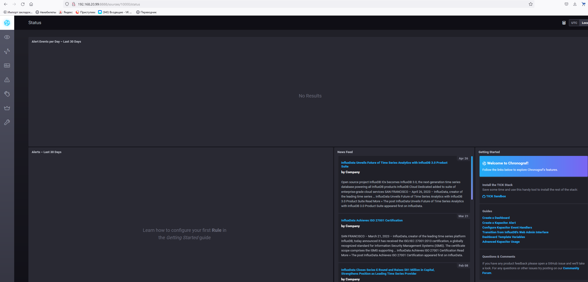

# Домашнее задание к занятию "13.Системы мониторинга"

## Обязательные задания

1. Вас пригласили настроить мониторинг на проект. На онбординге вам рассказали, что проект представляет из себя 
платформу для вычислений с выдачей текстовых отчетов, которые сохраняются на диск. Взаимодействие с платформой 
осуществляется по протоколу http. Также вам отметили, что вычисления загружают ЦПУ. Какой минимальный набор метрик вы
выведите в мониторинг и почему?

### Ответ:


Минимальный набор метрик предложу следующий:

1. Загрузка ЦПУ: Эта метрика позволит  отслеживать текущую загрузку ЦПУ на сервере, где развернут проект. Она позволит выявить, когда загрузка ЦПУ достигает предельных значений, что может указывать на возможные проблемы с производительностью или необходимость масштабирования ресурсов.

2. Пропускная способность сети: Мониторинг пропускной способности сети поможет отслеживать объем трафика, поступающего на сервер по протоколу HTTP. Это важно, чтобы обнаружить возможные сбои в сети, проблемы с пропускной способностью или атаки DDoS, которые могут негативно сказаться на доступности и   производительности платформы.

3. Количество запросов: Отслеживание количества входящих запросов на сервер поможет оценить нагрузку на платформу. Высокая интенсивность запросов может указывать на популярность проекта или возможные проблемы с его масштабируемостью. Эта метрика также может быть полезна для планирования и             масштабирования инфраструктуры в будущем.

4. Время отклика: Метрика времени отклика позволит измерить время, затраченное на обработку запросов и генерацию текстовых отчетов. Она позволит отслеживать производительность платформы и выявлять возможные проблемы, такие как увеличение времени отклика, которое может указывать на неэффективные       алгоритмы или проблемы с ресурсами сервера.

5. Статусные коды HTTP: Мониторинг статусных кодов HTTP (например, 200, 404, 500) позволит отслеживать успешность или ошибки при обработке запросов. Это поможет выявить потенциальные проблемы, такие как внутренние ошибки сервера (500), проблемы с доступностью (404) или превышение времени ожидания     (504).

#
2. Менеджер продукта посмотрев на ваши метрики сказал, что ему непонятно что такое RAM/inodes/CPUla. Также он сказал, 
что хочет понимать, насколько мы выполняем свои обязанности перед клиентами и какое качество обслуживания. Что вы 
можете ему предложить?

### Ответ:

Для помощи менеджеру продукта в понимании метрик и оценки качества обслуживания перед клиентами, я рекомендую следующие подходы и метрики:

SLA - это соглашение, в котором мы обязуетемся предоставлять определенный уровень сервиса клиентам. Это документ, который описывает, что они могут ожидать от нас.

SLO - это цель, которую мы устанавливаем для себя, чтобы соответствовать SLA. Например, это может быть цель обработки 99% запросов за определенное время.

SLI - это метрики, которые мы используем для измерения производительности или качества нашей системы. Например, это может быть метрика времени отклика или процент успешно обработанных запросов.

Резюме: Используя SLA, SLO и SLI, мы сможем оценить, насколько успешно мы выполняете свои обязанности перед клиентами и какое качество обслуживания предоставлям.

#
3. Вашей DevOps команде в этом году не выделили финансирование на построение системы сбора логов. Разработчики в свою 
очередь хотят видеть все ошибки, которые выдают их приложения. Какое решение вы можете предпринять в этой ситуации, 
чтобы разработчики получали ошибки приложения?

### Ответ:

Предложу разработчикам интегрировать  систему мониторинга, например - Prometheus, с их приложением. Это позволит автоматически собирать метрики производительности и ошибок приложения для последующего анализа, после чего
предложу разработчикам использовать метрики, предоставляемые системой мониторинга для обнаружения и отслеживания ошибок в приложении. Например, чтобы они могли настроить предупреждения (alerts) на основе пороговых значений метрик, чтобы получать оповещения о проблемах.
#
4. Вы, как опытный SRE, сделали мониторинг, куда вывели отображения выполнения SLA=99% по http кодам ответов. 
Вычисляете этот параметр по следующей формуле: summ_2xx_requests/summ_all_requests. Данный параметр не поднимается выше 
70%, но при этом в вашей системе нет кодов ответа 5xx и 4xx. Где у вас ошибка?

### Ответ:

Верная формула для вычисления параметра выполнения SLA будет следующей:
SLA = summ_2xx_requests / (summ_2xx_requests + summ_non_2xx_requests)

#
5. Опишите основные плюсы и минусы pull и push систем мониторинга.

### Ответ:

Pull система мониторинга:
Плюсы: 
гибкость, безопасность, управляемость данных.
Минусы:
задержка данных, нагрузка на сеть.

Push система мониторинга:
Плюсы:
мгновенные обновления, минимальная задержка.
Минусы:
требует конфигурацию агентов, потенциальные безопасностные риски.

#
6. Какие из ниже перечисленных систем относятся к push модели, а какие к pull? А может есть гибридные?

    - Prometheus 
    - TICK
    - Zabbix
    - VictoriaMetrics
    - Nagios

### Ответ:

Push модель:

    - Prometheus
    - VictoriaMetrics

Pull модель:

    - TICK (Telegraf, InfluxDB, Chronograf, Kapacitor)

Гибридные модели:

    - Zabbix
    - Nagios

#
7. Склонируйте себе [репозиторий](https://github.com/influxdata/sandbox/tree/master) и запустите TICK-стэк, 
используя технологии docker и docker-compose.

В виде решения на это упражнение приведите скриншот веб-интерфейса ПО chronograf (`http://localhost:8888`). 

P.S.: если при запуске некоторые контейнеры будут падать с ошибкой - проставьте им режим `Z`, например
`./data:/var/lib:Z`

### Ответ



#
8. Перейдите в веб-интерфейс Chronograf (`http://localhost:8888`) и откройте вкладку `Data explorer`.

    - Нажмите на кнопку `Add a query`
    - Изучите вывод интерфейса и выберите БД `telegraf.autogen`
    - В `measurments` выберите mem->host->telegraf_container_id , а в `fields` выберите used_percent. 
    Внизу появится график утилизации оперативной памяти в контейнере telegraf.
    - Вверху вы можете увидеть запрос, аналогичный SQL-синтаксису. 
    Поэкспериментируйте с запросом, попробуйте изменить группировку и интервал наблюдений.

Для выполнения задания приведите скриншот с отображением метрик утилизации места на диске 
(disk->host->telegraf_container_id) из веб-интерфейса.
#
9. Изучите список [telegraf inputs](https://github.com/influxdata/telegraf/tree/master/plugins/inputs). 
Добавьте в конфигурацию telegraf следующий плагин - [docker](https://github.com/influxdata/telegraf/tree/master/plugins/inputs/docker):
```
[[inputs.docker]]
  endpoint = "unix:///var/run/docker.sock"
```

Дополнительно вам может потребоваться донастройка контейнера telegraf в `docker-compose.yml` дополнительного volume и 
режима privileged:
```
  telegraf:
    image: telegraf:1.4.0
    privileged: true
    volumes:
      - ./etc/telegraf.conf:/etc/telegraf/telegraf.conf:Z
      - /var/run/docker.sock:/var/run/docker.sock:Z
    links:
      - influxdb
    ports:
      - "8092:8092/udp"
      - "8094:8094"
      - "8125:8125/udp"
```

После настройке перезапустите telegraf, обновите веб интерфейс и приведите скриншотом список `measurments` в 
веб-интерфейсе базы telegraf.autogen . Там должны появиться метрики, связанные с docker.

Факультативно можете изучить какие метрики собирает telegraf после выполнения данного задания.

## Дополнительное задание (со звездочкой*) - необязательно к выполнению

1. Вы устроились на работу в стартап. На данный момент у вас нет возможности развернуть полноценную систему 
мониторинга, и вы решили самостоятельно написать простой python3-скрипт для сбора основных метрик сервера. Вы, как 
опытный системный-администратор, знаете, что системная информация сервера лежит в директории `/proc`. 
Также, вы знаете, что в системе Linux есть  планировщик задач cron, который может запускать задачи по расписанию.

Суммировав все, вы спроектировали приложение, которое:
- является python3 скриптом
- собирает метрики из папки `/proc`
- складывает метрики в файл 'YY-MM-DD-awesome-monitoring.log' в директорию /var/log 
(YY - год, MM - месяц, DD - день)
- каждый сбор метрик складывается в виде json-строки, в виде:
  + timestamp (временная метка, int, unixtimestamp)
  + metric_1 (метрика 1)
  + metric_2 (метрика 2)
  
     ...
     
  + metric_N (метрика N)
  
- сбор метрик происходит каждую 1 минуту по cron-расписанию

Для успешного выполнения задания нужно привести:

а) работающий код python3-скрипта,

б) конфигурацию cron-расписания,

в) пример верно сформированного 'YY-MM-DD-awesome-monitoring.log', имеющий не менее 5 записей,

P.S.: количество собираемых метрик должно быть не менее 4-х.
P.P.S.: по желанию можно себя не ограничивать только сбором метрик из `/proc`.

2. В веб-интерфейсе откройте вкладку `Dashboards`. Попробуйте создать свой dashboard с отображением:

    - утилизации ЦПУ
    - количества использованного RAM
    - утилизации пространства на дисках
    - количество поднятых контейнеров
    - аптайм
    - ...
    - фантазируйте)
    
    ---

### Как оформить ДЗ?

Выполненное домашнее задание пришлите ссылкой на .md-файл в вашем репозитории.

---

